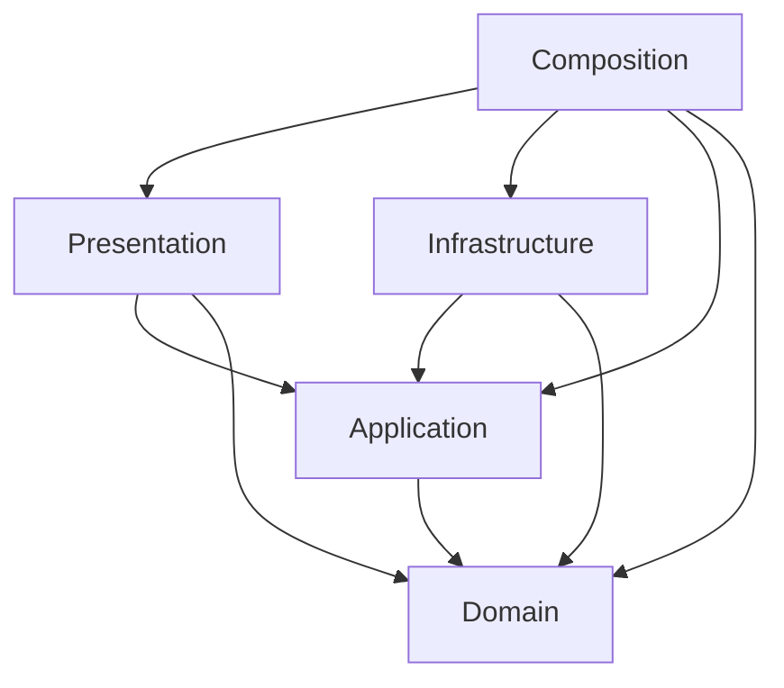

# アーキテクチャ

## 目的と現在の状態

Unity 6000.4.7f1上で、仕様書v0.1の配線UXと輸送ルールを検証する。
DDDを用いてルールの所有者と状態変更の境界を明確にし、EditMode中心のTDDで実装する。
この文書は設計とStep別の実装履歴を含む。現在のRoutingとBufferは末尾の「Relay限定Routing・Node種別ごとのBuffer」を参照。過去の共通容量50・Sink中継は廃止済み。

## モジュールとユビキタス言語

初期構成は単一プロセスのモジュラーモノリスとする。次の責務境界をDomain内部の名前空間とディレクトリに置き、必要になるまではモジュールごとのasmdefやサービスへ分割しない。

| モジュール | 所有する概念 | 責務と境界 |
| --- | --- | --- |
| FlowNetwork | FLOW、Node、Source、Sink、Relay、Buffer、Line、In-Flight | ネットワークの整合性、接続枠、局所FLOW Routing、容量、受け渡し、削除予約・取消、経路切替 |
| Spatial | LineRoute、経路長、Ground制約、通行可能領域 | 幾何経路の値と妥当性。建物の取り込み・Physics問い合わせ・探索アルゴリズムの実装は外部へ分ける |
| Progression | GameSession、Wave、生成予定、Overload猶予 | 同一都市内の進行、時間、生成する色の成立条件、SourceによるGame Over |

Hubは構成上の役割でありNode種別にしない。FLOW Routingは直接の接続先選択、Line Routingは障害物を避ける幾何経路生成であり、別のサービス・テストとして扱う。

## 集約と整合性

v0.1では、1都市の稼働中ネットワークを `FlowNetwork` 集約を採用する。NodeとLineを外部から個別に書き換えず、集約の操作を通す。これは接続作成・受け渡し・削除が複数のNodeとLineへ同時に影響するため。

- Line確定は始点OUT・終点IN・重複・経路を再検証し、両端の接続枠とLineを一緒に確定する。
- FLOWはNodeのBufferまたはLine上のいずれか1か所に属する。受け取り可否を確認し、所属の移動と容量更新を1つの操作として扱う。
- 削除予約や経路切替では、状態を変えて新規流入を止める。受け取り完了まではFLOWと接続枠を保持する。
- 外部へ渡す状態は読み取り専用ビュー・スナップショット・意味のある結果にする。コレクションを直接変更させない。
- GameSessionは進行を所有し、ApplicationがネットワークへのNode追加や生成を調整する。進行モジュールがネットワーク内部を直接変更しない。

集約のサイズ・更新コストは実測して見直す。初めからNodeごとにRepositoryを作ったり、分散トランザクション・イベントソーシングを導入したりしない。

## レイヤーとasmdef

| アセンブリ | 責務 | 主な外部依存 |
| --- | --- | --- |
| CityFlow.Domain | 集約・値オブジェクト・ルール | UnityEngineの型を利用可。外部の事前コンパイルDLLは自動参照しない |
| CityFlow.Application | コマンド・問い合わせ・進行調整・ポート | UniTask。必要な通知にR3コア |
| CityFlow.Infrastructure | ポートの具象実装・設定変換 | Unity API、UniTask。将来SDKアダプター |
| CityFlow.Presentation | 入力・カメラ・表示・購読 | UI Toolkit、Input System、Cinemachine、URP、VFX Graph、UniTask、R3.Unity |
| CityFlow.Composition | VContainer登録・スコープ構築 | VContainer（`VContainer.Unity` 名前空間を含む） |
| CityFlow.Editor | 開発ツール | UnityEditor。Editor限定 |
| CityFlow.Tests.EditMode | ロジック・設定の検証 | Unity Test Framework。Editor限定 |
| CityFlow.Tests.PlayMode | 起動・Unityライフサイクルの検証 | Unity Test Framework。テストアセンブリとしてPlayer通常ビルドから除外 |

自作asmdefの `autoReferenced` はfalseとし、依存を明示する。事前コンパイルDLLも `overrideReferences` / `precompiledReferences` で明示する。Domainは `noEngineReferences: false` でUnityEngineを利用できる。
R3コアはNuGetのDLLなので、UPMアセンブリ `R3.Unity` とは参照方式が異なる。DomainにはR3を持ち込まず、通知への変換をApplication / Presentationで行う。

## Unityとの境界

Domainを別の.NET専用プロジェクトへ移植すること自体を目標にしない。`Vector3`、`Bounds`、`Mathf` などはそのまま使用する。
一方、状態の正本をMonoBehaviour、Transform、VFX粒子数に置かない。Unityのシーンがなくても値を与えてルールを検証できる設計にする。

- MonoBehaviourはUnityライフサイクルと入力・描画のアダプター。
- ScriptableObjectは調整用の設定。起動時に検証してドメインへ渡し、実行中のBuffer等を設定アセットに保存しない。
- VFX GraphはFLOWの表示。輸送・停止・消化・容量はDomainの状態から描画へ反映する。
- VContainerはCompositionで組み立てる。Domain / ApplicationのクラスはDI属性を要求しない。
- UniTaskは読み込み・非同期探索などの境界に使用する。R3はHUDや選択状態などの通知に使用する。
- 購読・CancellationToken・スコープは所有者と寿命を一致させる。

## 時間、Pause、再現性

Applicationのシミュレーション更新入口に明示的な時間差分を渡し、Domainで `Time.deltaTime` やグローバル乱数を直接参照しない。ランダム選択は差し替え可能な乱数源または選択結果を入力にする。

Pauseはシミュレーション更新を止める。生成・移動・受け渡し・Wave・Node追加・Overloadタイマーは同時に停止する。一方、入力・カメラ・ホバー・Previewは表示側の時間で動かす。`Time.timeScale = 0` だけをPauseの契約にしない。

FLOWが残るLineの削除・経路切替は再開後に進める。既に空のLineの削除など、時間を必要としないコマンドはPause中も実行できる。

tick内の「生成・移動・受け渡し・出発・Overload評価」の詳細な順序は最初のシミュレーション実装時にテストで固定する。描画フレームレートによる二重転送・容量超過を許さない。

## 経路とPLATEAUへの拡張

Application側に必要になった時点で次のポートを追加する。先に空のインターフェース群を量産しない。

| 境界の候補 | v0.1 | v0.2 / v0.3 |
| --- | --- | --- |
| ステージ形状の供給 | 簡易都市のFootprint・範囲 | 建物ボリューム、PLATEAU座標変換・形状の簡略化 |
| 経路生成 | XZ上の1候補 | 3D・最大2〜3候補 |
| 経路検証 | Ground固定・全線分の衝突判定 | 上昇下降も含めた全区間の検証 |

経路生成と検証は同じステージ形状・クリアランス・単位を使う。Previewも確定も同じ検証を通す。描画とFLOW移動、長さ計測が参照する確定済み経路を一致させる。

PLATEAU SDKの型や座標系はInfrastructureのアダプターに閉じ込め、ゲーム側へUnityローカル座標と障害物形状を渡す。**1 Unity unit = 1 m** を基準にする。簡易都市も同じ境界を使って比較検証を残す。

Port Unit、Width、方向反転はv0.2で仕様に沿って導入する。v0.1の接続本数を架空のPortモデルに置き換えて先取りしない。

## 保留事項

- Node追加方式とWave構成（手動設計／自動生成／組み合わせ）。
- ステージ規模、性能目標（経路探索方式はStep 06、固定tick幅はStep 03に採用内容を記録）。
- UIの具体構成、入力バインド、描画の最適化方式。
- セーブ／ロード、対象プラットフォーム、PLATEAUの対象都市とSDKバージョン。

仕様を根拠に小さなテストで必要性を示し、決定時にこの文書へ反映する。

## Step 01：検証都市（実装済み）

BootstrapのComposition Rootは `GameplaySettings` と `StageConfiguration` を検証し、コピーした読み取り専用 `StageDefinition` をVContainerへ登録する。Presentationはその定義からGround、建物、Nodeを描画する。実行時状態をScriptableObjectへ書き戻さない。

検証都市は120 × 90 m、Ground Y=0、10 mグリッド、6棟、Source 1・Relay 2・赤／青Sink各1。中央建物の両側と6 m幅の通路で後続の配線検証を行う。NodeのGround・範囲・建物Footprint（クリアランス拡張）を起動時に検証する。全区間の経路検証はLine導入時に同じ定義を使う。

§17の暫定値としてMaxBuffer=50、MaxInFlight=10、Speed=20 m/s、Overload猶予=5 sを保持する。検証用の追加暫定値はクリアランス0.5 m、各Node IN/OUT=3、Source生成間隔0.25 s（長距離Lineの満杯を再現する負荷）。Overloadの敗北判定は後続Issueで実装する。

`City Flow > Set Up Validation City` は不足する設定アセットを作り、Bootstrapへ割り当てるEditor用の明示的セットアップ。通常の起動では不要。既存の調整値を上書きしない。

## Step 02：FlowNetwork集約（実装済み）

`FlowNetwork` がNodeのBuffer・Incoming/OutgoingとLineのIn-Flightを一括所有する。Node IDはステージ内で一意の文字列、Line IDとFLOW IDは集約内で発行する連番。外部入力でFLOW IDや所属を差し替える操作は公開しない。Hubは種別に追加しない。

`TryConnect` は端点存在、自分自身、同方向重複、OUT/IN上限、経路の順で検証する。成功したときだけLineと両端の接続枠を同時に確保し、失敗時は `ConnectionFailure` を返して状態を維持する。逆方向接続は独立したLine。初期配線もこの操作を通す。

経路は `LineRoute` へコピーし、Ground高さ、有限値、ゼロ長区間、端点、通行範囲、全線分とクリアランス付きFootprintの交差を検証する。XZ実長、描画座標、後続の移動処理は同じ折れ線を参照する。経路探索・配線操作は後続Issue。

公開する `NetworkSnapshot` は生成時点のコピーで、Node/Line/Buffer/In-Flightのコレクションは読み取り専用。UnityオブジェクトやTransformを状態の正本にしない。Sourceへの `GenerateFlow` は同色Sinkの存在を検証し、§5.2補完案に沿って超過分も保持する。Step 02のシーンは生成更新を呼ばず静止する。

検証アセットは5 Node・5 Line。Sourceから赤Sinkへの42 m直線と青Sinkへの169 m迂回を含む。HUDに各NodeのIN/OUT使用数、Lineの方向を表示する。

## Step 03：基本輸送と更新順（実装済み）

`FlowSimulation.Tick(deltaSeconds)` が入力時間を蓄積し、暫定固定幅 **0.05 s** ごとに次を実行する。0秒では何も進めず、負値・NaN・Infinityは拒否する。描画フレーム時間を切り捨てず、遅いフレームでも必要なtickを順に処理する。

1. **生成**：Sourceごとの予定時刻に従い、現在のSink色を重複排除して等確率で選ぶ。最初の生成は生成間隔経過後。Source自身の超過生成も保持する（§5.2補完案）。
2. **移動・受け渡し**：既存In-Flightを共通速度で進め、Line作成順・各Lineの出発順に受け取りを試す。同色Sinkは即時消化し、Relayへの到着はBufferへ渡す。異色Sinkへは送らない。受け取り容量不足ならLine上に保持する。容量は受け取り完了後だけ解放する。
3. **出発**：Nodeはステージ定義順、Bufferは待機順に評価。同色Sink直結があれば空き直結から選び、全部満杯なら待機。他の色を後続から評価する。直結がない場合はRelayを終点とする空きOutgoing間だけから等確率で選ぶ。同色Sinkが複数ある場合は接続作成順で選ぶ。このtickで出発したFLOWは次tickから移動する。

受け渡されたFLOWは同じtickの出発段階で中継できるが、次のLineの移動を同じtickに重ねない。複数Incomingが競合する場合はLine作成順を暫定採用し、受け取るたびにBuffer容量を再評価する。公平性制御は今回の対象外。

混雑時の追い越しを禁止し、終端側から待機する（§8.1補完案）。停止列の見える間隔は暫定0.8 m、短いLineでは `Length / MaxInFlight` 以下に制限する。運行中に混雑がなければ全FLOWが共通速度で移動する。移動位置は `LineRoute.PositionAt` による実経路上の位置。表示だけ0.9 m上へオフセットする。

乱数境界 `IRandomSource` をテストで差し替え、実シーンは設定の固定seed（暫定1337）で `System.Random.Next` を使う。Presentationの `SimulationDriver` はUnityのフレーム時間をApplicationへ渡すだけで、輸送ルールを持たない。表示粒子はIn-Flightのスナップショットから作成・更新・削除し、ゲーム状態の正本にはしない。

初期ネットワークは短い赤直結42 m（2.1 s）と長い青直結169 m（8.45 s）に同じ容量10を持つ。Sourceは0.25 s間隔で生成するため、青側が先に満杯になりSourceのBufferが増える。HUDに処理成功数・Buffer・In-Flight・Line実長・所要時間・容量使用数を表示する。Overload敗北、Wave、プレイヤー配線、削除・経路切替は後続Issueの対象。

## Step 03後：UI Toolkit移行

ゲーム内UIは開発用表示も含めUI Toolkitを採用する。`ValidationCityView` は3D都市・Line・FLOWの描画、`ValidationHud` はHUD・Nodeラベルの表示を担当する。従来の `OnGUI` によるIMGUI描画は削除した。

UXMLは構造、USSは見た目、ThemeStyleSheetはUnity標準のランタイムテーマ、PanelSettingsは基準解像度1600×900と画面への拡大縮小を定義する。Composition RootがUXMLとPanelSettingsを検証・注入し、都市と同じ寿命のUIDocumentを作る。UI Builderで編集可能なアセットとして管理し、実行中に見た目やゲーム状態をアセットへ書き戻さない。

HUDはスナップショットから統計値・Node接続数・Buffer・Line容量を更新する。Nodeラベルはカメラ投影をUIパネルの座標へ変換し、背後・画面外では非表示にする。表示専用要素のPickingModeをIgnoreにし、ワールドの選択・配線用入力を遮らない。UIDocumentの再有効化でVisual Treeが再生成された場合は参照を結び直し、行を重複作成しない。

UI移行で輸送ルール、tick順序、乱数、初期配線は変更しない。UI技術選定はAGENTS.mdにも明記した。

## Step 04：混雑とSource Overload（実装済み）

`NodeSnapshot.IsInputStopped` はSource/RelayそれぞれのBuffer上限以上を示し、`InFlightSnapshot.IsStopped` は受け取り待ち・停止列へ到達したFLOWを示す。Sink同色の即時消化とFIFO、受け取り完了までの容量保持はStep 03のルールを維持する。

§5.2の補完案を採用し、各Sourceの連続Overload時間を出発処理後に評価する。上限と等しい場合から計時し、下回れば0へ戻す。猶予は設定の `OverloadGrace`（暫定5 s）。Relay/Sinkは計時対象外。猶予到達時のSource IDを保持し、Applicationはそのtickで更新を終了する。Game Over後は生成・移動・経過時間を止め、FLOWを残す。結果画面・再試行はStep 11。

## Step 05：Overview操作と情報表示

`OverviewController` がInput SystemのAction Mapを所有し、Pan/Zoom/Orbit、画面投影によるNode/Line選択、フォーカス、全景復帰を担当する。カメラはシミュレーション時間と独立して動く。選択通知はR3の読み取り専用Observableとして公開し、`OverviewDetailsView` が有効中だけ購読する。破棄時はAction MapとSubjectを終了・破棄する。

`OverviewReadout` はスナップショットからBuffer色別内訳、I/O、入力停止、生成間隔・猶予、経路長・時間・容量・停止数・Throughputを生成する。選択Nodeの入出力Lineを太く表示し、停止FLOWは色を維持した扁平形状にする。NodeのBufferは無彩色ゲージと警告枠で示し、目的色と区別する。距離・移動・選択判定は確定済みLineRouteを使う。

入力の暫定割当: WASD/中ドラッグ=Pan、ホイール=Zoom、右ドラッグ=Orbit、左クリック=選択、F=フォーカス、Home=全景。配線コマンドはStep 07以降。

## Step 06：自動Ground経路とPreview（実装済み）

v0.1のLine Routingは **可視グラフ＋A\*** を採用。まず直線を検証し、迂回が必要ならクリアランス付き建物Footprintの角と両端点を頂点とする。全区間が有効な頂点間だけを接続し、実距離コスト・直線距離ヒューリスティックで1候補を探索する。同コストの候補は固定順で決め、不要な制御点を除去した後に全区間を再検証する。矩形境界を衝突に含めるため、探索頂点には暫定2 mmの数値的余裕を追加する。厳密な最短保証は求めない。現在の簡易都市向けの同期処理であり、大規模都市・3D用の探索方式は別途検証する。

`IGroundRoutePlanner` をApplicationの境界とし、Infrastructureの `GroundRoutePlanner` が空間問い合わせと探索を実装する。判定はDomainの `StageDefinition.ValidatePoint/ValidateRoute` に集約し、既存の接続時検証と同じ地形・クリアランスを参照する。Ground高さ、領域外、障害物、不正制御点は別の失敗理由として返し、該当区間番号を保持する。

`LinePreviewService` が確定Lineと独立したPreviewを保持する。生成・編集・取消はネットワークや接続枠を変更しない。自動探索失敗時も始終点を保持し、後続の手動編集へ渡せる。接続制約は `FlowNetwork.CheckConnection` と `TryConnect` で共通化する。成功経路・描画・実移動・距離は同じ折れ線を使う。

UI ToolkitのPreviewパネルからNodeペアを選び、Generate route/Cancelを操作する。半透明の破線・方向矢印、長さ・時間・固定容量・Throughput・仮確定後I/O・失敗理由を表示する。R3通知の購読はViewの有効期間に限定する。パネルとドロップダウン上のクリックはワールド選択へ渡さない。Line確定とNode 360はStep 07、制御点の手動操作はStep 08。

## Step 07：Node 360と接続確定

`ConnectionSession` が始点と距離フィルターを持ち、未選択→始点選択→Preview→確定/取消を扱う。始点未選択での終点指定・確定を拒否し、進行中の始点差し替えを防ぐ。終点・幾何形状は既存の `LinePreviewService` を正本とし、距離フィルターやカメラ切替では破棄しない。R3でセッション変更を通知し、VContainerスコープが購読を破棄する。

候補は最新のNetworkSnapshotから生成し、Ground直線距離、種類、Sink色、候補IN/OUT、始点OUT、自己接続・重複・枠不足を返す。経路探索前の「枠あり」は接続成功を意味しない。Nearは閾値以下、MidはNear超からMid閾値以下、Farはそれより遠い範囲。Compositionでステージ対角長の25%・50%を暫定閾値として渡す（検証都市37.5 m / 75 m）。

確定では同じ制御点を再検証した後、`FlowNetwork.TryConnect` が経路・両端枠を再確認して一括確保する。失敗時はPreviewと始点を保持して理由を更新し、成功時にだけ一時状態を終了する。取消は集約を変更しない。

`NodeConnectionController` がInput System操作とカメラを担当する。始点の3.2 m上を暫定視点とし、水平360°・上下±80°、透視投影で探索する。始点のメッシュと台座をNode 360中だけ非表示にし、視界を遮らないようにする（候補マーカーとしては自己接続理由を確認可能）。開始前のOverview内部pivot・角度・投影設定・カメラ姿勢・選択を保存し、確定/取消時に復元する。Overviewでの経路確認中もセッションを保持する。ゲーム時間をカメラ操作の時間源にしない。

`NodeConnectionView` はUI Toolkitで画面外方向・遮蔽中のマーカー、距離フィルター、注目情報、接続操作を表示する。表示用遮蔽判定は視点からNodeへの線分と建物ボリュームの交差を使い、Ground経路の通行可否とは分離する。マーカー重複時は注目候補を優先し、隠れた候補もTabによる順送りで再表示できる。加えてNode 360の右上に全候補のスクロール一覧を表示し、ラベルが重なるGREEN等もキーボードを使わず選べる。一覧は最新のNode構成と距離フィルターを反映し、表示順をNode登録順に保つ。候補への注目時にPreviewを生成し、クリック時に再検証して確定する。注目先とPreviewの終点が同じなら再生成しない。仕様§13の見つけやすさに関する補完案はこのステップで採用した。

検証シーン `WiringLab` は都市形状・Node配置を維持し、初期Lineを0本にした `WiringStage` を使う。Source生成間隔は配線操作の確認用に暫定1 sとする。`Bootstrap` の固定5本ではS1のOUTが満杯で、同色直結優先・満杯時待機によりRelayへ迂回しないため、Sourceから新規接続してFLOWが出発する検証をこの別シーンで行う。ゲームルールや上限を緩める変更はしない。

## Step 08：Ground制御点の手動編集

`LinePreviewService` に制御点の挿入・移動・削除と自動再生成を追加。始終点は変更不可、入力座標のYは始点のGround高さに投影し、毎回同じ全区間検証へ渡す。無効な点もPreviewには残して理由を表示し、確定を禁止する。適用時も全区間・接続枠を再検証する。

`NodeConnectionController` は接続セッションと開始前のOverviewを維持したまま真上の正射影へ切り替える。編集時はOverviewのNode選択・Orbitを止め、Pan/Zoomを維持。UI Toolkitの番号付き制御点をドラッグし、Shift+クリックで最寄り区間へ点を挿入、Deleteで選択点を削除する。入力座標はCameraのGround平面との交点へ変換する。適用・取消で元のカメラ内部状態と選択を復元する。

## Step 09：Line削除予約と経路切替

FlowNetwork集約が `Running / DeletePending / RouteChangePending` を所有する。削除・切替予約は同時適用を拒否し、新規出発の候補と同色Sinkへの直結判定から対象Lineを除外する。既存FLOWは旧経路で排出し、受け取り完了後にIn-Flightが0となったLineだけ削除または切替する。終点満杯による強制終了やタイムアウトは設けない。空のLineはコマンド内で直ちに完了する。

取消は予約と保留経路だけを解除し、Line ID、旧経路、FLOWのID・距離、接続枠を保持する。削除時にだけ両端から接続を取り除く。Line IDは単調増加し、削除後も再利用しない。

既存Lineの編集も `ConnectionSession` と `LinePreviewService` を使い、端点変更は禁止、仮適用後I/Oは現在値を維持する。Previewの適用時に経路と予約状態を再検証し、削除済み・別予約中のLineを変更しない。描画は確定LineRouteの変更・削除を検出して更新する。選択Lineのパネルに残りFLOW、排出/Buffer空き待ち、取消操作を表示し、削除待ちは橙、切替待ちは紫で区別する。仕様§11の運行中Line編集・予約排他に関する補完案を採用した。

## Step 10：シミュレーションPause

`FlowSimulation.IsPaused` をApplicationの状態とし、Pause中はtick入口で経過時間・端数・生成予定・FLOW移動/受け渡し/出発・Overloadをすべて維持する。停止中に受け取った実時間差分を蓄積せず、再開後は元の端数・残り距離・猶予から継続する。Time.timeScaleは変更しない。

`PauseView` がInput SystemのEscとUIボタンを結び、停止状態をHUDへ表示する。Escは編集取消に使用しない。カメラはunscaled時間で操作し、接続・Preview編集・予約・取消は通常の同期コマンドとして利用できる。空Lineの削除/切替は即時完了し、FLOWを含むLineは再開後の排出を待つ。仕様§14.1の再開と時間不要コマンドに関する補完案を採用した。

## Step 11：同一都市のWave、出現と結果

v0.1の最初の追加方式は**制作者が用意するスケジュール**を採用する。再現性と調整容易性を優先し、配置アルゴリズムは導入しない。`StageConfiguration.Waves` が時刻・生成間隔倍率・追加Nodeを読み込み、Domainの `WaveDefinition` へ変換する。配置・ID・色・数値を起動時に検証し、各追加Nodeは少なくとも既存NodeへのGround経路が必要。将来の追加方式はこの定義の供給元を差し替え、Domain/ApplicationにSDK固有型を持ち込まない。

FlowNetworkは初期Stageとは別に現存Nodeを所有する。追加は既存集約の中で行い、Node/Line/Buffer/FLOW/予約を再構築しない。描画・選択・Node 360・HUD・生成候補は現存Nodeを参照する。追加した同色Sinkは生成色の候補を重複させない。

tick順序は **Wave追加（Sinkを先に登録）→生成→移動/受け渡し→予約完了→出発→Overload判定→結果確定**。Sourceは `GenerationDelay` 秒の準備後、最初の生成間隔を経て生成する。Waveの生成間隔倍率は既存Sourceの残り生成位相へ反映するが、準備猶予を短縮しない。PauseはWave・追加・準備時間も同じtick入口で止める。Waveは1から始まり、最終スケジュール以後も同じ都市で生存を続ける。

WiringLabの暫定値（1 unit = 1 m）：初期5 Node / 2色 / 0 Line、S1準備15 s・基本生成間隔1 s。Wave 2は60 sでGREEN(-48,34)とS2(48,-20)、間隔倍率0.9。Wave 3は120 sでYELLOW(0,36)とR3(-45,0)、倍率0.75。Wave 4は180 sでPURPLE(48,-36)とS3(-48,-36)、倍率0.6。座標はXZ、Y=0。S2の基本間隔1.3 s、S3は1 s、追加Sourceの準備は20 s。初期の建物・Node位置、容量・接続上限は維持する。難度の最終調整はStep 12で行う。

追加通知・画面外方向マーカーはゲーム時間で12 s表示し、クリックで新Nodeへフォーカスする。HUDにはWave、次回までの時間、生成倍率/Source準備、既存の経過時間・処理数・混雑を表示。Game Overで `SessionResult` にWave・生存秒・処理数・原因Sourceを固定する。再試行はUniTaskで同じシーンを再読み込みし、新しいVContainerスコープ・固定シード・設定値から開始する。結果表示中は新規配線開始を拒否し、編集中だったPreviewを破棄してOverviewに戻す。

## v0.1操作の改善

Overviewの実クリックをR3で通知し、NodeクリックはNode 360へ、Shift＋Lineクリックは既存Lineの編集へ直接移る。プログラムによる選択・復元では配線を自動開始しない。編集開始フレームのShiftクリックを制御点追加として二重処理しない。

Node本体・マーカー・候補一覧への注目でPreviewを生成し、クリックで接続確定する。無効な接続はPreviewと理由を保持する。Enterでの確定、Eでの確定前編集、VでのOverview確認、Backspace取消も維持する。画面上のConnectボタンは削除した。

Node 360では3D描画を左72%・上端12%と下端6%を除く領域へ限定し、操作・候補一覧・Previewを右側へまとめる。Node位置への投影と画面外判定もCamera.rectを使う。注目ラベルはNodeの上（上端では下）へずらす。建物と屋根はアルファ0.18の専用マテリアルへ切り替え、元の不透明マテリアルを保持する。Overview復帰・手動編集・Controller無効化で元のマテリアル、影、カメラ領域を復元する。空間判定と確定経路は変更しない。

## v0.1 Sourceの視認性

`NodeSnapshot`にSourceごとの生成累計・直近生成色を保持する。生成と同じtickに出発してBufferが空になっても生成を観測できる。表示は`SourceStatusView`が所有し、生成リング（暫定0.75 s）と最大50個の待機粒子を描画する。表示上限でDomainのFLOWを削除しない。生成リングの時間源は`FlowSimulation.ElapsedSeconds`とし、Pauseで停止する。

Sourceモニターは全Sourceの準備時間、生成累計・直近色、Buffer実数／容量、残容量を常設表示する。容量80%を予告警告の暫定値とし、満杯では継続Overloadの残り猶予を表示する。360では上端12%をSource表示専用に追加し、都市描画と重ならない。結果の見出しはGAME OVERとし、原因Source・生存時間・配送数とRetryを表示する。

## v0.1 FLOW速度の暫定調整

視認性の改善として、`GameplaySettings.FlowSpeed`と`ValidationGameplay`の速度を20から8 m/sへ下げた。距離・移動時間・Preview・輸送能力はすべて同じ実速度から計算する。42 mのLineは2.1から5.25 s、100.98 mは約5.05から12.62 sとなる。容量10、Buffer 50、生成間隔、Wave倍率、Overload猶予5 sは維持する。上記のStep 03記録と仕様中の20 m/sの計算例は当時の値／数式の例であり、現在の調整アセットは8 m/s。速度を落とすと容量回復も遅くなるため、最終採用値と生成量の組み合わせは [Issue #13](https://github.com/OrthogonalInteractive/CityFlow/issues/13) で比較する。

Wave通知と出現マーカーはNode 360中に非表示とし、追加Nodeは候補一覧で選べる。Overviewの出現マーカーはPause/ResumeとWave通知の実レイアウト下端より下へ配置し、操作を遮らない。

## Relay限定Routing・Node種別ごとのBuffer

ユーザー指定により、同色Sink直結がなければRelay行きLineだけをランダム候補にする。異色Sink・Sourceは候補から外す。同色Sink直結が存在し満杯なら待機し、Relayへ逃がさない。同色Sinkが複数ある場合は空きLineを作成順で選ぶ。Relayが1つなら乱数を消費せず、複数なら等確率で選ぶ。

Sinkは消化専用の終点とする。`NodeDefinition.MaxOutgoing`を0にし、SinkからLineを作れなくする。受け渡しは同色Sinkへの即時消化、またはBufferを持つNodeへの移動だけ。Sinkのスナップショットは`BufferCapacity = null`でBufferなしを表し、共通のFLOW所在参照用コレクションは常に空。HUDはBuffer数・ゲージを表示せず、詳細に即時消化とIN枠を表示する。

`NetworkSettings` / `GameplaySettings`の共通MaxBufferを`SourceBufferCapacity`と`RelayBufferCapacity`へ分離し、基本設定をSource 10、Relay 5とする。S1・Wave追加のS2/S3もSourceの設定を使う。`NodeSnapshot.BufferCapacity`を受け取り上限・入力停止・HUDの基準に使い、Sourceの敗北判定はSource容量だけを見る。猶予は現行5秒を維持し、10個以上が5秒続くとGame Over。10未満へ戻れば猶予をリセットする。即時敗北への変更は別判断とする。

旧スナップショットを変更せず、満杯Relayへの6個目はLineに保持する。削除予約・経路切替・Pause・FLOW保存のルールは維持する。旧来のSinkから次のSinkへ中継する検証配線は使わず、Wave追加色にはRelayからOutgoingを増設する。

## 生成頻度・In-Flight容量・ホバー中心のHUD

Sourceの生成間隔を約3倍、MaxInFlightを3へ変更した。WiringLabはS1/S3 3秒、S2 3.9秒、Bootstrapは0.75秒。Wave倍率とSourceのOverload猶予5秒は維持する。値は設定アセットに保存し、生成間隔の基準・調整履歴をREADMEと仕様へ記録する。

Domainの待機間隔は`Route.Length / MaxInFlight`。停止を検出してからFLOWの位置を並べ替えるのではなく、通常移動中から先行FLOWとの間隔を制約する。出発直後に後続が始点で待つ場合はあるが、各tickの進行量は0〜共通速度×時間差分で、後退・追い越し・瞬間移動を起こさない。停止・Pause・予約中も実距離とFLOW IDを維持する。

`ValidationCityView`は`InFlight.IsStopped`から混雑色を表示する。通常Lineはオレンジ、削除予約・経路切替中は本線の状態色を保って矢印をオレンジにする。Pauseそのものは混雑色を付けない。

`ValidationHud`はDELIVERED/TIME、簡易Nodeラベル、Line一覧を表示し、UIに対するワールド入力の遮断も所有する。常設NETWORK INSPECTOR・Source詳細・Node接続表・独立Previewパネルは廃止。`OverviewDetailsView`がホバー中のNode/Lineだけを選び、`OverviewReadout`の詳細を対象付近へ置き、カーソルを外すと消す。選択は詳細表示の保持条件にしない。Node 360の始点・候補コントロールも同じNode情報を公開する。

`SourceStatusView`は生成リングと待機粒子だけを描画し、数値カードを生成しない。`GroundPreviewView`は実経路の破線描画と配線・手動編集欄のメトリクス／無効理由を担当する。Node 360の上部Source専用領域を廃止し、都市のカメラ領域を縦に拡大した。接続確定・取消・手動編集・削除予約は既存Applicationユースケースを継続利用する。
