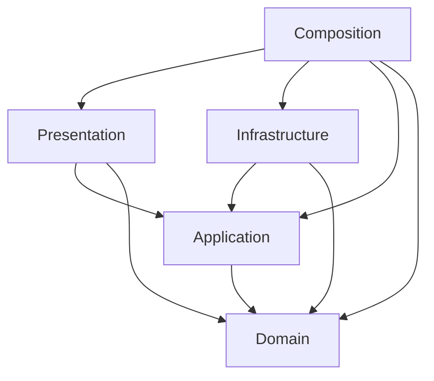

# アーキテクチャ

## 目的と現在の状態

Unity 6000.4.7f1上で、仕様書v0.1の配線UXと輸送ルールを検証する。
DDDを用いてルールの所有者と状態変更の境界を明確にし、EditMode中心のTDDで実装する。
この文書の型・ポート名は設計上の候補であり、今回用意した基盤に全て実装済みという意味ではない。

## モジュールとユビキタス言語

初期構成は単一プロセスのモジュラーモノリスとする。次の責務境界をDomain内部の名前空間とディレクトリに置き、必要になるまではモジュールごとのasmdefやサービスへ分割しない。

| モジュール | 所有する概念 | 責務と境界 |
| --- | --- | --- |
| FlowNetwork | FLOW、Node、Source、Sink、Relay、Buffer、Line、In-Flight | ネットワークの整合性、接続枠、局所FLOW Routing、容量、受け渡し、削除予約・取消、経路切替 |
| Spatial | LineRoute、経路長、Ground制約、通行可能領域 | 幾何経路の値と妥当性。建物の取り込み・Physics問い合わせ・探索アルゴリズムの実装は外部へ分ける |
| Progression | GameSession、Wave、生成予定、Overload猶予 | 同一都市内の進行、時間、生成する色の成立条件、SourceによるGame Over |

Hubは構成上の役割でありNode種別にしない。FLOW Routingは直接の接続先選択、Line Routingは障害物を避ける幾何経路生成であり、別のサービス・テストとして扱う。

## 集約と整合性

v0.1では、1都市の稼働中ネットワークを `FlowNetwork` 集約の候補とする。NodeとLineを外部から個別に書き換えず、集約の操作を通す。これは接続作成・受け渡し・削除が複数のNodeとLineへ同時に影響するため。

- Line確定は始点OUT・終点IN・重複・経路を再検証し、両端の接続枠とLineを一緒に確定する。
- FLOWはNodeのBufferまたはLine上のいずれか1か所に属する。受け取り可否を確認し、所属の移動と容量更新を1つの操作として扱う。
- 削除予約や経路切替では、状態を変えて新規流入を止める。受け取り完了まではFLOWと接続枠を保持する。
- 外部へ渡す状態は読み取り専用ビュー・スナップショット・意味のある結果にする。コレクションを直接変更させない。
- GameSessionは進行を所有し、ApplicationがネットワークへのNode追加や生成を調整する。進行モジュールがネットワーク内部を直接変更しない。

集約のサイズ・更新コストは実測して見直す。初めからNodeごとにRepositoryを作ったり、分散トランザクション・イベントソーシングを導入したりしない。

## レイヤーとasmdef

| アセンブリ | 責務 | 主な外部依存 |
| --- | --- | --- |
| CityFlow.Domain | 集約・値オブジェクト・ルール | UnityEngineの型を利用可。外部の事前コンパイルDLLは自動参照しない |
| CityFlow.Application | コマンド・問い合わせ・進行調整・ポート | UniTask。必要な通知にR3コア |
| CityFlow.Infrastructure | ポートの具象実装・設定変換 | Unity API、UniTask。将来SDKアダプター |
| CityFlow.Presentation | 入力・カメラ・表示・購読 | Input System、Cinemachine、URP、VFX Graph、UniTask、R3.Unity |
| CityFlow.Composition | VContainer登録・スコープ構築 | VContainer（`VContainer.Unity` 名前空間を含む） |
| CityFlow.Editor | 開発ツール | UnityEditor。Editor限定 |
| CityFlow.Tests.EditMode | ロジック・設定の検証 | Unity Test Framework。Editor限定 |
| CityFlow.Tests.PlayMode | 起動・Unityライフサイクルの検証 | Unity Test Framework。テストアセンブリとしてPlayer通常ビルドから除外 |

自作asmdefの `autoReferenced` はfalseとし、依存を明示する。事前コンパイルDLLも `overrideReferences` / `precompiledReferences` で明示する。Domainは `noEngineReferences: false` でUnityEngineを利用できる。
R3コアはNuGetのDLLなので、UPMアセンブリ `R3.Unity` とは参照方式が異なる。DomainにはR3を持ち込まず、通知への変換をApplication / Presentationで行う。

## Unityとの境界

Domainを別の.NET専用プロジェクトへ移植すること自体を目標にしない。`Vector3`、`Bounds`、`Mathf` などはそのまま使用する。
一方、状態の正本をMonoBehaviour、Transform、VFX粒子数に置かない。Unityのシーンがなくても値を与えてルールを検証できる設計にする。

- MonoBehaviourはUnityライフサイクルと入力・描画のアダプター。
- ScriptableObjectは調整用の設定。起動時に検証してドメインへ渡し、実行中のBuffer等を設定アセットに保存しない。
- VFX GraphはFLOWの表示。輸送・停止・消化・容量はDomainの状態から描画へ反映する。
- VContainerはCompositionで組み立てる。Domain / ApplicationのクラスはDI属性を要求しない。
- UniTaskは読み込み・非同期探索などの境界に使用する。R3はHUDや選択状態などの通知に使用する。
- 購読・CancellationToken・スコープは所有者と寿命を一致させる。

## 時間、Pause、再現性

Applicationのシミュレーション更新入口に明示的な時間差分を渡し、Domainで `Time.deltaTime` やグローバル乱数を直接参照しない。ランダム選択は差し替え可能な乱数源または選択結果を入力にする。

Pauseはシミュレーション更新を止める。生成・移動・受け渡し・Wave・Node追加・Overloadタイマーは同時に停止する。一方、入力・カメラ・ホバー・Previewは表示側の時間で動かす。`Time.timeScale = 0` だけをPauseの契約にしない。

FLOWが残るLineの削除・経路切替は再開後に進める。既に空のLineの削除など、時間を必要としないコマンドはPause中も実行できる。

tick内の「生成・移動・受け渡し・出発・Overload評価」の詳細な順序は最初のシミュレーション実装時にテストで固定する。描画フレームレートによる二重転送・容量超過を許さない。

## 経路とPLATEAUへの拡張

Application側に必要になった時点で次のポートを追加する。先に空のインターフェース群を量産しない。

| 境界の候補 | v0.1 | v0.2 / v0.3 |
| --- | --- | --- |
| ステージ形状の供給 | 簡易都市のFootprint・範囲 | 建物ボリューム、PLATEAU座標変換・形状の簡略化 |
| 経路生成 | XZ上の1候補 | 3D・最大2〜3候補 |
| 経路検証 | Ground固定・全線分の衝突判定 | 上昇下降も含めた全区間の検証 |

経路生成と検証は同じステージ形状・クリアランス・単位を使う。Previewも確定も同じ検証を通す。描画とFLOW移動、長さ計測が参照する確定済み経路を一致させる。

PLATEAU SDKの型や座標系はInfrastructureのアダプターに閉じ込め、ゲーム側へUnityローカル座標と障害物形状を渡す。**1 Unity unit = 1 m** を基準にする。簡易都市も同じ境界を使って比較検証を残す。

Port Unit、Width、方向反転はv0.2で仕様に沿って導入する。v0.1の接続本数を架空のPortモデルに置き換えて先取りしない。

## 保留事項

- Node追加方式とWave構成（手動設計／自動生成／組み合わせ）。
- Ground経路探索アルゴリズム、ステージ規模、固定tick幅、性能目標。
- UIの具体構成、入力バインド、描画の最適化方式。
- セーブ／ロード、対象プラットフォーム、PLATEAUの対象都市とSDKバージョン。

仕様を根拠に小さなテストで必要性を示し、決定時にこの文書へ反映する。
