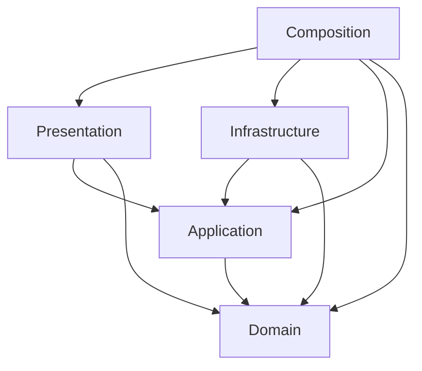

# アーキテクチャ

## 目的と現在の状態

Unity 6000.4.7f1上で、仕様書v0.1の配線UX・輸送ルールとv0.2 Δ1の高さ配線を検証する。
DDDを用いてルールの所有者と状態変更の境界を明確にし、EditMode中心のTDDで実装する。
この文書は現在の設計を記す。変更経緯・旧数値は [設計履歴](history/Architecture-v01.md)、仕様§18の検証対応は [完了条件の追跡](V01-Acceptance.md) を参照。

## モジュールとユビキタス言語

初期構成は単一プロセスのモジュラーモノリスとする。次の責務境界をDomain内部の名前空間とディレクトリに置き、必要になるまではモジュールごとのasmdefやサービスへ分割しない。

| モジュール | 所有する概念 | 責務と境界 |
| --- | --- | --- |
| FlowNetwork | FLOW、Node、Source、Sink、Relay、Buffer、Line、In-Flight | ネットワークの整合性、接続枠、直結優先・最短距離のFLOW Routing、容量、受け渡し、削除予約・取消、経路切替 |
| Spatial | LineRoute、3D経路長、Ground／高度制約、通行可能領域 | 幾何経路の値と妥当性。建物の取り込み・Physics問い合わせ・探索アルゴリズムの実装は外部へ分ける |
| Progression | GameSession、Wave、生成予定、Overload猶予 | 同一都市内の進行、時間、生成する色の成立条件、SourceによるGame Over |

Hubは構成上の役割でありNode種別にしない。FLOW Routingは既存ネットワークに基づく次の配送先選択、Line Routingは障害物を避ける幾何経路生成であり、別のサービス・テストとして扱う。

## 集約と整合性

v0.1では、1都市の稼働中ネットワークを `FlowNetwork` 集約を採用する。NodeとLineを外部から個別に書き換えず、集約の操作を通す。これは接続作成・受け渡し・削除が複数のNodeとLineへ同時に影響するため。

- Line確定は始点OUT・終点IN・重複・経路を再検証し、両端の接続枠とLineを一緒に確定する。
- FLOWはNodeのBufferまたはLine上のいずれか1か所に属する。受け取り可否を確認し、所属の移動と容量更新を1つの操作として扱う。
- 削除予約や経路切替では、状態を変えて新規流入を止める。受け取り完了まではFLOWと接続枠を保持する。
- 外部へ渡す状態は読み取り専用ビュー・スナップショット・意味のある結果にする。コレクションを直接変更させない。
- FlowSimulationは進行を所有し、ApplicationがネットワークへのNode追加や生成を調整する。進行モジュールがネットワーク内部を直接変更しない。

集約のサイズ・更新コストは実測して見直す。初めからNodeごとにRepositoryを作ったり、分散トランザクション・イベントソーシングを導入したりしない。

## レイヤーとasmdef

| アセンブリ | 責務 | 主な外部依存 |
| --- | --- | --- |
| CityFlow.Domain | 集約・値オブジェクト・ルール | UnityEngineの型を利用可。外部の事前コンパイルDLLは自動参照しない |
| CityFlow.Application | コマンド・問い合わせ・進行調整・ポート | UniTask。必要な通知にR3コア |
| CityFlow.Infrastructure | ポートの具象実装・設定変換 | Unity API、UniTask。将来SDKアダプター |
| CityFlow.Presentation | 入力・カメラ・表示・購読 | UI Toolkit、Input System、Cinemachine、URP、VFX Graph、UniTask、R3.Unity |
| CityFlow.Composition | VContainer登録・スコープ構築 | VContainer（`VContainer.Unity` 名前空間を含む） |
| CityFlow.Editor | 開発ツール | UnityEditor。Editor限定 |
| CityFlow.Tests.EditMode | ロジック・設定の検証 | Unity Test Framework。Editor限定 |
| CityFlow.Tests.PlayMode | 起動・Unityライフサイクルの検証 | Unity Test Framework。テストアセンブリとしてPlayer通常ビルドから除外 |

自作asmdefの `autoReferenced` はfalseとし、依存を明示する。事前コンパイルDLLも `overrideReferences` / `precompiledReferences` で明示する。Domainは `noEngineReferences: false` でUnityEngineを利用できる。
R3コアはNuGetのDLLなので、UPMアセンブリ `R3.Unity` とは参照方式が異なる。DomainにはR3を持ち込まず、通知への変換をApplication / Presentationで行う。

## Unityとの境界

Domainを別の.NET専用プロジェクトへ移植すること自体を目標にしない。`Vector3`、`Bounds`、`Mathf` などはそのまま使用する。
一方、状態の正本をMonoBehaviour、Transform、VFX粒子数に置かない。Unityのシーンがなくても値を与えてルールを検証できる設計にする。

- MonoBehaviourはUnityライフサイクルと入力・描画のアダプター。
- ScriptableObjectは調整用の設定。起動時に検証してドメインへ渡し、実行中のBuffer等を設定アセットに保存しない。
- 現在のFLOW表示はMeshRenderer、LineはLineRenderer。VFX Graphは導入済みだが輸送状態を所有しない。
- VContainerはCompositionで組み立てる。Domain / ApplicationのクラスはDI属性を要求しない。
- UniTaskは読み込み・非同期探索などの境界に使用する。R3はHUDや選択状態などの通知に使用する。
- 購読・CancellationToken・スコープは所有者と寿命を一致させる。

## 時間、Pause、再現性

Pause／Resumeは画面内ボタンだけで切り替える。Escは`NodeConnectionController.CancelSelection`で配線セッションを取り消し、Overviewの選択・フォーカスを解除する。ボタン取消も同じ入口を使い、カメラを元へ戻して時間状態を維持する。確定・編集・削除・Undoのキー割当を廃止し、`ValidationHud`でUI ToolkitのNavigationSubmitも止める。クリックは有効で、UIDocument再生成時はイベントを結び直す。

プレイヤー向け文言はDelete／DELETING／Cancel deletion。DomainのDeletePendingと排出待ち・取消の契約は変更しない。

Applicationのシミュレーション更新入口に明示的な時間差分を渡し、Domainで `Time.deltaTime` やグローバル乱数を直接参照しない。生成色のランダム選択は差し替え可能な乱数源を入力にする。配送先は乱数を使わず決定する。

Pauseはシミュレーション更新を止める。生成・移動・受け渡し・Wave・Node追加・Overloadタイマーは同時に停止する。一方、入力・カメラ・ホバー・Previewは表示側の時間で動かす。`Time.timeScale = 0` だけをPauseの契約にしない。

FLOWが残るLineの削除・経路切替は再開後に進める。既に空のLineの削除など、時間を必要としないコマンドはPause中も実行できる。

固定tickは暫定0.05秒。順序はWave追加（Sinkを先に登録）→生成→既存FLOWの移動・受け渡し→予約完了→Bufferからの出発→Source Overload→結果確定。このtickで出発したFLOWは次tickから移動する。乱数源は差し替え可能なIRandomSourceで、実シーンは固定seed 1337。

## FLOWの配送経路

`FlowNetwork.Routing.cs` が色ごとの配送経路表を所有し、Source／Relay共通で使う。同色Sinkへの直結を優先し、直結がないNodeは「次のLine長＋残り距離」でRelayを選ぶ。幾何経路を作るA*とは独立した、逆向き有向グラフの複数起点Dijkstra法である。

直結があるNodeでは探索の辺を作成順先頭の同色直結だけに制限し、実際には選ばないRelay経由の近道を残り距離に含めない。出発時の複数直結は従来の作成順で空きを探す。Relay候補は等距離内で空き・ステップ数・Line IDの順に決定する。受け取り先BufferやLineの満杯は経路表の重みに含めず、最短候補が満杯なら待つ。無関係な色のFLOWの評価は続ける。

経路表は色が必要になった時に作成し、Node追加、Line追加、削除予約、取消、経路切替要求と排出完了時に失効する。生成・輸送・容量回復だけでは再探索しない。既存FLOWの現在位置やIn-Flight所有権は変更しない。高さ有効時も評価は`LineRoute.Length`の3D実経路長を使う。混雑予測・Widthを使う自動分散は未実装。

## 経路とPLATEAUへの拡張

`ILineRoutePlanner`はApplicationの境界で、Infrastructureの`LineRoutePlanner`が実装する。Ground専用名から改名し、アセットGUIDを維持した。

| 境界の候補 | v0.1 | v0.2 / v0.3 |
| --- | --- | --- |
| ステージ形状の供給 | 簡易都市のFootprint・範囲 | 建物ボリューム、PLATEAU座標変換・形状の簡略化 |
| 経路生成 | XZ上の1候補 | 3D・最大2〜3候補 |
| 経路検証 | Ground固定・全線分の衝突判定 | 上昇下降も含めた全区間の検証 |

経路生成と検証は同じステージ形状・クリアランス・単位を使う。Previewも確定も同じ検証を通す。描画とFLOW移動、長さ計測が参照する確定済み経路を一致させる。

PLATEAU SDKの型や座標系はInfrastructureのアダプターに閉じ込め、ゲーム側へUnityローカル座標と障害物形状を渡す。**1 Unity unit = 1 m** を基準にする。簡易都市も同じ境界を使って比較検証を残す。

2026-09-26にPLATEAU SDK 4.3.0のセットアップを先行した。都市データとアダプターは未導入で、自作asmdefにSDK参照を追加していない。導入範囲と環境検証は [PLATEAU SDKセットアップ](PLATEAU-Setup.md) を参照。

Port Unit、Width、方向反転はv0.2で仕様に沿って導入する。v0.1の接続本数を架空のPortモデルに置き換えて先取りしない。

## 読み取り用Snapshot

FlowNetwork.Snapshot()は変更のない間、同じ不変Snapshotを返す。生成・接続・Node追加・出発・移動・Overload評価・削除／切替／取消の操作でキャッシュを失効させる。NodeDefinitionsもNode追加時だけ作り直す。過去に取得したSnapshotやNode一覧はその後の変更で書き換わらない。

tick後だけの通知に限定せず、Pause中の同期コマンドの次の読み取りにも新状態を返す。Viewごとのコレクションコピーを避けるための変更であり、R3のイベントバスや別の状態の正本は追加しない。進行中はtick内でも操作ごとに失効するため、常に1tickにつき厳密に1個という契約ではない。

## Nodeの定義と配置

`NodeDefinition`はID・位置と共通の読み取り契約を持つ抽象型。`SourceNodeDefinition`はOUT上限・生成設定、`RelayNodeDefinition`はIN／OUT上限、`SinkNodeDefinition`はIN上限・目的色を持つ。Kindは型から決まり、SourceのINとSinkのOUTは構築引数を持たず、共通の上限照会には0を返す。生成設定はSource型にのみ存在する。

配置も`NodePlacement`を基底とする3種類に分け、StageConfigurationの初期NodesとWaveのAdditionsを`SerializeReference`で保存する。UI ToolkitのPropertyDrawerで種類を選び、有効な設定項目だけを編集する。種類変更時はID・位置と両種別に共通する接続枠を保持し、Undoで元の設定へ戻せる。種類未選択の配置はLoad時に拒否する。

既存のWiringStage／ValidationStageはuloop経由で旧設定を退避し、型付き配置へ移行済み。位置・有効な接続上限・Source生成値・Wave時刻／倍率・初期Line・GUIDを維持し、無効だったSource INなどの項目を除去した。旧形式アセットの自動移行はランタイムに持ち込まない。

Snapshotの`IsBufferFull`はSource／Relayの容量到達を表し、`IsInputStopped`はRelayの満杯による受け取り停止だけを表す。Sourceの敗北警告は`IsBufferFull`とOverload猶予を使う。

接続はSource→Relay／Sink、Relay→Relay／Sinkのみ。Sourceへの入力とSinkからの出力は、枠の満杯とは別の失敗理由で拒否する。Relay同士の逆方向Lineは引き続き独立して作成できる。

## 現行の輸送とLine操作

Source／RelayはBufferから古い順に出発可否を評価し、出られない色を残して後続の別色も評価する。同色Sinkへの直結を優先し、全部満杯なら待つ。直結がなければ同色Sinkまでの合計実経路長が最小のRelay行きを選び、最短が満杯なら等距離の空き候補以外へ迂回せず待つ。同色Sinkが複数ある場合は接続作成順。Sinkは同色FLOWを即時消化し、Buffer・Outgoing Lineを持たない。

受け取り完了まではLineの容量を解放しない。移動間隔は実経路長 / MaxInFlight。各FLOWは現在の距離から共通速度以下で前進し、後退・追い越し・停止時の位置変更をしない。Sourceの容量超過生成も失わず保持し、Relay満杯は入力だけを停止する。Source容量以上が猶予時間続くと敗北し、容量未満へ戻ると猶予をリセットする。

削除予約・経路切替は新規流入を止め、既存FLOWを旧経路で排出する。空になった時だけ削除または切替し、削除完了時だけ接続枠を解放する。取消はLine ID・FLOW・旧経路・接続枠を維持する。

## 現行のLine Routingと配線UX

v0.1はクリアランス付き建物Footprintの角を頂点とする可視グラフ＋A*。まず直線を試し、有効な全区間だけを辺にして、実距離コストと直線距離ヒューリスティックで1候補を探索する。頂点の数値的余裕は暫定2 mm。不要な制御点を除き、確定と共通の全区間検証を再実行する。`MaximumAltitude = 0`ではこのGround制約を維持する。

v0.2 Δ1では`StageDefinition.MaximumAltitude`を有効化する。XYZすべてをクリップして線分とクリアランス付き建物Boundsの交差を調べ、上越し・下通過・上昇下降を扱う。`LineRoute.Length`は全区間のVector3距離を合計し、PositionAt、輸送時間、推定Throughput、配送経路表へ共通で渡す。

3D可視グラフはGround、端点、建物上面／下面の高さで角をサンプリングし、上面／下面の辺には端点投影と直線経路の交点も加える。3D距離を辺のコストとA*ヒューリスティックにする。有限グラフ上の最短候補であり、連続3D空間の厳密最短ではない。PLATEAUや大規模都市の性能保証は対象外。

HeightLabは同じ6棟を使い、屋上と空中に初期Node／Wave追加Nodeを置く。上限高度はGroundから暫定60 m。既存WiringLab／Bootstrapは0のまま。手動編集では内側の制御点だけY入力でき、XZドラッグはそのYを保持する。端点はNode位置に固定。右ドラッグでOrbitし、候補には3D距離と符号付き高低差を表示する。入力欄のEnterは接続確定に渡さない。

高さ有効時のLine中心線・FLOW位置は確定経路そのものを使い、Ground描画用の上方オフセットを適用しない。FLOWは直径0.8 mにして0.5 mクリアランス内へ収める。垂直区間の矢印・二重線は代替基準軸から横方向を算出する。

ConnectionSessionが始点・距離フィルター・確定／取消、LinePreviewServiceが経路と編集を所有する。NodeクリックでNode 360へ入り、ホバーでPreview、クリックで再検証・確定してOverviewへ戻る。OUT 0のSinkは始点にせず理由を表示する。始点自身とすべてのSourceを接続先候補から除外する。作成直後6秒以内の空LineだけをUndoでき、FLOW流入・別操作・期限切れで提示を終了する。既存Line編集はShift＋クリックで開始する。

Node 360の視点は始点から3.2 m上、上下±80°。Near/Midは都市対角長の25%/50%（現在37.5 m/75 m）。カメラ領域はUSSのcity-viewportから求め、建物をアルファ0.18へ切り替える。Overview復帰・手動編集・無効化時に元のカメラ、選択、不透明表示を復元する。

`NodeConnectionController`はOverviewの退避済みカメラ回転から画面上方向をGroundへ投影し、360進入時の水平方角に使う。Node位置やステージ中央への方向には依存しない。経路確認との往復では360の視線を維持する。

`NodeMinimapView`は360中だけ接続元のXZ位置に直交投影カメラを置き、同じ都市を512×512のRenderTextureへ描画する。北（+Z）を上に固定し、表示半径はNear上限の1.5倍（現在56.25 m、暫定）とする。メインカメラの投影や都市の当たり判定は変更しない。360で非表示にしている始点は中央のUIマーカーで示す。水平視野・正面線はUI ToolkitのPainter2Dで反映し、配置・寸法・色・表示半径の倍率はUXML/USSへ置く。候補マーカーはミニカメラのパネルを避ける。

ミニカメラはURPの影・ポスト処理を無効化し、360以外では描画を停止する。セッション内ではカメラとRenderTextureを再利用し、Viewの無効化・シーン破棄で解放する。UIDocumentの再生成時は画像と描画コールバックを結び直す。

## 現行のUIと表示

テスト用建物はStageDefinitionのBoundsから1棟1個のCubeを生成する。暗いガラス調の面、アンバーの発光枠、細い外壁格子は`AmberObstacle.shader`で面上に描き、装飾用の屋根やColliderを追加しない。レンダラーとBoxColliderの範囲を経路判定のBoundsに一致させる。

色・枠幅・パネル寸法は`Art/Materials/AmberObstacle.mat`、Bloomは`Settings/Rendering/ObstacleGlow.asset`で調整する（ともに`Assets/CityFlow`配下）。シーンのCityFlowLifetimeScopeから渡し、ランタイムでShader.Findしない。Node 360では既存のマテリアル複製でアルファ0.18・Depth Write無効にし、Overviewへ戻ると共有マテリアルへ復帰する。

UXML/USSをUI Builderで調整し、CompositionからUIDocumentへ渡す。C#は状態反映・入力・座標変換を担当する。ホバー詳細はHoverDetails.uxmlで見出し・主要数値・Buffer・接続・警告に分ける。接続情報はSourceがOUT・送り先、RelayがIN／OUT、SinkがIN・送り元のみ。SourceにINPUT OPEN／STOPPEDは表示しない。表示用要素はPickingMode.Ignore。UIDocument再生成時は参照・イベント・描画を結び直す。

基本HUDはDELIVERED、分:秒のTIME、Waveと次回までの秒数。常設詳細表は置かない。状況ヒントは危険・編集中・配線・Source準備・開始案内へ切り替える。Source満杯はゲージに添える残り秒数、縮む猶予円弧、控えめな枠点滅と画面端警告で示す。Pauseで警告時間も止まり、回復・Retryで解除する。

Node名・種別の常設表示は置かない。Source／RelayのワールドゲージはBufferが1個以上の間だけ表示し、空になると消す。待機順の1枠1 FLOWで色と頭文字を表示し、空き枠と実数／容量を維持する。警告で色を上書きしない。空Bufferの容量やNode名はホバー詳細で確認する。Sourceは無彩色の立方体、Relayは無彩色の球、Sinkは目的色の円柱。停止FLOWはOverviewで小さな扁平粒子、Node 360で通常の球にする。

OverviewのNodeホバー／Fフォーカスは、`ConnectionFocus`がSnapshotから直接つながる入出力Lineとその両端だけを取り出して表示する。対象外の建物・Ground・Node・Line・FLOW・Source演出をMaterialPropertyBlockで暗くし、共有Materialや衝突判定を変更しない。ワールドゲージの減光はUSSのopacityを使い、基本HUD・ホバー詳細・画面端警告は維持する。接続の追加・削除・排出待ちをSnapshotに追従し、Node 360／経路編集では解除する。ホバー解除で通常表示、FフォーカスはHome／空白選択で解除する。

Lineの混雑は橙＋太さ、削除予約は破線、経路切替待ちは二重線。混雑と予約が同時に成立しても線種と色を併用する。二重線の左右オフセットは装飾であり、FLOWと距離計測は中央の確定経路を使う。

OverlayLayoutが画面端・Node・操作欄・他マーカーを避け、OverlayLeaderで対象との対応を示す。余白・安全距離・Viewport比率はUSSへ置く。候補一覧は接続可能／経路未確認／BLOCKEDの順にし、一覧をホバー中は行位置を固定する。重複だけを理由に候補マーカーを非表示にしない。極端に狭い画面では全要素の非重複を保証しないが、一覧で全候補を操作できる。

候補一覧は固定の候補情報とPreviewを更新し、`OverviewDetailsView`へのホバー対象を登録しない。始点ラベル・ワールドマーカーは詳細表示を維持する。

## 設定と同一都市の進行

| 設定 | 現行の暫定値 |
| --- | --- |
| 都市 | 120×90 m、Ground Y=0、6棟、クリアランス0.5 m |
| Source / Relay Buffer | 10 / 5 FLOW。SinkはBufferなし |
| Line容量 / FLOW速度 | 3 FLOW / 8 m/s |
| Source Overload猶予 | 5秒（容量以上から計時） |
| HeightLab | 5 Node、0 Line、上限高度60 m。R1・BLUEは屋上、R2は空中。Waveも高さ付き |
| WiringLab開始 | 5 Node、2色、0 Line。S1準備15秒 |
| Source基本生成間隔 | S1/S3 3秒、S2 3.9秒。Bootstrapは0.75秒の負荷検証 |
| Wave 2 / 3 / 4 | 60 / 120 / 180秒、生成間隔倍率0.9 / 0.75 / 0.6 |
| 追加Node | Wave 2: GREEN/S2、3: YELLOW/R3、4: PURPLE/S3 |
| 追加Source準備 / 出現通知 | 20秒 / ゲーム時間12秒 |

StageConfigurationは制作者が設定する配置・Waveスケジュールを供給する。Wave追加でも既存ネットワーク・FLOW・予約を保持し、同色Sinkは生成色候補を重複させない。準備中Sourceの残り準備時間は生成倍率で短縮しない。

Game OverではSessionResultにWave・生存時間・配送数・原因Sourceを固定する。RetryはUniTaskで同じシーンを再読み込みし、新しいVContainerスコープと固定seedから開始する。

## 保留事項

- #12 / #13: 構成比較、人による操作感確認、生成間隔・速度・猶予の最終採用値。
- #18: リバインド要件確定後のInputActionAsset化、Player対象化とShader保持、既存未追跡ファイルの管理判断。
- セーブ／ロード、大規模都市の性能目標、PLATEAUの対象都市とSDKバージョン。
