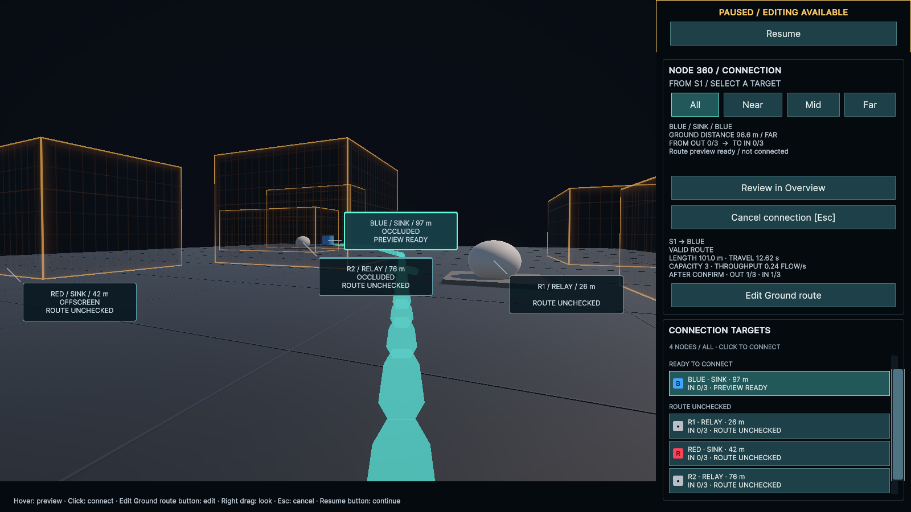
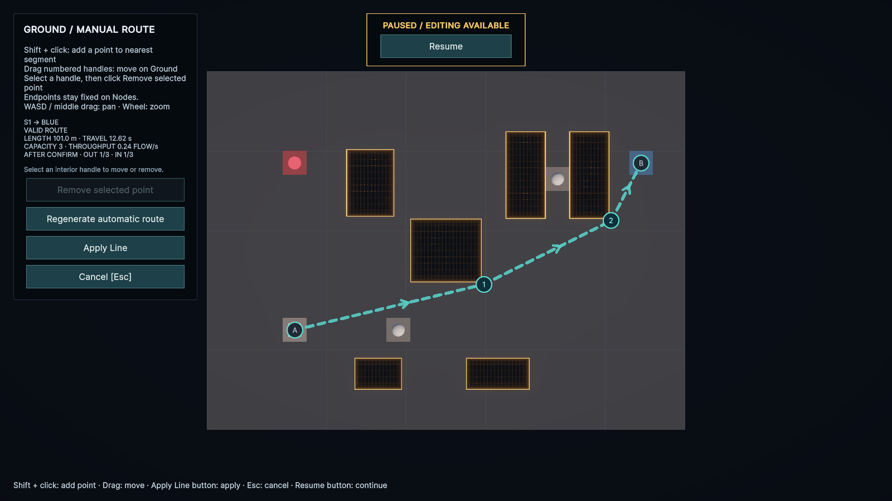
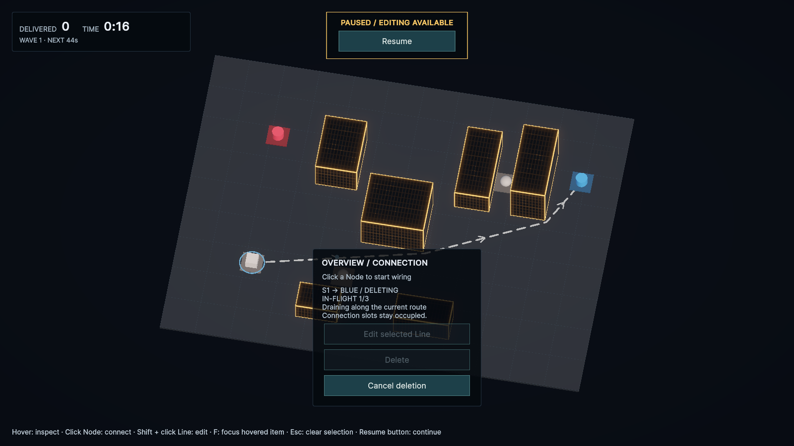

# v0.1のボタン操作とEscキャンセル（2026-09-25）

## 操作の変更

- 時間停止・再開は画面内のPause／Resumeボタンだけで行う。
- EscとCancelボタンは360・経路確認・経路編集を取り消し、元のOverviewへ戻す。Overviewでは選択と明示フォーカスを解除する。時間の停止状態、確定済みLine、FLOWを変更しない。
- 確定・編集・制御点削除・Undoは画面内ボタンを使う。Enter／Backspaceと従来のアクションキー割当を外し、UI ToolkitのNavigationSubmitによるフォーカス中ボタンの実行も止める。候補クリック、カメラ操作、Shift＋クリックは維持する。
- Lineの操作名はDelete、処理中はDELETING、取消はCancel deletionへ簡略化した。新規流入を止めて既存FLOWの排出を待つ仕組み、破線表示、完了までの接続枠保持は従来どおり。
- 接続パネルのinline表示が編集時のUSS非表示を上書きしていた問題も修正し、編集ボタンを遮らないようにした。

## 検証

mainの`f8c2842`を基点に作業。Unity 6000.4.7f1はuloop launchで起動し、同じプロジェクトのuloop経由でコンパイル・テスト・画面確認を実施した。

Redでは関連7件中6件が旧Esc動作、Enterによる実行、削除文言、パネル重複で失敗した。追加のキー廃止はC・Ctrl+Z・Deleteが動作することをテストで確認してから変更した。

UIの操作テストはキーボードSubmitからPointerDown／PointerUpへ変更した。実キーボード入力は仮想デバイスを使い、Pauseと配線の状態を直接確認する。Node候補テストでは実マウスを一時的に無効化してポインター移動による候補変更を避け、終了時に復元する。

- コンパイル：Error **0**、Warning **0**。
- 全EditMode：**158/158成功**。全PlayMode：**57/57成功**。
- 実画面ではPause・編集・Apply Line・DeleteをUI ToolkitのPointerイベントで操作し、Pauseを維持したまま配線を確定できること、削除中もIn-Flightを保持することを確認した。
- 画面確認後のConsole：Error **0**、Warning **0**。
- `git diff --check`：問題なし。Playerビルドは対象外。

## 画面

画面確認用のLineは実行中だけ作成し、WiringStageの初期配線0は維持する。

Node 360：ResumeボタンとCancel connection [Esc]。Enter／Backspaceによる確定・取消の案内は表示しない。

経路編集：Apply Line／Cancel [Esc]を表示。接続パネルを隠し、編集ボタンと重ならない。

削除中：DELETING、In-Flight **1/3**、Cancel deletionを表示。既存FLOWが排出されるまでLineと接続枠を保持する。

確認後はmainのUnityを起動したまま、WiringLabを配線0・Pause・SimulationDriver有効へ戻した。Resumeボタンで開始できる。
