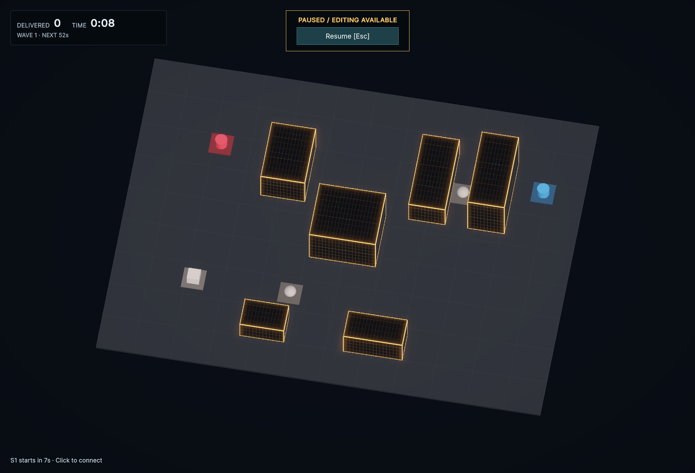
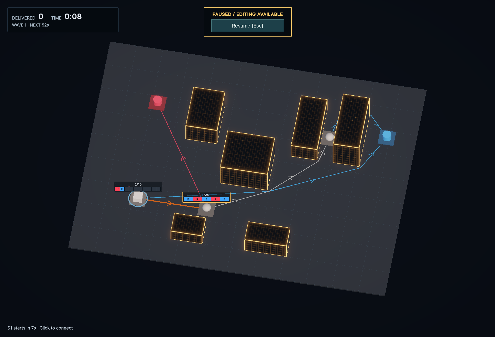
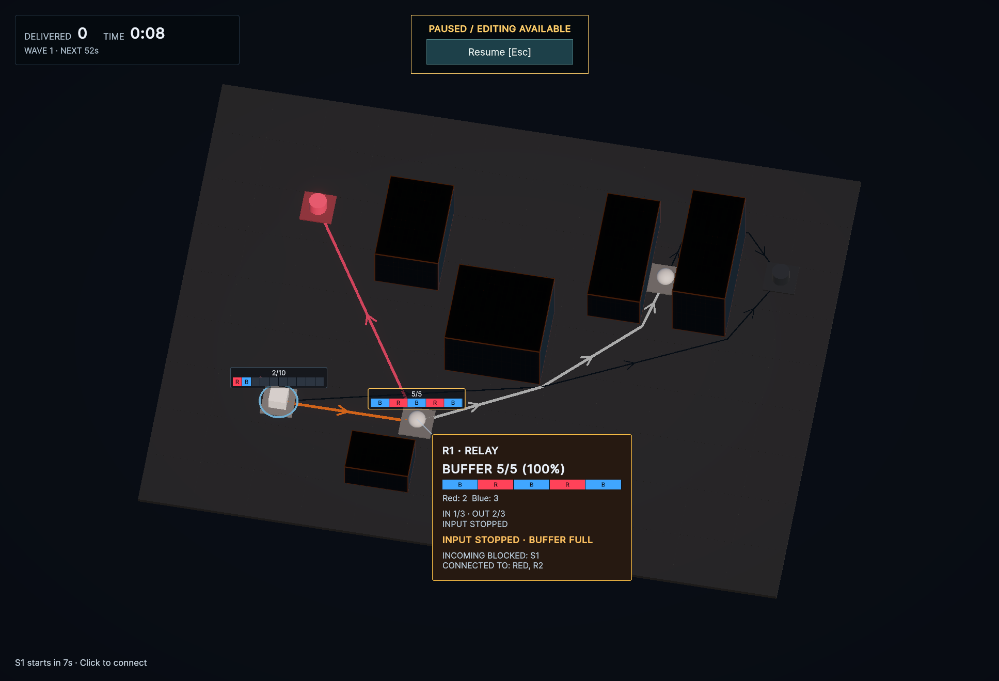

# 接続フォーカスと待機ゲージ（2026-09-22）

OverviewでNodeにホバーすると、対象Nodeと直接つながる入出力Line、その相手Nodeを明るく残す。建物の発光、地面、無関係なNode・Line・FLOW・Source演出・ワールドゲージを暗くする。隣のRelayから先へは強調を広げない。接続の追加・削除で対象が変わり、孤立NodeではそのNodeだけを残す。

ホバーを外すと元へ戻る。Fでフォーカスした場合はポインターを外しても保持し、Homeまたは空白クリックで解除する。Node 360・経路編集では接続確認用の減光を解除し、候補とPreviewを通常どおり表示する。暗くした要素の当たり判定や輸送状態は変更せず、共有Materialも書き換えない。

Node名・種別の常設ラベルを削除した。Source／RelayはBufferに待機FLOWがある間だけ、色・頭文字・空き枠・実数／容量のゲージを表示する。空BufferとSinkは表示しない。Sourceの80%警告・満杯時の猶予秒数はゲージへ添え、ホバー詳細・基本HUD・画面端の警告は維持する。

## 検証

- Buffer表示の仕様テストを先に更新し、Node名が残ること／空ゲージが見えることで3件失敗を確認。実装後の関連PlayModeは **15/15成功**。
- 接続フォーカスのテストを先に追加し、Node・FLOWが暗くならないことで3件失敗を確認。実装後の関連PlayModeは **17/17成功**。
- 孤立Nodeとゲージ減光・復帰も確認し、最終の全PlayModeは **53/53成功**。混雑・削除予約・経路切替・ホバー・Node 360・Wave・Pause・Source警告の回帰を含む。
- コンパイルError / Warning **0**。uloopで撮影し、撮影後ConsoleもError / Warning **0**。
- Unity Editor内で検証。Domain / Applicationの変更はなく、今回EditModeとPlayerビルドは実行していない。
- 撮影用のネットワークは破棄し、WiringLabをLine 0・Buffer 0・Pause・SimulationDriver有効へ戻した。

## 画面

配線0・空Bufferでは常設Node情報を表示しない。

待機中のSourceとRelayだけゲージを表示する。比較用にPause中のネットワークを用意した。

同じ状態でR1にホバー。S1→R1、R1→RED、R1→R2とそのNodeを残し、BLUE方面のLine・Nodeと建物を暗くする。混雑中のS1→R1は橙を保つ。

