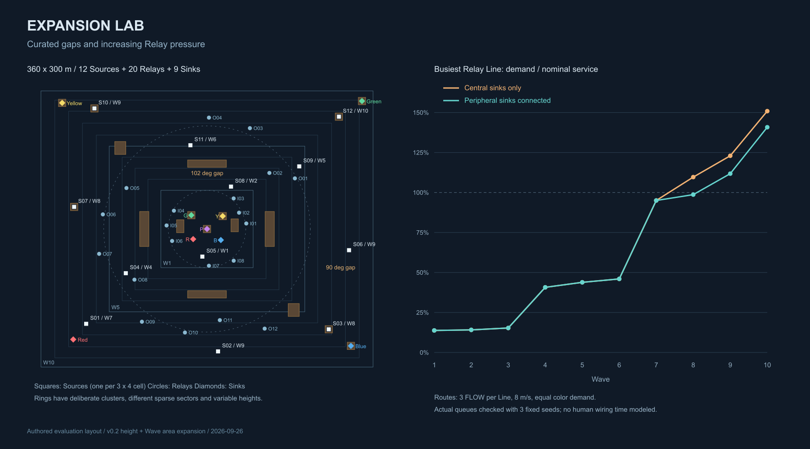
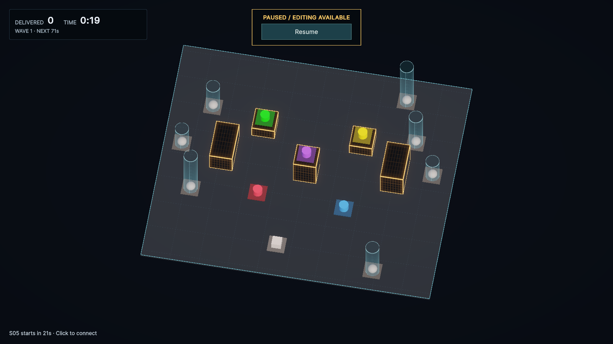
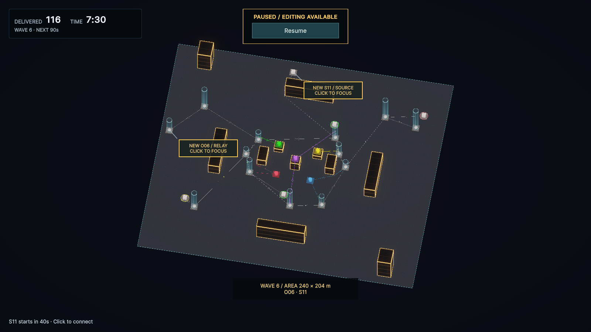
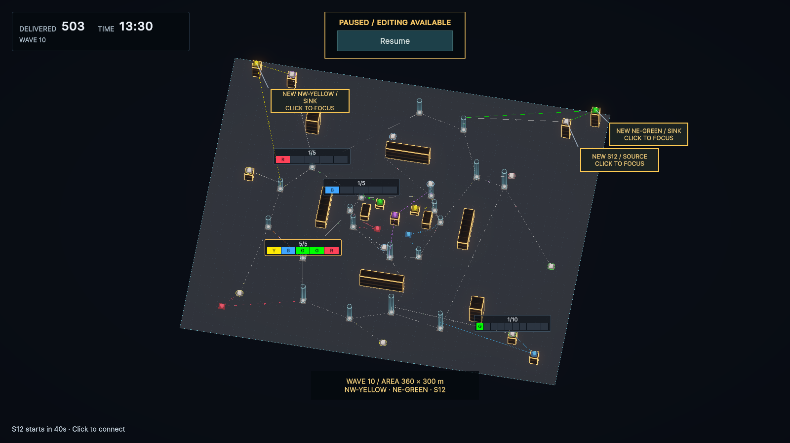
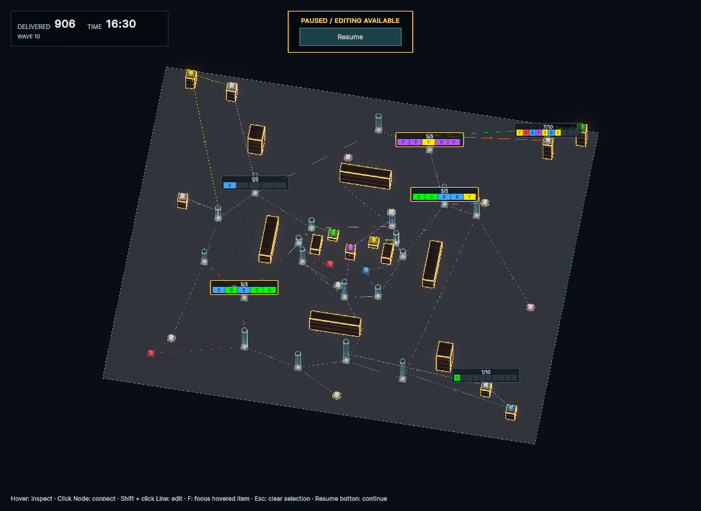

# ExpansionLab：広域・高さ・Wave別の負荷評価

新規シーン `Assets/CityFlow/Scenes/ExpansionLab.unity` を作成した。初期100×84 mから最大360×300 mへ同じネットワークを保って拡張する。[#19](https://github.com/OrthogonalInteractive/CityFlow/issues/19)の実装と、Relayの偏り・Source需要の増加を含む評価用レベルを兼ねる。PLATEAUモデルを使用する東京駅シーンとは別の、配置を調整しやすい人工都市である。

レベル・数値は暫定採用。中央集中配線が終盤に詰まり、外周Sinkの利用で改善する差をDomainシミュレーションで確認した。人が配線する時間・操作負荷・楽しさの最終評価は含まない。

## 配置



- 中央に5色Sink。Red／BlueはGround、Yellow／Greenは6 m、Purpleは12 m。
- 外周SinkはSW Red、SE Blue、NW Yellow、NE Green。最大矩形の角から位置をずらし、高さは0／12／18／24 m。4隅なのでPurpleは中央だけに残す構成とした。
- Relayは内周8基（半径39〜45 m）、外周12基（半径91〜125 m）。各基IN 3／OUT 3、Buffer 5。高さ能力10〜32 m、ステージ上限40 m。
- 内周の角度間隔は19〜102°、外周は12〜90°。内周の北側、外周の東〜南東側を空け、密集区間から短い接続だけで一周できない構成とした。配置は保存済みの固定値。
- Sourceは全域を3列×4行に分けて1基ずつ置く。計12基、うち4基を高所へ配置。登場後40秒の準備時間、その後に最初の生成間隔を経て生成開始。
- 建物は最大都市について開始前に固定する。高さを持つNodeの足元と、内外周間の迂回を作る障害物を配置した。
- 全Node間の3D距離は8 mより大きい。初期配線は0本。比較用配線はシーンに保存しない。

位置・高さ・解放Wave・建物Boundsの正確な値は[配置データ](data/expansionlab-layout.json)、再生成定義は `ExpansionLabSetup.Configure` を参照。上図のラベルは設計資料用で、ゲーム内の常設Nodeラベルではない。

## Waveと生成需要

各Waveは90秒間。Wave 10は810秒で解放する。以下の需要は全Sourceが準備を終えた後の定常値であり、追加直後の40秒は実際の流入が少なくなる。負荷率は外周Sinkを使う参考配線の最混雑Relay発Lineについての推定値。

| Wave | 開始秒 | 利用可能領域 m | Source / Relay | 1基の生成間隔 秒 | 需要 FLOW/秒 | Relay負荷率 |
| --- | ---: | --- | ---: | ---: | ---: | ---: |
| 1 | 0 | 100×84 | 1 / 7 | 12 | 0.083 | 13.8% |
| 2 | 90 | 128×108 | 2 / 8 | 7.8 | 0.256 | 14.1% |
| 3 | 180 | 156×132 | 2 / 9 | 7.2 | 0.278 | 15.3% |
| 4 | 270 | 184×156 | 3 / 11 | 7 | 0.429 | 40.7% |
| 5 | 360 | 212×180 | 4 / 12 | 6.5 | 0.615 | 43.9% |
| 6 | 450 | 240×204 | 5 / 13 | 6.2 | 0.806 | 46.0% |
| 7 | 540 | 270×230 | 6 / 18 | 6 | 1.000 | 95.0% |
| 8 | 630 | 300×256 | 8 / 20 | 5.2 | 1.538 | 98.7% |
| 9 | 720 | 330×280 | 11 / 20 | 5.1 | 2.157 | 111.8% |
| 10 | 810 | 360×300 | 12 / 20 | 5 | 2.400 | 140.8% |

Wave 3はSourceを増やさず、外周への足場を先に1基解放する。Wave 7で外周の経路を広げ、Wave 8以降は遠いSourceと外周Sinkを導入する。終盤はRelayが20基で頭打ちになる一方、Sourceが8→11→12基へ増え、生成も加速する。Relay追加で負荷が戻っていた初案は採用せず、総負荷・最混雑箇所の負荷の両方が毎Wave増すよう生成間隔を調整した。

## 中継能力の扱い

Line容量3、速度8 m/秒、Source Buffer 10、Relay Buffer 5、Source Overload猶予8秒を使用する。接続枠は固定で、未実装のPort Unit／Line幅は追加していない。

公称Line処理量を `3 × 8 / 実経路長` FLOW/秒とする。1つのFLOWがRelayを3回通れば、中継需要には3回分を数える。評価には次の指標を併用した。

1. **総中継需要／全Relay発Lineの公称処理量の合計**：外周活用配線ではWave 1の0.317／19.273（1.6%）から、Wave 10の8.000／36.797（21.7%）へ毎Wave増加する。
2. **最混雑Relay発Lineの需要／処理量**：約14%から141%へ毎Wave増加する。無負荷・低負荷のLineも含む総和には余力があっても、必要な色の行き先へ通じる経路は局所的に詰まる。
3. **配線全体の需要換算の実効能力**：各Source・各色について実際のDomainルーティングを通して通過Lineを集計し、最混雑Lineが100%となるSource流入量へ換算する。Wave 10は外周活用で約1.704 FLOW/秒に対し、需要2.400 FLOW/秒。中央集中では約1.591 FLOW/秒。
4. **実測の待ち行列**：Relay満杯時間、Source Buffer最大、Source警告時間、Line占有率、配送・生成数、Game Overを明示tickで記録する。

公称値は理論上の最適配線の上限ではなく、この参考配線の概算である。色は各20%を仮定する。混雑時の等距離代替は負荷を逃がし、受け取りBuffer停止は悪化させるため、100%超をそのまま敗北確定とは扱わない。総枠数や公称処理量の総和を使って「全Relayが飽和した」とも判断しない。

## 比較結果

`ExpansionLabEvaluation.Evaluate()` をEditModeの通常C#実行で呼び、同じ配置で次の2案を比較した。

- **中央集中**：内外周を双方向で接続し、4本の外周→内周接続と中央Sinkへの接続を使う。最終64本。
- **外周活用**：中央集中案に、外周Relay→近隣Sinkと近隣Source→同色Sinkの直結を各4本追加する。最終72本。同色直結優先の既存ルールを利用する。

生成色のシードは19010／19011／19012。各Waveの解放時に作成できる参考Lineを即時に追加し、990秒（Wave 10解放後180秒）まで進める。実行にはDomainの0.05秒tickを使用し、記録は0.5秒間隔。人の接続判断・操作時間・配線ミス・削除や再配線のコストは含まない。

| 配線 | Seed | 到達秒 | 配送／生成 | Wave 10最大Source Buffer | Wave 10 Relay満杯の累積秒 | 結果 |
| --- | ---: | ---: | ---: | ---: | ---: | --- |
| 中央集中 | 19010 | 987.95 | 866 / 984 | 11 | 555.75 | S12過負荷 |
| 中央集中 | 19011 | 987.95 | 866 / 984 | 11 | 477.75 | S12過負荷 |
| 中央集中 | 19012 | 987.95 | 872 / 984 | 11 | 407.75 | S12過負荷 |
| 外周活用 | 19010 | 990 | 906 / 992 | 7 | 167.0 | 評価時間まで継続 |
| 外周活用 | 19011 | 990 | 908 / 992 | 4 | 177.5 | 評価時間まで継続 |
| 外周活用 | 19012 | 990 | 909 / 992 | 3 | 285.0 | 評価時間まで継続 |

満杯秒は各Relayの満杯時間の合計で、複数Relayが同時に満杯なら重複して加算する。中央集中案はGame Over時点で停止しているため、最終時刻と生成数が異なる。Sourceは容量超過を敗北判定用に保持する既存仕様により11まで記録される。途中も含め、生成数＝配送＋Buffer＋In-Flightを確認した。

**評価上の結論：** 終盤の増加需要によって中継待ちが発生し、外周Sinkを活用する価値がある。外周活用でもRelay満杯は解消しきらず、特に北東側から中央への経路に圧力が残る。一方、3シード・990秒までの結果であり、Wave 10を無期限に維持できる保証ではない。序盤は中央5色への配線準備、中盤は外周への経路確保、終盤は流入の分散と再配線を評価する構成として採用した。

全Waveの測定値は[評価JSON](data/expansionlab-pressure.json)。比較配線の定義・能力測定・シミュレーションは `Assets/CityFlow/Editor/ExpansionLabEvaluation.cs` に集約している。

## 領域拡張の実装

`StageDefinition`が現在領域と最大領域を所有し、Waveは拡張後の矩形を持つ。開始前に全Waveを別のStageで検証し、実際の解放では領域とNode追加をまとめて検証・適用する。縮小、最大領域外、非有限値、衝突するNodeなどを拒否する。

Node・Line・FLOWの状態を作り直さず、既存実経路と削除待ち・経路切替待ちを保つ。建物は最初からDomainに存在し、画面では現在領域との交差部分だけ描画する。表示用Colliderも同じ部分へ合わせる。新しい障害物を既存Line上に出現させない。

経路探索と確定時の再検証、Overview移動制限、Home、最大ズーム、候補の距離帯、ミニカメラは現在領域を参照する。拡張でカメラを強制移動しない。Wave通知には領域の寸法を追加した。

## 検証と画面

- `uloop compile`：Error 0／Warning 0。
- 全EditMode：192／192成功。新規の領域拡張6件と、配置・全色配送・負荷設計3件を含む。
- Red：当初の均等に近いRelay帯、Node間隔不足、Wave 2でRelay負荷が減る設定の失敗を確認。配置と間隔曲線を修正してGreen。
- 全Waveで参考配線の接続枠が成立し、全Sourceから5色すべてを実際に配送できることを確認。
- **ExpansionLabのPlayModeテストは作成・実行していない。** Test Runnerとは別にuloopでシーンを起動し、時間を明示的に進めて画面確認した。
- 画面確認：Wave 1／6／10、最大領域の地面寸法、建物描画とColliderのBounds一致、全41Nodeの表示、Homeで画面外Node 0、Pause停止、拡張によるカメラ移動なし。1600×900と1036×757を記録。
- 終了後Console：Error／Warning 0。Playを停止し、初期配線0本の編集状態へ戻した。









最大領域の全景ではLineとNodeが小さくなる。局所の配線・高さ調整は既存のZoom／Fフォーカス／Node 360を利用する。画面の参考配線は比較用に自動配置したもので、初期シーンの状態ではない。

## 再評価

Unity Editorをuloopで接続し、次のコードを`execute-dynamic-code --code-file`でEditMode実行すると保存済みの設定から評価できる。

```csharp
System.IO.File.WriteAllText("/tmp/expansionlab-evaluation.json",
    CityFlow.Editor.ExpansionLabEvaluation.Evaluate());
return "Saved evaluation";
```

`Evaluate(10)`などの引数で、全Sourceの基本生成間隔だけを一時的に変更した比較も可能。アセット本体は変更しない。Wave間隔倍率はそのままなので、各Waveの実間隔は引数×倍率になる。レベルを編集した後は配置・全色到達性・毎Waveの負荷上昇をEditModeで再検証する。
