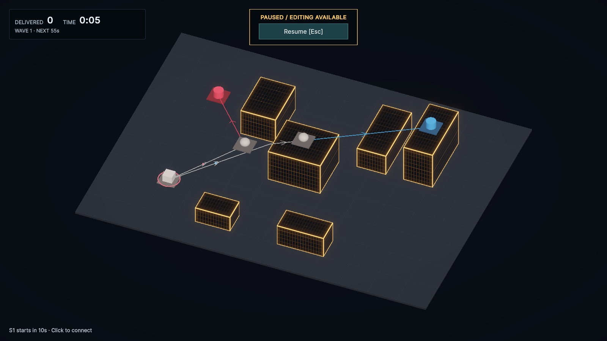
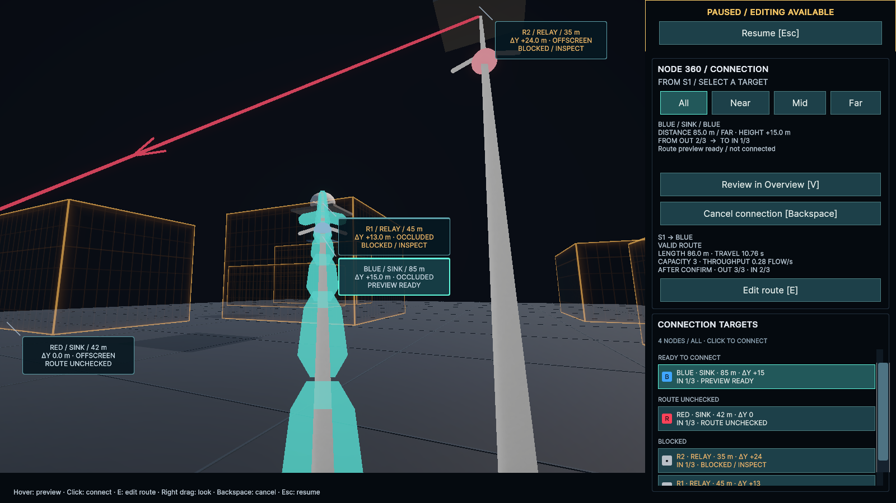
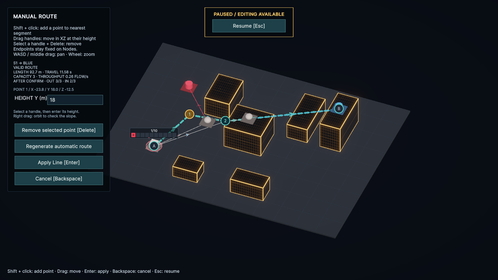

# 高さ方向の配線（v0.2 Δ1、2026-09-23）

このページは初期実装の履歴。2026-09-25に斜め配線と個別制御点のY編集を廃止し、Relayの高さ上限と垂直昇降へ変更した。現在の仕様・配置・操作は[Relay高さ制限の対応報告](Relay-Lift-2026-09-25.md)を参照する。

## 実装

屋上・空中Node、上昇／下降・上越しLine、全区間の3D建物衝突判定、3D距離による輸送と経路選択、高さを入力して行う手動編集を追加した。容量3・接続本数制・直結優先の配送は維持する。Port Unit、Width、複数候補、方向反転、PLATEAUは今回の対象外。

`StageConfiguration.MaximumAltitude`を0にすると従来のGround専用、正の値ならGroundから上限まで連続したY座標を使う。検証用HeightLabは暫定60 m。同じ6棟の都市、5 Node・0 Lineから始まり、R1とBLUEを屋上、R2を空中に配置する。Wave追加Nodeにも高さを設定した。WiringLab／BootstrapはGroundのまま。

自動探索は、建物の角と上面／下面の辺をサンプリングした3D可視グラフ＋A*。横迂回と上越しの長さを同時に比較する。有限グラフの候補なので、連続空間の厳密な最短経路を保証するものではない。高さのサンプルは探索内部の点で、固定高度レイヤーではない。

## 操作

HeightLabをPlayし、Source／Relayから候補に注目すると3D距離と高低差を表示する。EでOverviewの手動編集へ切り替え、Shift＋クリックで制御点を追加する。選択点の`HEIGHT Y (m)`に絶対Y座標を入力する。Enterは入力の適用、Apply Lineは接続確定。XZドラッグはその点のYを維持し、右ドラッグで斜めから確認できる。

端点はNodeに固定する。地下・上限外・建物を貫く区間は無効表示となり確定できない。運行中の高さ変更は新規流入を止め、既存FLOWが旧経路を排出し終えるまで切り替えない。

## 検証環境

並行開発から分離するため、基点`f8c2842`から`codex/v02-height`を作成し、`/private/tmp/CityFlow-v02-height`のworktreeと専用Unity 6000.4.7f1を使用した。コンパイル・テスト・シーン／アセット操作・撮影はすべて、このプロジェクトを明示したuloop経由。元のcheckout／Editorは操作していない。

## テスト

- Red: 高さ方向のEditMode 13件中11件が、旧Ground制約など意図した理由で失敗。
- Green: 全EditMode **171/171成功**。
- 関連PlayMode **3/3成功**。高さ入力、無効な高度での確定禁止、入力中Enterの誤確定防止、確定経路とLine／FLOW描画座標の一致、垂直矢印、編集中Orbitを確認。
- 最初の全PlayModeは55/56。Previewオブジェクト改名に追従していない既存テストの検索名を修正し、56/56成功。
- 画面確認で、接続パネルのinline表示がUSSの編集時非表示を上書きしていることを発見。関連テストでNone期待／Flex実値の失敗を確認し、表示時のinline指定を解除してUSSへ戻した。修正後の全PlayModeも**56/56成功**。
- 検証中にUnity EditorのQuick Search初期索引生成（`SearchDatabase.EnumerateAll`）で例外が出た。ゲームコードのスタックではなく、再度のテスト後も同じEditor側例外を確認した。撮影セッションのConsoleはError/Warning **0**。
- 最終コンパイルはError/Warning **0**。

EditModeには屋上・空中配置、3D実経路長と補間、上越し／下通過／斜め貫通、地面・高度上限、横迂回との比較、経路なし、上昇下降の移動時間とThroughput、手動Y編集、3D距離帯、Wave追加、In-Flight中の経路切替待ちを含む。既存のGround・配送・Buffer・Pause・Waveも回帰対象。

## 実画面

撮影用に接続とFLOWを作り、シミュレーションを止めて確認する。初期設定にこれらのLineを保存していない。画面確認は人による難度比較の代用ではない。

### Overview：屋上・空中Nodeへの上昇／下降

### Node 360：3D距離と高低差

S1→BLUEは直線距離85.0 m、高低差+15.0 m。自動生成した経路は中央建物を上越しし、実長86.0 m。

### Overview：高さ入力による経路編集

追加した制御点をY=18 mへ変更。実長92.7 m、移動時間11.58 sへ更新される。候補パネルは隠れ、入力欄と操作ボタンを遮らない。

確認後は専用EditorのPlayを止め、初期配線0のHeightLabを開いた状態に戻した。

## 検証範囲

Unity Editor内が対象。Playerビルド、大規模都市での性能測定、#12／#13の難度比較は未実施。
