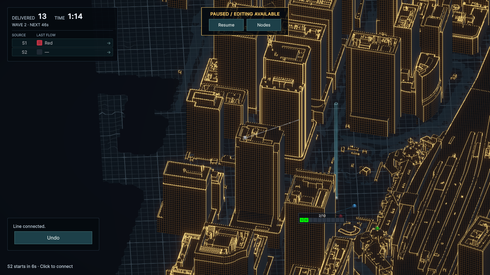

# 配線確定後のLine表出演出（2026-09-27）

Node 360で新しい配線を確定し、Overviewのカメラを復元した直後に、接続元から接続先へLineを描き進める。実経路長に沿った一定速度で、曲がり角・Relay直上の昇降を順に表示する。矢印は演出の先端が各矢印の位置へ到達してから表示する。時間は暫定0.9 UI秒。

Pause中も演出は進む。DomainのLineは確定時点で完成しており、接続枠・輸送・選択は演出完了を待たない。初期Line、失敗・取消、既存Lineの経路編集には演出を適用しない。別の配線を始めた場合やGame Overでは全長表示に切り替え、削除・Undo・状態変更時には演出を破棄する。

## 実装

`NodeConnectionController`が接続セッションの終了時に、360で確定されたLine IDを受け取り、Overview復元後に`ValidationCityView.RevealNewLine`へ渡す。描画済みのLineには再生しない。

`ValidationCityView.AdvanceLineReveals`はunscaledDeltaTimeで進み、確定経路の始点から途中までをLineRendererへ設定する。経路や状態の変更では既存の描画再構築とともに演出を破棄する。新しいシーン・再試行へ演出の状態を持ち越さない。

## 検証

- Red：新規4件のうち3件が、全長で即表示される現状を検出して失敗。Undo・削除の既存不変条件1件は成功。
- Green：関連PlayMode **46/46成功**。LineReveal、LineLifecycleView、NodeConnection、HeightInteraction、PauseInput、ConnectionFocus、ValidationCity、CongestionPresentation、TokyoStationWiringLab、Overview、NodeHighlight、NodeArrivalを実行。
- Pause中の候補行クリック、Overview位置の復元、始点からの描画、曲がり角、上昇→水平→下降の順序、矢印の出現、Snapshotと時計の不変を確認。
- 初期配線・重複接続失敗・取消で再生しないこと、次の360開始時の全長表示、演出中のUndo・削除取消、In-Flightの保持を確認。
- 東京駅Wave 2でS2→R2（338.56 m）を360から確定。実フレームで0 m→79.31 m→175.60 m→264.60 m→全長と進み、水平区間の後にRelay側を下降した。PauseとNetworkSnapshotを維持。
- 記録画像は描画を安定させるため、同じ配線を作り直して演出時計を0.25秒／0.75秒へ明示的に進め、uloopのStepとscreenshotで撮影。各時点の表示長は94.04 m／282.13 m。
- コンパイルError／Warning **0**。テスト後Console Error **0**、既知のPLATEAU橋梁メッシュの大きな三角形に関するWarningあり。画面確認後もError **0**、キャプチャに伴うmemoryless depth surfaceのload／store Warningが2件。ExpansionLabのPlayModeテストは実行していない。
- 検証後はPlay Modeを停止し、Game Viewを1800×1000へ、検証用設定も元に戻した。検証用配線・進行・一時的な描画停止は保存していない。

0.25秒：屋上Sourceから水平区間の途中まで表示。

0.75秒：水平区間が完了し、Relay側の下降区間を描画中。

