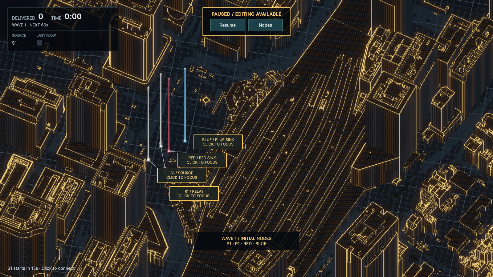
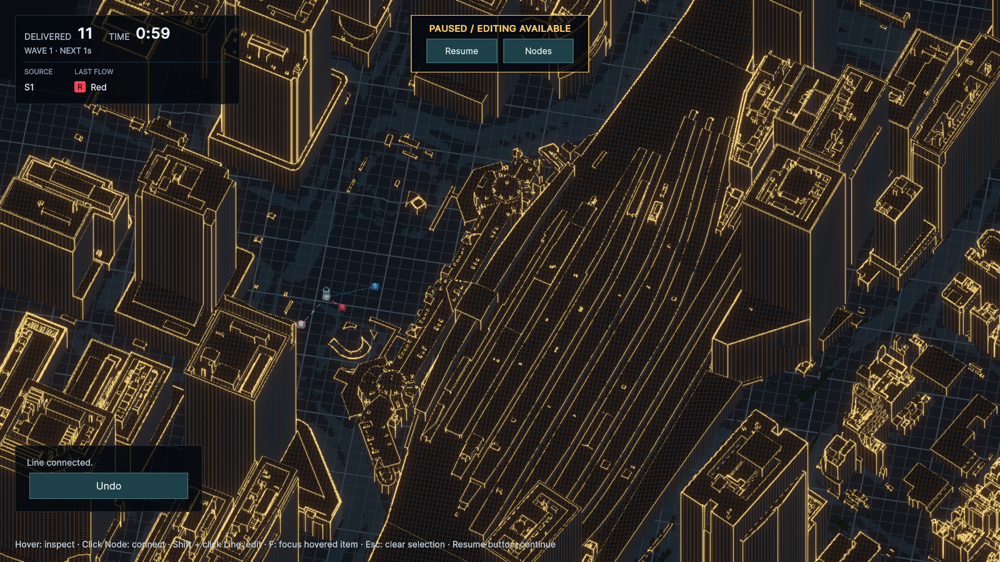
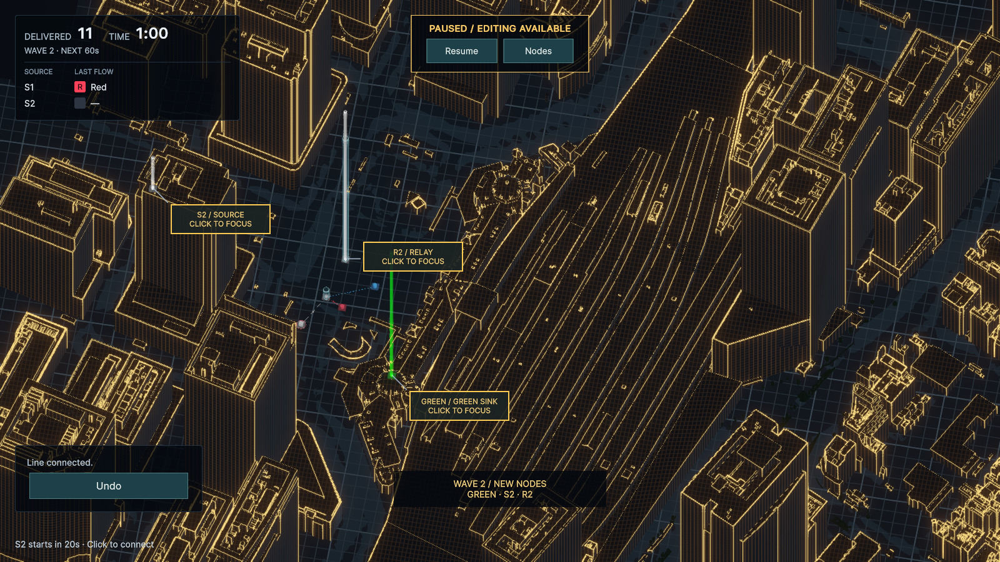
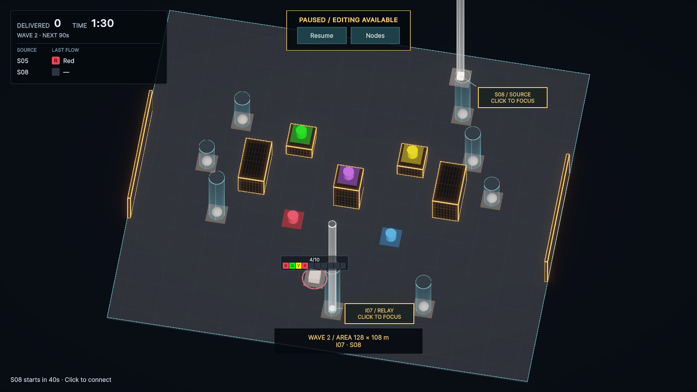

# 初期配置・Wave追加のNode出現演出（#20、2026-09-27）

開始直後のNodeを見つけやすくするため、初期配置にも自動で光る柱を表示する。Nodes: ONと同じ円柱を使い、Source／Relayは白、Sinkは目的色とする。Wave追加も同じ表現で、既存Nodeの演出は繰り返さない。東京駅では初期4 Node、Wave 2で追加3 Nodeを区別して確認できる。

## 採用内容

- 柱は8ゲーム秒表示し、最後2秒でフェード。本体は最初0.65秒で60%から通常サイズへ拡大し、発光する。柱の光量はNodes: ONより強めにし、東京駅の建物の輪郭の中でも位置を把握しやすくした。長さ・光量・時間は見た目の暫定値。
- 柱は配置高度から、ステージ天井と建物上端の高い方＋12 mまで。高さ能力の目盛りは付けない。柱の選択は同じNodeへ渡し、配線高度には使わない。
- 初期にも「WAVE 1 / INITIAL NODES」と種別・Sink色付きマーカーを12ゲーム秒表示。画面外でもマーカーからフォーカスできる。Wave通知と領域拡張通知は継続する。
- 演出開始時点から配線可能。Sourceの生成猶予はNode追加時点から計り、Sink登録後に生成色が有効になる既存の順序を維持する。演出の長さで生成開始やWave進行を遅らせない。
- Pause／Resumeで演出も停止・途中再開する。**#20本文のEsc停止は、現行の仕様§14とAGENTS.mdに合わせてPause／Resumeボタンへ読み替えた。Escは選択・編集キャンセル専用。**
- Node 360／経路編集中は柱を隠し、Overviewへ戻ると残り時間分を表示する。時計が進んでいればその間にも演出時間が進む。Nodes: ONの手動表示を優先し、ボタン解除で出現演出をやり直さない。
- Game Overで演出を終了。Retryで新しい初期Nodeから再生し、旧Node・柱・マーカーを残さない。効果音は追加していない。

`ValidationCityView`が描画とゲーム時計の参照を担当する。位置・接続枠・Buffer・In-Flightの正本はDomain、追加順序・生成時計はApplicationのまま。シーン・Stageアセット・難度設定は変更していない。

## 検証

- Red：新規PlayMode 3件が初期／Wave出現の柱がないことで失敗することを確認。
- 最終PlayMode **53/53成功**。NodeArrival、NodeHighlight、HudPresentation、HoverHud、WaveSession、PauseInput、TokyoStationWiringLab、RelayHeightVisual、Overview、ConnectionFocus、NodeConnection、ValidationHudを実行。
- 最終EditMode **15/15成功**。WaveTests・AreaExpansionTestsでSource準備猶予、新色Sink先行登録、状態保存、Pause、領域拡張を回帰確認。
- 新規テストは初期同時出現、色・種別、即時配線、Pause中の明るさ・サイズ・Snapshotの保持、途中再開・フェード・消灯、手動Nodes表示との共存、高所Source／Relay／Sinkの同時追加、既存Nodeの維持、画面外フォーカス、Node 360との往復、Game Over／Retryを確認。
- 東京駅を1600×900・1036×757で確認。開始時4本、Wave 2の60秒でS2・R2・GREENの3本だけが出現し、68秒で消灯する。通常のRelay能力表示は残る。
- ExpansionLabは**PlayModeテストを作成・実行していない**。uloopで13 Nodeの初期表示と89.95→90秒の128×108 mへの領域拡張を確認。柱は新規I07・S08の2本だけで、カメラを強制移動せず通知と併用できる。
- コンパイルError／Warning **0**、実画面確認後のConsole Error／Warning **0**。確認後はPlay Modeを停止し、検証用の配線・進行を破棄。TokyoStationWiringLabを開き、Play設定・バックグラウンド設定・Gameビューサイズを検証前に戻した。

## 再現手順

1. uloopでTokyoStationWiringLabを開いてPlayする。開始時のS1・R1・RED・BLUEに自動で柱が立ち、初期Node通知が出る。
2. 8秒以内にPauseボタンを押す。柱の明るさ・本体の拡大・フェードが止まり、Resumeで途中から継続する。演出中でもNodeを選んで配線できる。
3. S1→R1、R1→RED、R1→BLUEを接続して60秒まで進める。S2・R2・GREENだけに柱が立つ。S2の準備猶予は20秒で始まる。
4. 66〜68秒で柱が消え、72秒で出現マーカーが消える。Pause中にNodesをON／OFFしても、古い出現演出は再生しない。
5. Game Over後にRetryし、初期4 Nodeの柱から再開することを確認する。

[Wave 2の8秒間の記録](screenshots/tokyo-node-arrival.mp4)は、uloopでゲーム時計を1/6秒ずつ進めた49枚の実レンダリングを動画化したもの。動画の30fps化はフレーム複製で、実行性能の計測ではない。

開始直後：

Wave 2の出現直前（59.95秒）：

Wave 2の出現直後（60秒）：

領域拡張時：

