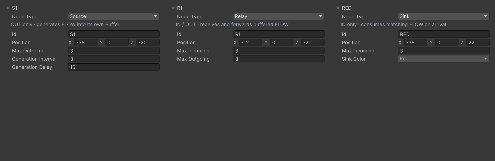
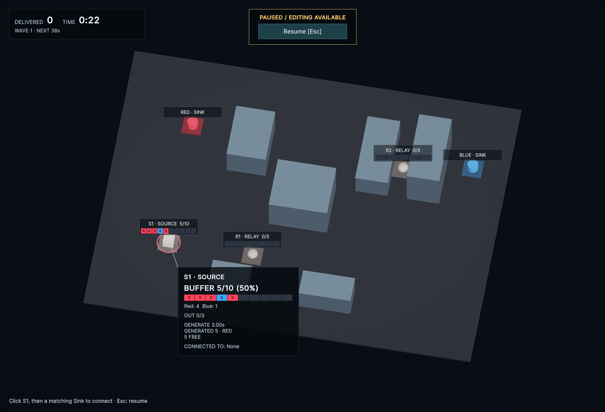
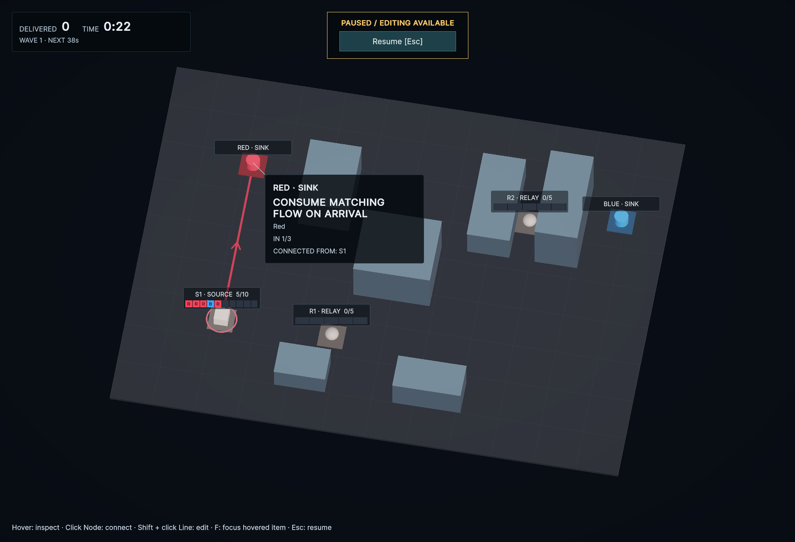

# Node方向の型分割（2026-09-22）

SourceはOUTのみ、RelayはIN／OUT、SinkはINのみを正式なv0.1仕様として採用した。NodeDefinitionとNodePlacementを種別ごとの3型に分け、Kindは型から決まる。SourceのIN、SinkのOUT、Relay／Sinkの生成設定は構築引数・保存フィールドを持たない。

初期配置と全WaveをSerializeReferenceへ移行し、位置・有効な接続上限・Sourceの生成値・Wave時刻／倍率・初期Line・アセットGUIDを維持した。SourceへのLineとSinkからのLineはDomainで拒否し、Sourceは候補から除外する。無効なSource指定で以前の別候補を誤確定しない。

Sourceの満杯はIsBufferFull、Relayの受け取り停止はIsInputStoppedで区別し、既存のOverload猶予・警告・FLOW色を維持する。ホバーはSourceのOUT・送り先、SinkのIN・送り元、RelayのIN／OUTを表示する。

## 検証

- uloop compile: Error 0 / Warning 0。撮影・初期状態復帰後のConsoleもError 0 / Warning 0。
- 全EditMode: 146/146成功。型付き配置のシリアライズ往復、初期配置・Wave、生成設定、接続の方向制約、Inspector種類変更・Undoを含む。
- 全PlayMode: 48/48成功。配線・候補・ホバー・警告・色付きBuffer・Waveの回帰を含む。
- ホバーテストは仮想マウスを使う間だけ他のMouseデバイスを無効化し、finallyで元へ戻す。実マウスによるMouse.currentの置換を検証に混ぜない。
- Unity Editor内で確認。Playerビルドは対象外。

## 画面

uloopで撮影。Inspector比較は、実際のWiringStageのS1・R1・REDを同じPropertyDrawerで3列に並べた確認用Editorウィンドウ。通常のInspectorでも同じ項目を編集できる。種類変更はID・位置と共通する接続枠を保持し、Undoできる。

SourceはOUT 0/3と生成・Buffer・送り先だけを表示し、INと入力停止表示を持たない。

SinkはIN 1/3と送り元S1を表示し、OUT・生成・Bufferの項目を持たない。

ゲーム画面は撮影用FLOWを追加してPauseした制御検証。終了後はWiringLabを再起動し、Line 0・Buffer 0・Pause・通常SimulationDriver有効へ戻した。
