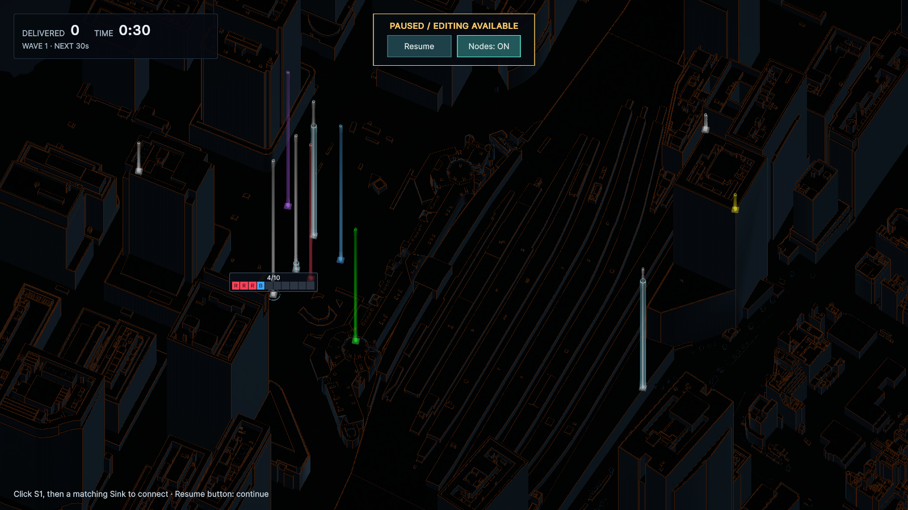
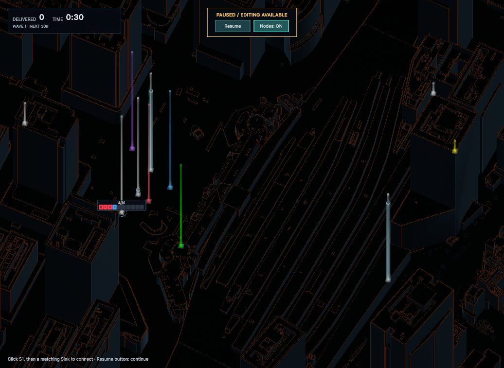

# Pause中のNode強調表示（2026-09-26）

Pause／Resumeの横に **Nodes** ボタンを追加した。Pause中のOverviewで押すと **Nodes: ON** となり、Source・Relay・Sinkを明るく残して、建物・地面・Line・移動中のFLOWを暗くする。再度押すと解除する。通常のホバー・Fフォーカスよりも全Nodeの強調を優先する。

各Nodeから上向きに目印の柱を表示する。Source・Relayは白、Sinkは目的色で、柱のホバー・クリックでも元のNodeを選択できる。Source／Sinkの固定高度やRelayの能力を変えず、クリックした高さを経路高度には使わない。既存Relayの高さ表示・Shift＋クリックによるLine編集も維持する。

目印の直径2.4 m、上端を「ステージ天井と建物Bounds上端の高い方＋12 m」に揃える設定、色と透明度は見た目の暫定値。能力を示すRelayの柱と区別するため、目印には1 m間隔の帯を付けない。Colliderと影を持たず、建物や輸送の状態を変更しない。

配線・経路編集に入ると強調を一時解除し、PauseしたままOverviewへ戻ると復元する。Resume・Game Over・HUDの無効化で解除し、次のPauseには持ち越さない。ボタンは実行中・配線中・Game Overでは無効。Enter等のキーボードSubmitでは動作しない。

## 検証

- Red：ボタンがない旧実装で新規PlayMode 3件の失敗を確認。
- Green：新規3件成功。全Nodeの強調、他要素の減光、柱の配置高度・色の維持・Collider不在、追加Node、高所Sourceの柱選択、Pause中のSnapshotと時計の不変、配線開始／取消・再開・Game Over・HUD再生成を確認。
- 関連PlayMode **38/38成功**。PauseInput、RelayHeightVisual、ConnectionFocus、NodeConnection、Overview、ValidationHud、HudPresentationを含む。ExpansionLabのPlayModeテストは作成・実行していない。
- `TokyoStationWiringLab`に実行時だけWave追加予定のNodeを配置し、11 Nodeすべての柱と屋上S2の柱選択を確認。シーン・Stageアセットには検証用配置を保存していない。
- 1600×900、1036×757でPause／Nodesボタンの配置と柱の視認性を確認。
- コンパイルError／Warning **0**、画面確認後のConsole Error／Warning **0**。Play Modeを終了し、検証用配置を破棄。Play・バックグラウンド設定とGameビューのサイズは検証前に戻した。

