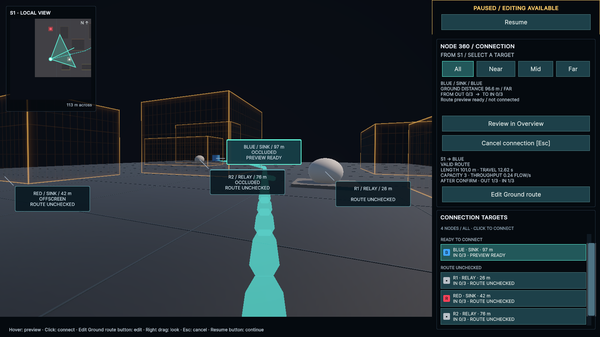
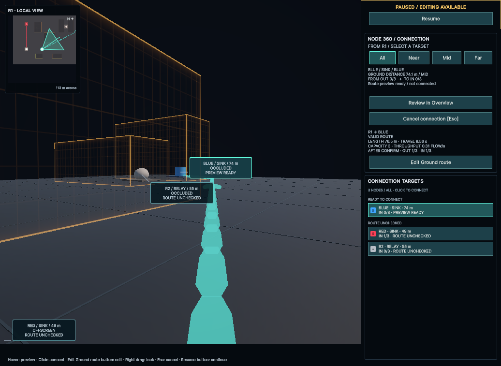

# Node 360の見下ろしミニカメラ（2026-09-25）

## 実装

- 360中だけ左上へ見下ろしミニカメラを表示する。接続元のSource／Relayを中心に固定し、候補をホバーしても中心は移動しない。
- 北（+Z）を上に固定し、中央の点で始点、扇形で水平視野、中央線で正面を示す。Pause中も視線・Previewを更新する。
- 同じシーンを直交投影カメラからRenderTextureへ描画するため、建物・Node・既存Line・FLOW・Previewの状態を共有する。メインの360で非表示になる始点は中央のUIマーカーで示す。
- 現在の表示範囲は約113 m四方（Near上限×1.5を半径にする暫定値）。中心を守るため、ステージ外は空白になる。
- UI Toolkitの表示専用パネルとし、候補マーカーはパネルを避ける。候補一覧・接続操作はそのまま使える。
- Overview・手動編集・Game Overでは非表示にしてカメラ描画を止める。512×512のRenderTextureとカメラは再利用し、View無効化・シーン破棄で解放する。ミニカメラには影・ポスト処理・AudioListenerを追加しない。

## 検証

mainの`e5c46b6`を基点に、Unity 6000.4.7f1とuloopで実装・検証した。先に中心固定・モード切替・リソース寿命のテストを書き、未実装のパネルが見つからないことで2件とも失敗することを確認した。

新規PlayMode **3/3成功**。Source中心、候補変更時の固定、北上固定、Pause中の視線操作、メインカメラへの非干渉、候補一覧との非重複、Overview・編集・Game Overでの停止、Relayへの中心変更、UIDocument再生成時の画像再接続、シーン破棄時のカメラとRenderTextureの解放を確認した。

全PlayMode **61/61成功**。コンパイルと最終ConsoleはError／Warning **0**、`git diff --check`は問題なし。今回はPresentationとCompositionの変更としてPlayModeで回帰確認し、EditMode・Playerビルド・GPU負荷の定量測定は実行していない。

## 実画面

S1を中心にBLUEへ注目。左上のミニカメラに周辺Node・建物と、右上へ延びるPreviewが映る。

R1へ入り直した状態。R1が中央になり、S1 → REDの確定済みLineとR1 → BLUEのPreviewを同時に確認できる。1036×757のGame Viewでも候補一覧と重ならない。

撮影用の確定済みLineは実行中だけ作成し、WiringLabの初期配線0は維持する。

終了時はUnityを起動したまま、WiringLabのS1の360モード・Pause・配線0へ戻した。BLUEへのPreviewとミニカメラを表示しており、EscでOverviewへ戻るか、候補クリックで配線を開始できる。
