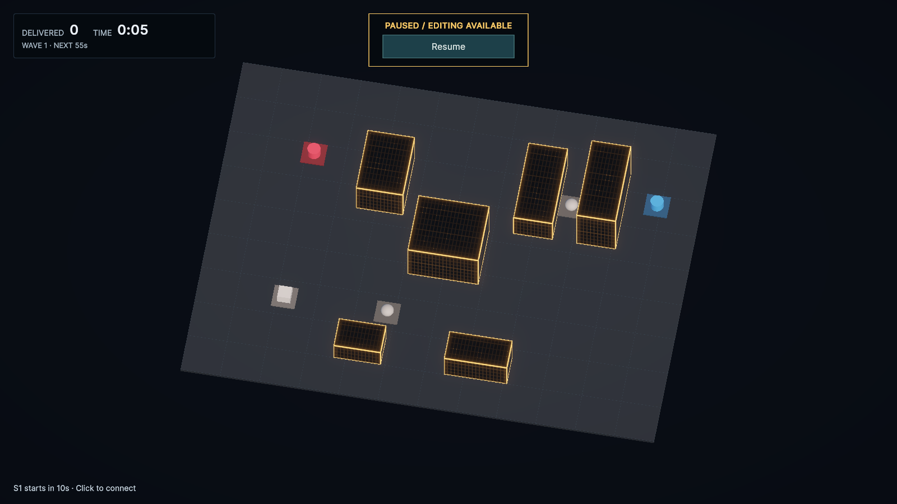
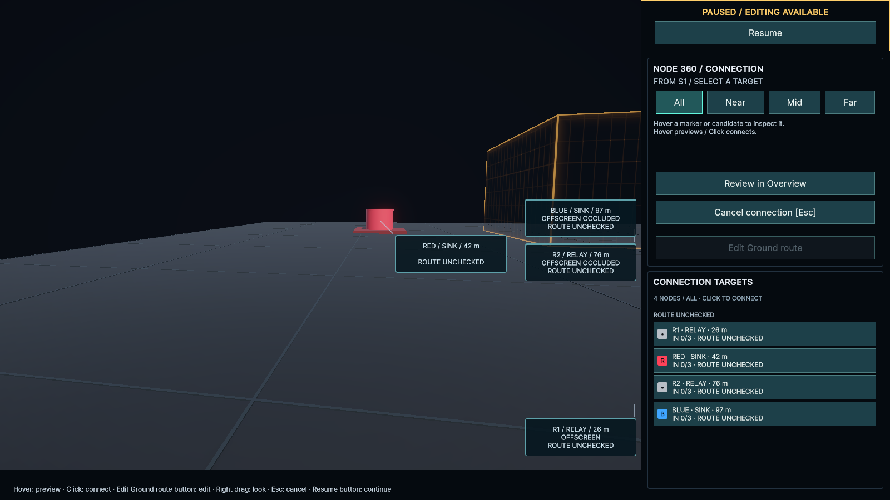

# Node 360の候補ホバーと初期方向（2026-09-25）

## 変更

- CONNECTION TARGETSへのホバーで、一覧に重なるNode詳細ポップアップを表示しない。固定の候補情報・注目方向・経路Previewは更新し、クリック接続も維持する。始点ラベルとワールドのNode／候補マーカーは従来の詳細ホバーを利用できる。
- 360へ入るとき、直前のOverview画面の上方向をGround面へ投影した方角を正面にする。以前の「選択Nodeからステージ中央を向く」処理を外し、どのNodeでも同じ画面方位を引き継ぐ。経路確認でOverviewと往復する場合は、最後に見ていた360の方向を保持する。
- 終了時は元のOverview位置・回転を復元する。配線・FLOW・停止状態のルールは変更しない。

## 検証

Unity 6000.4.7f1、mainの`33c4187`を基点に実装。uloop経由でコンパイル・PlayModeテスト・実画面を確認した。

先に2件の再現テストを追加・更新し、旧実装では「候補一覧でポップアップが表示される」「S1から画面上方向を向かない」という意図した理由で失敗した。

方向のテストは3つのOverview角度とS1／R1／R2の組み合わせで、画面中央と上側からGroundへ投影した方向と、360の正面が一致することを確認する。任意の方向を見た後のOverviewとの往復、キャンセル時の復元も検証する。ホバーのテストは始点の詳細表示から一覧へ移動してポップアップが消えること、Previewと固定の候補情報の更新、クリックによる接続を検証する。

- 全PlayMode **58/58成功**。コンパイルError／Warning **0**。
- 撮影時も候補行`candidate-option-BLUE`へのヒット、`TargetId = BLUE`、詳細パネル`display: none`を確認した。
- Overviewの画面上方向と360の正面を水平面で比較した内積は **0.9999999**。
- 画面確認後Console Error／Warning **0**。`git diff --check`は問題なし。
- 今回はPresentationの変更のためPlayModeで回帰確認し、EditModeとPlayerビルドは再実行していない。

## 画面

進入前のOverview。S1は左下の立方体で、画面上方にREDが見える。

S1の360に入った直後。ステージ中央へ向き直らず、Overviewの画面上方向を正面にしている。

CONNECTION TARGETSのBLUEをホバーした状態。固定欄とPreviewが更新され、一覧に詳細ポップアップが重ならない。

確認後は撮影用の入力設定を復元し、Unityを起動したままWiringLabのOverview・配線0・Pause状態へ戻した。Resumeボタンで開始できる。
