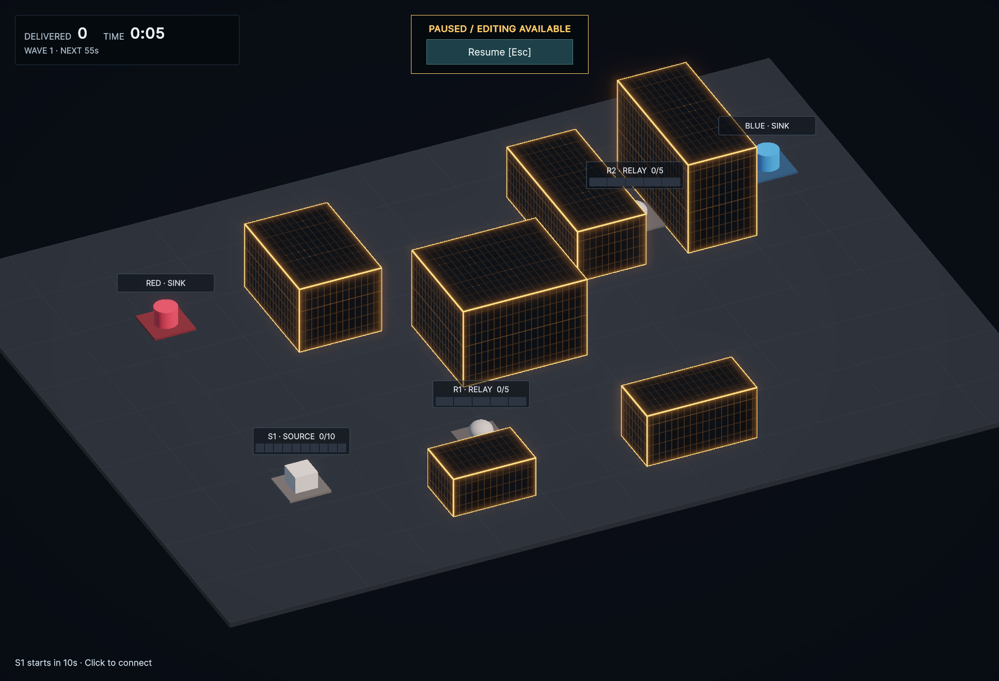
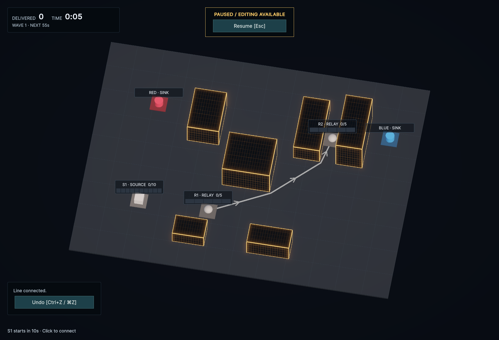
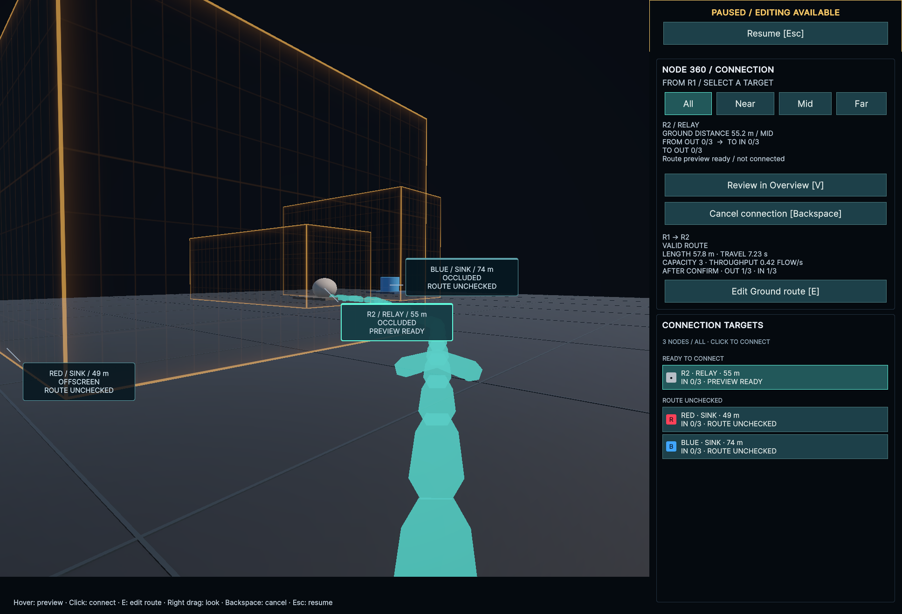

# テスト用障害物の外観（2026-09-22）

参照動画 `short_center_1080x1920.mp4` の建物から、暗いガラス調の面・金色からアンバーの発光枠・細かな外壁格子を取り入れた。BootstrapとWiringLabの6棟に共通マテリアルを適用する。配置・寸法・Ground上の配線ルールは維持する。

格子はOverviewで主張しすぎない明るさにし、屋根ではさらに抑える。外周の発光とBloomで輪郭を読み取りやすくする。Node 360では壁面と発光をまとめて半透明にし、奥のNode・経路を確認できる。確定後は元の不透明表示へ戻る。

## 調整箇所

- `CityFlow/Assets/CityFlow/Art/Materials/AmberObstacle.mat`：ガラス色、枠・格子の発光色、線幅、パネル寸法。寸法の単位はm。
- `CityFlow/Assets/CityFlow/Settings/Rendering/ObstacleGlow.asset`：Bloom。初期値はThreshold 1、Intensity 0.3、Scatter 0.55、Clamp 12。
- `CityFlow/Assets/CityFlow/Art/Shaders/AmberObstacle.shader`：Cubeの各面に格子と外周を描くURPシェーダー。距離に応じて細線を弱め、深度・法線・影のパスも持つ。

シーンがマテリアルとVolumeProfileを直接参照する。外観のために追加メッシュ・テクスチャ・外部パッケージを導入していない。従来の張り出すRoofとそのColliderを除去し、描画・物理・Line Routingが同じBoundsを使う。

## 検証

- 新規PlayModeテストを先に追加。旧表示は障害物Colliderが6棟に対して12個あり、意図した理由で失敗した。
- 実装後は全PlayMode **49/49成功**。追加テストは物理Transformを同期して、6棟すべての描画・Colliderの中心と寸法を設定Boundsと照合する。
- シェーダーの最終調整後、関連PlayMode **3/3成功**。
- uloop compileはError / Warning **0**。実描画後のShader診断も0件。
- uloopでOverview、近づいた視点、Node 360を撮影し、R1→R2の建物迂回Previewと接続確定を確認。
- Unity Editor内の検証。Domain / Applicationの変更はなく、今回EditModeとPlayerビルドは実行していない。
- 確認終了後はWiringLabをLine 0・Buffer 0・Pause・SimulationDriver有効へ戻した。Console Error / Warning **0**。

## 画面

すべてuloopのGameビュー撮影。動画は参照にのみ使用し、リポジトリにはコピーしていない。

