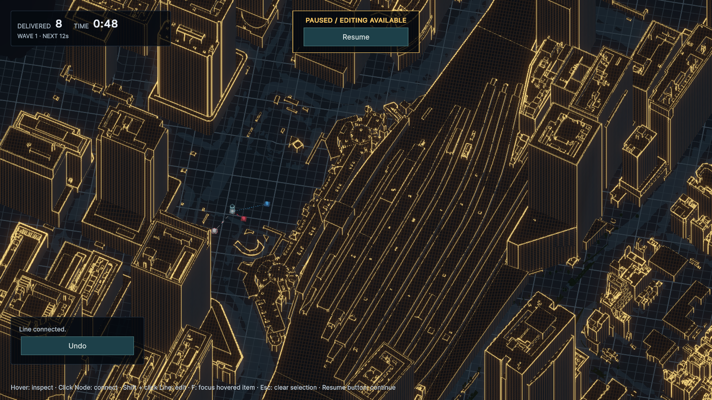
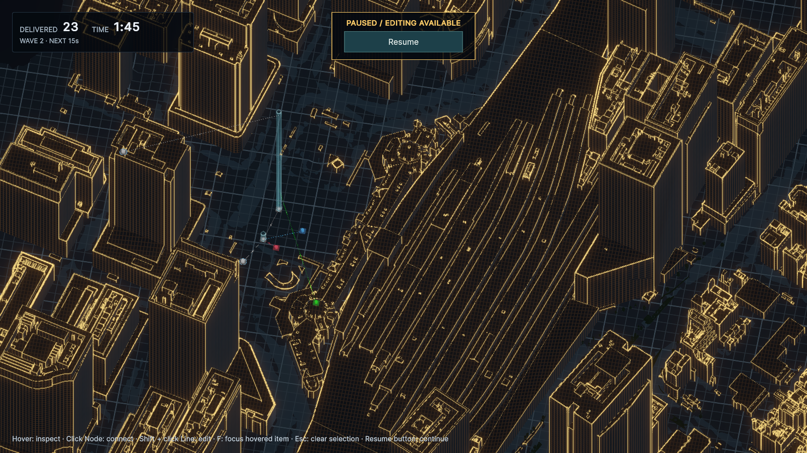
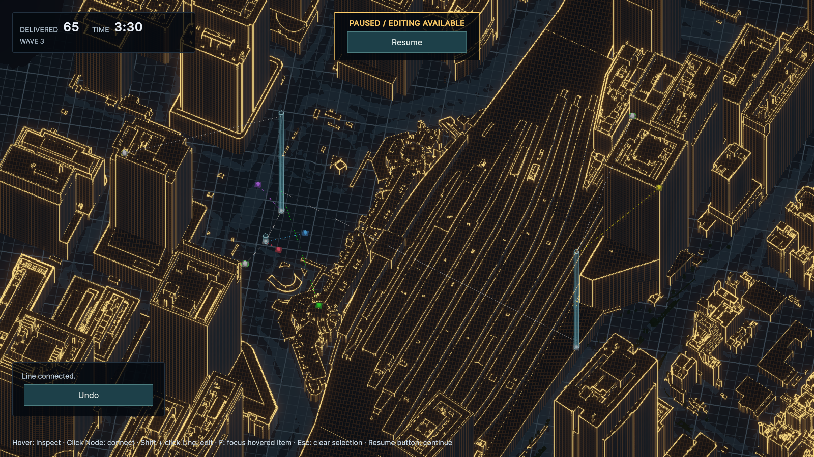
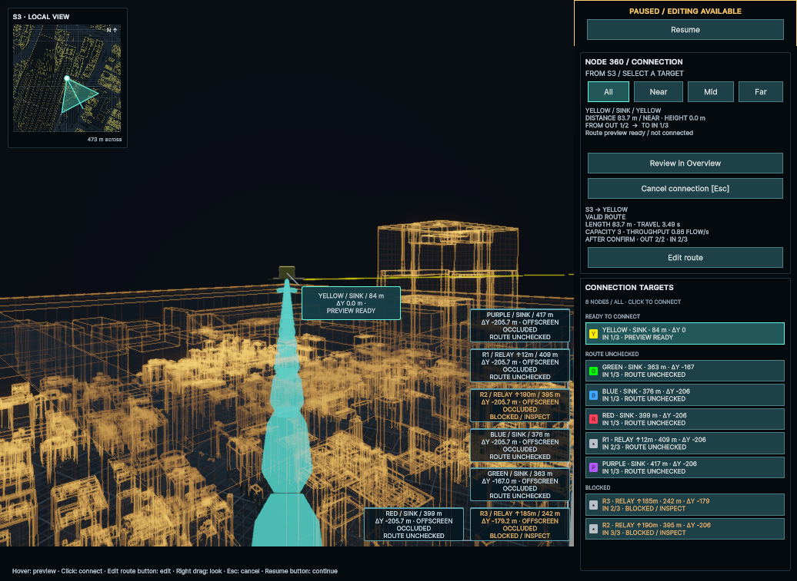
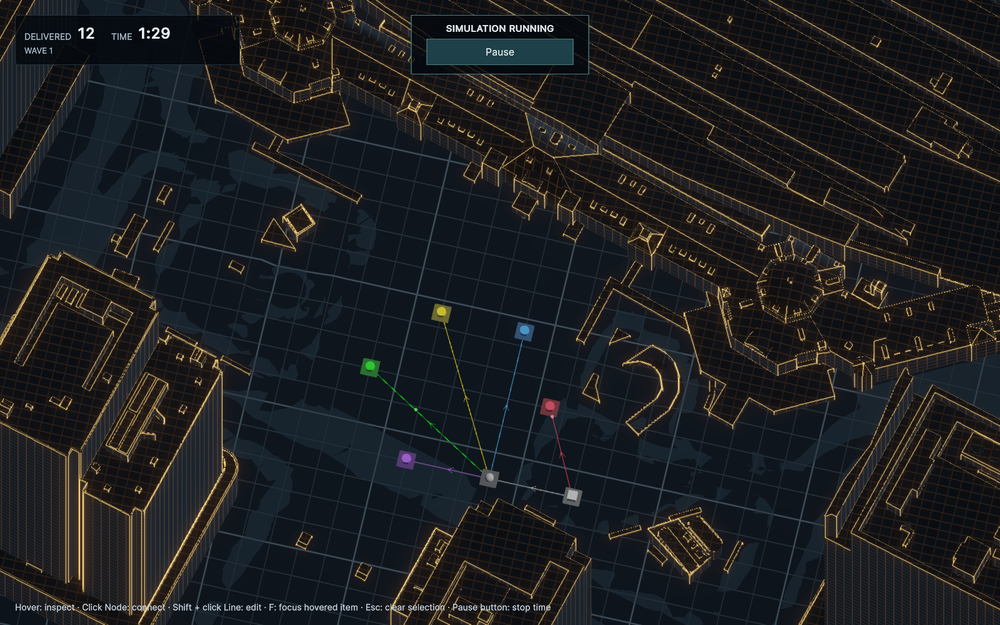
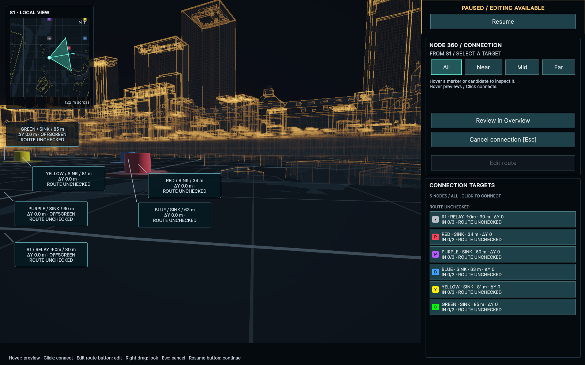

# 東京駅周辺の都市データ確認シーン

2026-09-26の依頼に基づき、提供されたCityGMLから都市確認用の `TokyoStationInspection` を作成。同日の追加依頼で、WiringLab風の派生シーン `TokyoStationWiringLab` の駅前を配線ゲームとして操作できるようにした。Inspectionは元の都市確認用シーンを維持する。

## 開く場所と操作

- シーン：`CityFlow/Assets/CityFlow/Scenes/TokyoStationInspection.unity`
- 生成モデル：`CityFlow/Assets/CityFlow/Art/PLATEAU/TokyoStation/`
- **Sceneビュー**で閲覧する。右ボタンを押しながらW/A/S/Dで移動、Q/Eで上下、ホイールで速度調整。選択した建物をFでフレーム表示できる。
- Gameビューは保存された確認用カメラの固定表示。プレイヤー用の移動操作は追加していない。
- HierarchyはBuilding／Road／Relief／Vegetation／Bridgeに分かれる。種類ごとの表示を切り替えて地物を確認できる。
- 東京駅の基準点へSceneビューを戻す：`uloop --project-path CityFlow execute-dynamic-code --code 'CityFlow.Editor.PlateauTokyoStationSetup.FocusStation();'`

## TokyoStationWiringLabで遊ぶ

`CityFlow/Assets/CityFlow/Scenes/TokyoStationWiringLab.unity`を開いてPlayする。駅前の2色配線から始め、建物の屋上と駅舎の反対側へネットワークを伸ばす。初期Lineは0本。Wave 3を最終Waveとし、そのままSource OverloadによるGame Overまで生存時間を競う。

| 段階 | 開始 | 追加Nodeと役割 | 合計 |
| --- | --- | --- | --- |
| Wave 1 | 0秒 | 駅前のS1・R1・RED・BLUE。地上の配送を組む | 4個・2色 |
| Wave 2 | 60秒 | 西側の高層屋上S2、駅舎屋上GREEN、高さ190 m対応のR2 | 7個・3色 |
| Wave 3 | 120秒 | 反対側の高層屋上S3／YELLOW、東側屋上R3、駅前PURPLE | 11個・5色 |

Source／Sinkの接続高度は配置Yに固定する。屋上のSourceはその高さでRelayへ送り、Relay直上で下降させる。屋上のSinkへは対応Relay直上で上昇してから水平に配線する。駅舎を横断するLineもこのルールを使い、途中での昇降・斜め配線は許可しない。

- Source OUTは2本。R1は低所用で、R2・R3には受け持てる高さと接続枠の違いがある。既存LineとFLOWを維持しながら経路を増やす。
- S1は15秒、新規S2／S3は出現から20秒準備し、その後に生成間隔1回分を経て最初のFLOWが生まれる。新色は対応Sinkの登場後に生成対象へ加わる。
- Source／RelayをクリックしてNode 360へ入り、候補をクリックして配線する。Pause／Resumeで時間を操作し、停止中も配線・編集・削除・カメラ操作ができる。
- 右ドラッグでOrbit、WASD／中ドラッグでPan、ホイールでZoom。Fでホバー対象へフォーカス、Homeで両側の建物を含む全景へ戻る。新Nodeの出現マーカーからもフォーカスできる。
- Shift＋Lineクリックで経路編集へ入り、高さの変更は画面のROUTE Yで行う。適用・削除・取消は画面ボタン、Escは配線・選択の取消専用。

### 配置と高さ

屋上は表示メッシュの頂点と下向きRaycastで実測し、建物上面から約1 m上へ配置した。建物のBounds上限より少なくとも0.5 mのクリアランスを保つ。

| Wave | Node | X / Y / Z [m] | 配置・能力 |
| --- | --- | --- | --- |
| 1 | S1 | -207 / 3.7 / -24 | 駅前Source |
| 1 | R1 | -192 / 3.7 / 4 | 上昇12 m、IN/OUT 3/3 |
| 1 | RED / BLUE | -178 / 3.7 / -3、-156 / 3.7 / 20 | 駅前Sink |
| 2 | S2 | -324.2 / 186.1 / -26.7 | 西側の屋上185.057 m |
| 2 | GREEN | -125.25 / 42.4 / -79.1 | 駅舎の屋上41.34 m |
| 2 | R2 | -183 / 3.7 / 40 | 上昇190 m、IN/OUT 3/4 |
| 3 | S3 | 151.7 / 209.4 / 85.5 | 反対側の屋上208.4 m |
| 3 | YELLOW | 190.8 / 209.4 / 11.5 | 同じ反対側建物の別の屋上位置 |
| 3 | R3 | 125.3 / 30.2 / -75.15 | 屋上29.086 mから上昇185 m、IN/OUT 3/3 |
| 3 | PURPLE | -210 / 3.7 / 65 | 駅前Sink。高所SourceのFLOWを地上へ戻す |

実測対象は西側`bldg_a98349a1-56c0-4ec4-b22c-abe49301bd04`、駅舎`bldg_6af58cef-669e-4aca-bc01-355e870d1ad5`、反対側`bldg_b5b4d7d4-a078-4ca9-8ec3-87e5bdc63cde`、R3足元`bldg_b3bff028-8dc1-4887-8895-3b37524b7226`。

R1はGREENへ届かず、R2はYELLOW／S3の高度へ届かない。R2は西側屋上と駅舎、R3は東側の高層屋上を担当する。R2⇄R3で駅舎を越え、R2から地上のR1やPURPLEへ戻す構成が成立する。

### 範囲と調整値

範囲はX=-355〜245 m、Z=-90〜105 mの600 × 195 m。両側の高層建物を含めるため平面版から拡張し、Wave中の領域拡張は行わない。Ground Y=3.7 m、MaximumAltitude=220 m（絶対Y上限223.7 m）。カメラは(-55, 60, 10)を中心に俯角60度・orthographicSize 220で両側の屋上を表示する。

| 項目 | 調整値 |
| --- | --- |
| S1基本生成間隔 | 3.6秒 |
| S2／S3基本生成間隔 | 12秒 |
| Wave 2 / 3生成倍率 | 0.95 / 0.9 |
| Source／Relay Buffer | 10 / 5 FLOW |
| Line容量・速度 | 3 FLOW・24 m/s |
| Source Overload猶予 | 5秒 |
| Source OUT / Sink IN | 2 / 3 |

長い垂直区間・駅舎横断の実経路長を含めて生成間隔と速度を調整している。これらは難度調整値であり、人の操作を含む最終バランスは未確定。都市形状は元メッシュを維持し、配線判定には範囲内の建物・橋梁の3D Renderer Bounds 66個を使う。地形へ自動追従する汎用機能は追加していない。

#### 配線の一例

初期は`S1 → R1`、`R1 → RED / BLUE`。Wave 2で`S2 → R2`、`R1 ⇄ R2`、`R2 → GREEN`を追加。Wave 3で`S3 → R3`、`R2 ⇄ R3`、`R3 → YELLOW`、`R2 → PURPLE`を追加すれば、全Sourceから全色へ届く。双方向は別々の有向Lineとして作る。この12本は検証用の一例で、ゲーム開始時に自動配置しない。

### 都市の見た目と組み立て

- 建物・橋梁は琥珀色の輪郭と窓グリッド、道路・地形は暗い青系のグリッド、植生は控えめな緑。元の都市FBXと輪郭メッシュを共用する。
- `AuthoredCityScenery` が都市のRendererを既存ゲーム表示へ渡し、簡易都市の地面や直方体を重ねて生成しない。Domain／ApplicationへPLATEAU型を追加しない。
- OverviewのNodeホバー／Fフォーカスで都市表示も減光する。Node 360では建物と輪郭を半透明にし、元のマテリアル配列・影設定へ復元する。Colliderは変更しない。
- 保存済みシーンにはゲーム設定を割り当て済み。起動シーンの先頭を維持したままBuild Settingsに追加し、Game Over後のRetryで再読み込みできる。

Sceneビューを駅前へ戻す：

```sh
uloop --project-path CityFlow execute-dynamic-code --code 'CityFlow.Editor.TokyoStationGameplaySetup.FocusStation();'
```

初回セットアップ用の `TokyoStationGameplaySetup.Create()` は、ゲーム未設定のTokyoStationWiringLabを開いてuloopから実行する。既存のゲーム設定やシーンを上書きしない。通常のPlay時には不要。既存のStageを本書の3 Wave配置へ戻す場合は`TokyoStationGameplaySetup.ApplyThreeWaveLayout()`をEdit Modeでuloopから実行する。東京駅シーンを開いて実行する。Node・Wave・初期Line・速度を更新し、現在の都市から対象範囲の障害物Boundsを再取得する。都市メッシュは変更しない。

元のスタイル生成ツール `PlateauTokyoStationStyleSetup.Create()` は、派生シーン・`Art/PLATEAU/TokyoStationWiringLab`・`Art/Materials/TokyoStationWiringLab` が未作成の場合だけ使用する。都市形状・地物属性・Colliderは元のInspectionと共通で、見た目の詳細値は窓間隔3.2 × 4 m、輪郭の折れ角35度・最小長0.75 m。実際の窓配置を表すものではない。

### 高さを使う3 Waveゲームの検証（2026-09-26）

- Red：従来の高さ無効Stageでは屋上配置テストが失敗することを確認してから変更。
- 全EditMode **199/199**、東京駅PlayMode **2/2**成功。コンパイルおよび最終ConsoleのError／Warningは**0**。
- 屋上への配置、駅舎の両側への配置、Relay能力不足による拒否、対応Relayでの有効経路、駅舎を越える経路の3D衝突判定を検証。全Wave・全Source・全色を接続枠内で配送できる。
- 固定シード1337／42／2026で、各Waveから10秒後に配線を補い5分間運行した。敗北なし、FLOW保存、Wave 3のまま継続することを確認。放置すればSource Overloadで終了する。
- 実シーンでPause、4→7→11ノードへの追加、既存LineのID・経路の保持、Wave 3のHUD・追加マーカー、Game Over、Retryで4ノード・0 Lineへ戻ること、都市透過／復元、Home復帰を確認。
- uloopから検証用の12本を段階的に配線し、明示tickで48／105／210秒へ進めた実画面を撮影。配送数は8／23／65。最終時点は74生成＝65配送＋9輸送中、待機0、敗北なし。人の操作速度を含む最終難度評価ではない。
- 1600×900と1036×757で表示を確認し、屋上S3からYELLOWへのNode 360候補と有効Previewも確認。ExpansionLabのPlayModeテストは実行していない。






### 初回の7ノード配置の検証履歴（2026-09-26）

- Red：専用StageConfigurationが存在しないため、新規EditModeテストが想定どおり失敗。
- Green：コンパイルError／Warning 0、全EditMode **184/184**、全PlayMode **66/66**成功。
- 専用テストで7個・全種類・5色・未配線開始・全SinkへのRelay経由の到達可能性・範囲・障害物・Build Settings登録を確認。実シーンではPause中の配線、再開後の5色配送、都市マテリアル全スロットの透過／復元、Collider保持、Home復帰を確認した。
- uloopのInput Systemマウス入力でSource／Relayを選び、UI Toolkitのポインターイベントで候補・Pause／Resume・Retryを操作した。UI ToolkitはEventSystemを置かない構成のため、EventSystem向け`simulate-mouse-ui`は対象外。GameビューでNode 360と都市の透過表示を確認した。
- 画面操作で6本のLineを作り、Resume後の自然進行でDELIVERED 12を確認。保存アセットの初期Lineは0本のまま。
- 入力確認時、uloop 3.6.3の`MouseInputStateService.ApplyStateEvent`に起因するInput System Assertionを6件確認した。ゲーム実装の例外とは区別し、テスト本体は全件成功している。既存橋梁の大型三角形に関するPhysics警告も元データ由来の注意点として残る。
- 元のPlay Mode設定へ戻した通常起動でも7ノード・配線0本を確認し、この最終起動ではConsole Error／Warningともに0件。
- Inspectionシーンは元の保存データと一致。WiringLabの既存シーンブロックもカメラとSceneRoots以外は不変で、元の都市モデルやColliderを削除・再生成していない。





## データと範囲

| 項目 | 内容 |
| --- | --- |
| 提供ZIP | `13101_chiyoda-ku_pref_2025_citygml_1_op.zip` |
| データ | 東京都千代田区、2025年度の3D都市モデル |
| データ作成日 | 2026-03-13（同梱READMEの記載） |
| ZIP SHA-256 | `d903d0e59a93475c8684284ac52e9b2b5cba972208dec258641fc8942ca42ee2` |
| 取り込みメッシュ | `53394611`、`53394621` |
| 選定範囲 | 東京駅を含む街区と、その北側の大手町方面 |
| 位置の基準 | 緯度35.681236、経度139.767125、高さ0 m |
| 平面直角座標系 | 9系、EUN（X=東、Y=上、Z=北） |
| 距離 | 1 Unity unit = 1 m |
| 建物 | LOD1〜2、利用可能な最高LODを表示、テクスチャあり |
| 道路・植生 | LOD1〜3、利用可能な最高LODを表示 |
| 地形・橋梁 | 収録LODのうち1〜2、選定範囲内 |
| マテリアル | SDKのURP対応マテリアル、テクスチャ結合4096 px |

原本の建物GMLには2メッシュで2,345棟のBuilding要素があり、`53394611`に名称「東京駅」の要素を4件確認した。この原本件数は取り込み後のRenderer数とは異なる。範囲外の地物、重複LOD、BuildingPart等により件数は変わる。

元ZIPは約2.1GB、全展開は約7.3GB。必要な地物、テクスチャ、codelists、schemas、metadata、READMEのみを `.local-data/plateau/chiyoda-2025-tokyo-station/` へ展開した（8,039ファイル、約1.9GB）。地形の入力は大きい2次メッシュのGMLを使い、SDKで指定範囲へ切り出す。地理院の航空写真タイル取得は無効にし、提供されたデータで確認する。

## 再生成

初回の空の出力先を対象に、リポジトリルートから実行する。

```sh
python3 scripts/prepare_plateau_tokyo_station.py /path/to/13101_chiyoda-ku_pref_2025_citygml_1_op.zip
uloop --project-path CityFlow compile
uloop --project-path CityFlow execute-dynamic-code --code 'CityFlow.Editor.PlateauTokyoStationSetup.Start(System.IO.Path.GetFullPath("../.local-data/plateau/chiyoda-2025-tokyo-station")); return CityFlow.Editor.PlateauTokyoStationSetup.Status;'
```

取り込みはEditor上で非同期に進む。地物を種類ごとに取り込み、SDKのAssets保存機能でFBX・テクスチャを保存してからシーンを保存する。元データの展開先と検証用スクリーンショットはコミット対象外。保存済みシーンと参照アセット・`.meta`を通常のGitで管理し、都市データにはGit LFSを使わない。作成済みシーンの閲覧にはZIPと展開先を必要としない。

```sh
uloop --project-path CityFlow execute-dynamic-code --code 'return CityFlow.Editor.PlateauTokyoStationSetup.Status;'
```

`Completed`で完了。`Cancel()`でキャンセルできる。未保存シーンがある場合、Play Mode中、既に出力先がある場合はStartを拒否し、既存の作業を上書きしない。途中失敗時はConsoleを確認する。再生成のために既存成果物を削除する場合もuloopのAssetDatabase操作を使う。

SDK依存はEditorアセンブリだけに追加し、Domain・Application・ゲームの空間判定への依存は追加していない。シーン内のSDK属性コンポーネントは都市データの確認に利用する。

## 出典

出典：東京都／Project PLATEAU「3D都市モデル 千代田区（2025年度）」、ユーザー提供ZIP。同梱READMEで提示されたライセンスのうちCC BY 4.0を選択する。Unity向けに範囲選択、座標変換、LOD表示の選択、テクスチャ結合、FBX変換を行った。元データのREADMEとmetadataは展開先に保持する。データは現在の建築状況を保証するものではない。

## 確認結果

Unity 6000.4.7f1 / macOS arm64 / PLATEAU SDK 4.3.0で確認。

| 確認 | 結果 |
| --- | --- |
| コンパイル | Error 0 / Warning 0 |
| ProjectConfigurationTests（EditMode） | 4 / 4成功：URP、Input System、起動シーン設定 |
| BootstrapTests（PlayMode） | 2 / 2成功：既存シーンのDI構築、UniTask・R3連携 |
| 保存後のシーン再読み込み | 成功、5種類の都市モデルを復元 |
| メッシュ | 3,866個、合計1,455,448頂点、欠落0 |
| マテリアル | 172個、うち165個にテクスチャ、非対応シェーダー0 |
| 東京駅 | 原本で確認した4件の建物IDが有効なオブジェクトとして存在 |
| 座標範囲 | Bounds中心 `(147.92, 117.72, 193.90)`、半径方向の各成分 `(682.50, 123.82, 1056.83)` m |
| 表示 | Sceneビューの俯瞰・駅舎拡大、Gameビューの固定カメラで確認 |
| 生成アセット | 約2.4GB（モデル・テクスチャ等177ファイル、全ファイルの.metaを確認） |
| Git差分 | `git diff --check`成功。既存シーン、Build Settings、Editor再生設定の変更なし |

ConsoleのErrorは0。元データの橋梁メッシュ `brid_74d13577-7e6f-4f5f-8481-cab3020e6fdd` に500 unitを超える辺の三角形があり、UnityのMeshColliderが物理判定の安定性に関するWarningを1件出す。形状・テクスチャは表示できているが、この橋梁Colliderをゲームの衝突判定に採用する検証は行っていない。警告抑制や原本形状の変更はしていない。

地形の航空写真は取得しておらず、地形の見た目はSDKの既定マテリアルによる。起動時のスムーズさ、大規模都市のフレームレート、Playerビルド、ゲームへの組み込みは未検証。全ゲームテストの再実行ではなく、上記6件の関連テストと新規シーンの実データ検証を行った。
