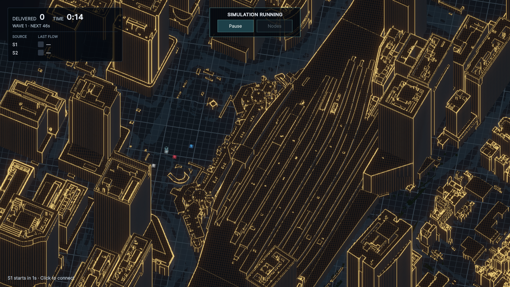
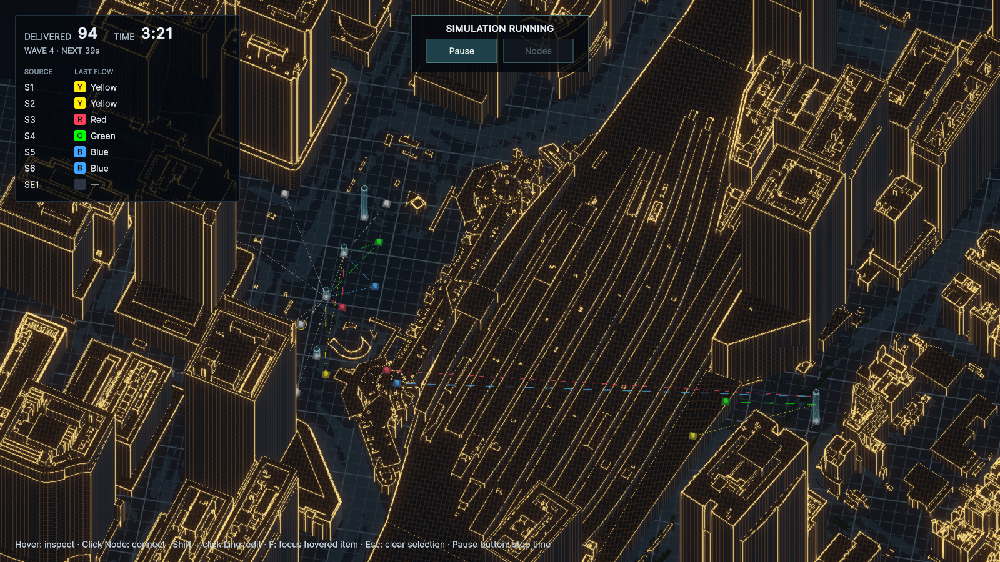
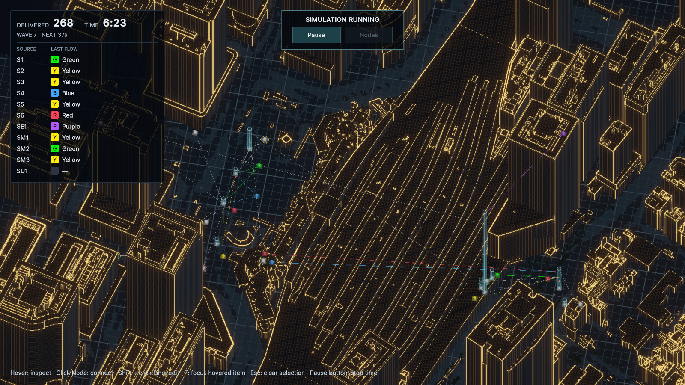
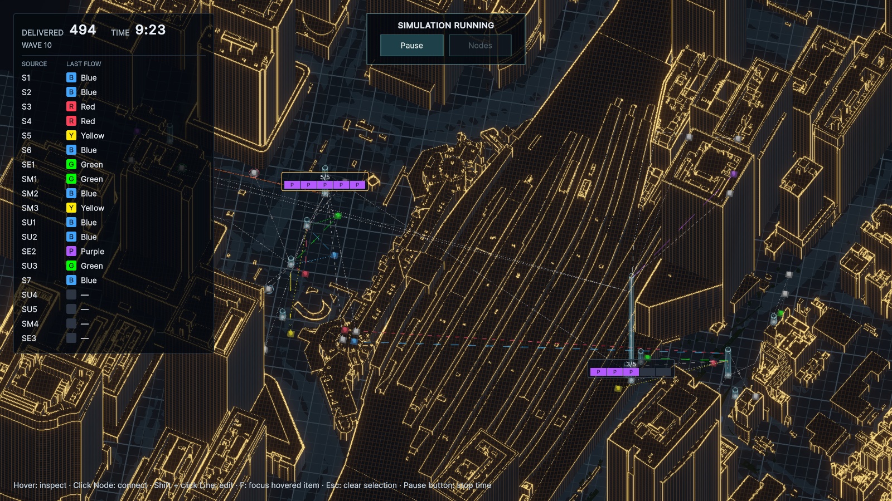
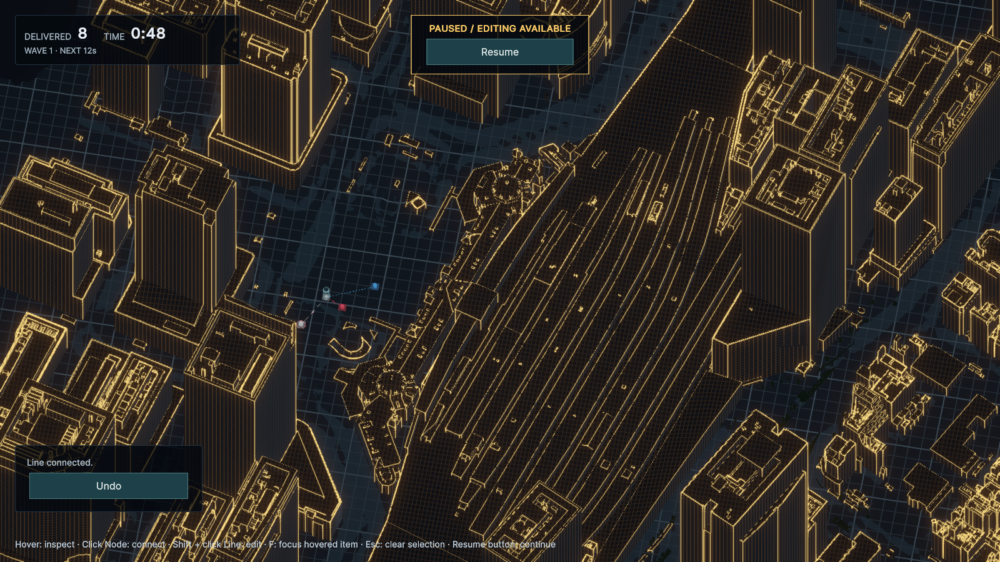
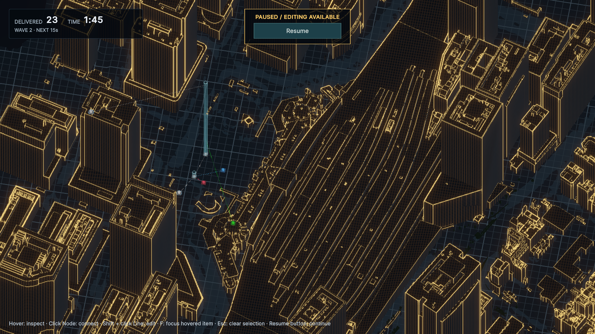
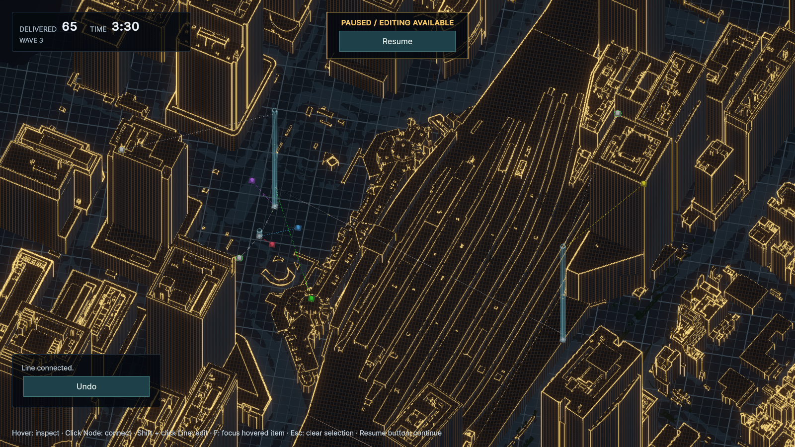
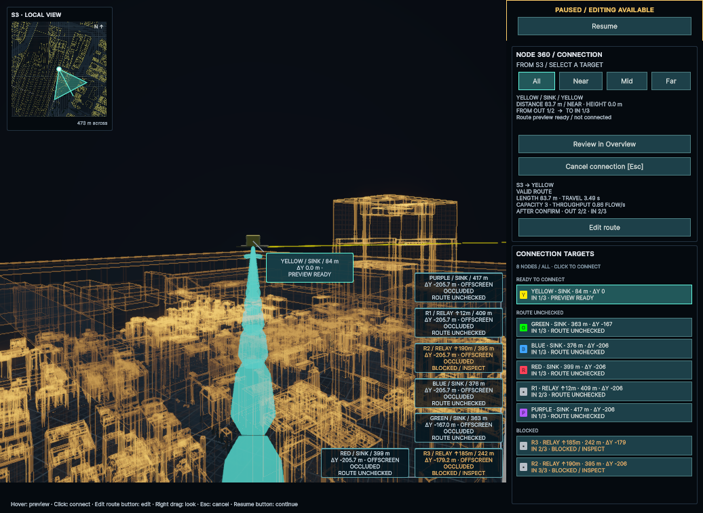
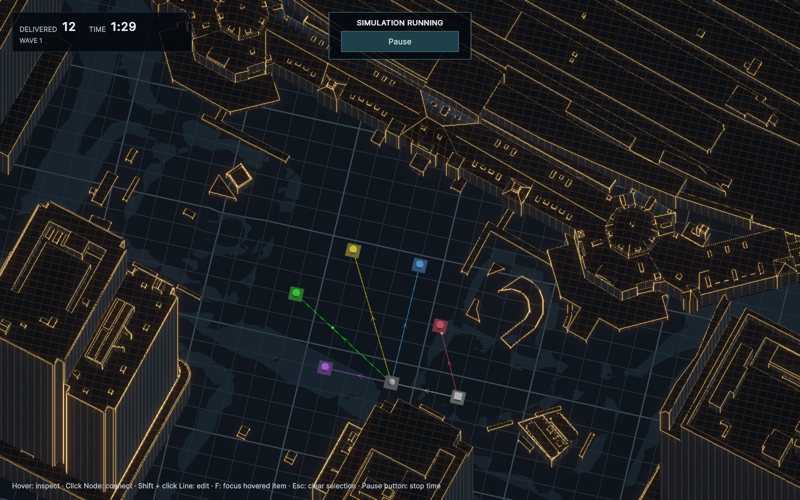
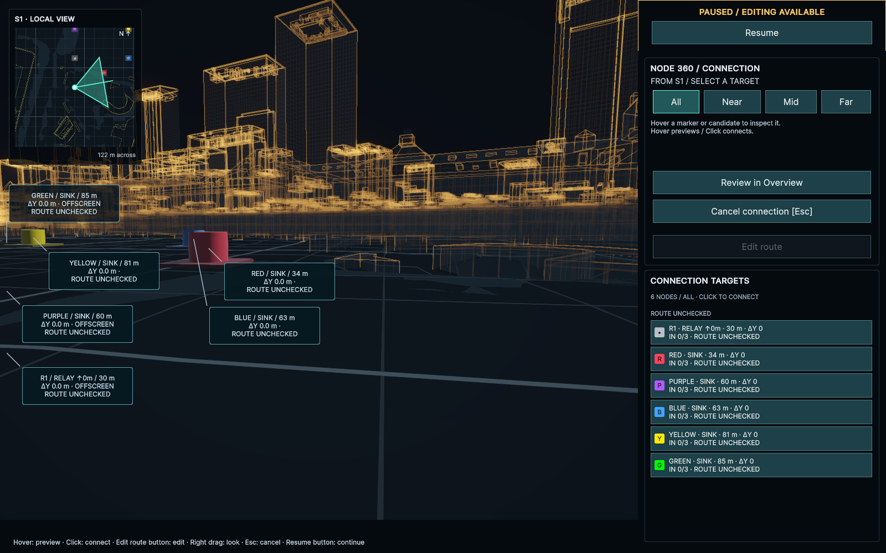

# 東京駅周辺の都市データ確認シーン

2026-09-26の依頼に基づき、提供されたCityGMLから都市確認用の `TokyoStationInspection` を作成。同日の追加依頼で、WiringLab風の派生シーン `TokyoStationWiringLab` の駅前を配線ゲームとして操作できるようにした。Inspectionは元の都市確認用シーンを維持する。

## 開く場所と操作

- シーン：`CityFlow/Assets/CityFlow/Scenes/TokyoStationInspection.unity`
- 生成モデル：`CityFlow/Assets/CityFlow/Art/PLATEAU/TokyoStation/`
- **Sceneビュー**で閲覧する。右ボタンを押しながらW/A/S/Dで移動、Q/Eで上下、ホイールで速度調整。選択した建物をFでフレーム表示できる。
- Gameビューは保存された確認用カメラの固定表示。プレイヤー用の移動操作は追加していない。
- HierarchyはBuilding／Road／Relief／Vegetation／Bridgeに分かれる。種類ごとの表示を切り替えて地物を確認できる。
- 東京駅の基準点へSceneビューを戻す：`uloop --project-path CityFlow execute-dynamic-code --code 'CityFlow.Editor.PlateauTokyoStationSetup.FocusStation();'`

## TokyoStationWiringLabで遊ぶ

`CityFlow/Assets/CityFlow/Scenes/TokyoStationWiringLab.unity`を開いてPlayする。駅舎西側（丸の内側）の地上2色配線から始め、駅舎の屋上（中層）、八重洲側の地上、両側の高層屋上（上層）へネットワークを伸ばす。初期Lineは0本。Wave 10を最終Waveとし、そのままSource OverloadによるGame Overまで生存時間を競う。仕様はv0.2 Δ1.3。

### 階層

階層はDomainの概念ではなく、Relayの高度帯（配置Yから`Position.y + MaximumRise`）と「Relayは配置位置より下へ伸ばせない」規則で表す制作上の分類。Source／Sinkの接続高度は配置Yに固定する。

| 階層 | 高度帯 [m] | 配置場所（実測Bounds上端） | Nodeの配置Y |
| --- | --- | --- | --- |
| 下層 | 3.7〜15.7 | 西側の地上、東側の地上（南側の広場と北東の細長い区画） | 3.7 |
| 中層 | 25〜50 | 駅舎の南ドーム付近（41.3 m）、東側の別棟屋上（29.1 m）、南北の街区の屋上（31.4〜42.2 m） | 30.2〜43.29 |
| 上層 | 180〜215 | 西側の高層屋上（185.1 m）、東側の高層屋上（208.4 m）、北西・北東・南・東端の高層屋上（185〜210 m） | 186.1〜210.76 |

- 階層内のRelayは帯の上端まで届く小さな上昇を持ち、階層内でも短い垂直区間が出る。階層をつなぐRelay（ブリッジ）は低い側の階層に置く。中層－下層ブリッジは西側`WB`と東側`EB`（地上、上昇46.3 m）、中層－上層ブリッジは`RU`（別棟屋上30.2 m、上昇184.8 m）。
- 駅舎とホーム群は駅前の地上を東西に遮る。街全体へ範囲を広げたため、地上の長い迂回も建物Boundsに従って許可する。中層ブリッジは駅舎越えの短い経路を作る。
- 西側の地上ブリッジからは駅舎ドームのSink（42.4 m）へ届くが、別棟のSink（30.2 m）は駅舎の陰となり、広域の迂回を必要とする。Relay同士のLineは41.8 m以上を通って駅舎を越えられる。
- 下層と中層は赤・青・緑・黄の4色。紫のSinkは上層だけに置き、上層には他の色のSinkを置かない。
- Node 360の候補一覧では、高度帯に共通部分がない相手を表示しない。同じ階層で経路が建物に阻まれる相手は従来どおり理由付きで表示する。

### Wave

開始は60秒間隔。追加数・座標・生成間隔・倍率は暫定値。

| Wave | 開始 | 追加Node | 合計 |
| --- | --- | --- | --- |
| 1 | 0秒 | 西側地上：S1・S2、ハブR1、RED・BLUE | 5個・2色 |
| 2 | 60秒 | 西側地上：S3・S4、ハブR2、GREEN | 9個・3色 |
| 3 | 120秒 | 西側地上：S5・S6、ハブR3、YELLOW | 13個・4色 |
| 4 | 180秒 | ブリッジWB・EB、東側地上SE1、中層RED-M・BLUE-M（ドーム）、GREEN-M（別棟）・YELLOW-M（南側屋上） | 20個 |
| 5 | 240秒 | 中層SM1（ドーム）・SM2（別棟）、中層ハブRM1 | 23個 |
| 6 | 300秒 | 中層SM3・ハブRM2（北側屋上）、東側地上RE1・RED-E・BLUE-E | 28個 |
| 7 | 360秒 | ブリッジRU、上層PURPLE-U（東塔）、上層SU1（西塔） | 31個・5色 |
| 8 | 420秒 | 上層SU2（北西塔）、北東地上SE2・GREEN-E・RE2、南東YELLOW-E | 36個 |
| 9 | 480秒 | 上層SU3（北東塔）、RU2・PURPLE-U2（北西塔）、南西地上R4・北西S7 | 41個 |
| 10 | 540秒 | 上層SU4（南塔）・SU5（東端塔）、南側屋上SM4、南東地上SE3 | 45個 |

- Wave 1〜3を西側に限るのは、序盤の配線を駅前に集中させるため。Wave 4以降に屋上と東側、Wave 6以降に遠方の街区へ展開する。
- 中層のSourceは中層内のSinkと、ブリッジ経由で両側の地上へ送れる。紫は全Sourceから`RU`経由で上層へ、上層Sourceの他色は`RU`から中層・地上へ下ろす。
- 新規Sourceは出現から20秒（S1・S2は15秒）準備し、その後に生成間隔1回分を経て最初のFLOWが生まれる。新色は対応Sinkの登場後に生成対象へ加わる。
- 操作は従来どおり。Source／RelayをクリックしてNode 360へ入り、候補をクリックして配線する。Pause／Resumeで時間を操作し、停止中も配線・編集・削除・カメラ操作ができる。右ドラッグでOrbit、WASD／中ドラッグでPan、ホイールでZoom、Fでフォーカス、Homeで全景。Shift＋Lineクリックで経路編集、高さはROUTE Yで変更。Escは取消専用。

### 配置と高さ

駅前の屋上は5 m間隔の下向きRaycastで実測した。広域への追加配置は都市Renderer Boundsの上端を基準として、既存と同じ近似で高さを設定する。Nodeは各建物のBounds上端から約1 m上に置き、上限より少なくとも0.5 mのクリアランスを保つ。駅舎の屋根はドーム頂部で約38 mで、Bounds上端41.3 mに合わせた配置Y 42.4 mはドーム上約5 m、西塔の屋上（実測約181 m）では約5 mの浮きがある。建物Boundsによる近似として許容する。

| Wave | Node | 種別 | X / Y / Z [m] | 能力 |
| --- | --- | --- | --- | --- |
| 1 | S1 | Source | -207 / 3.7 / -24 | OUT 2・6秒 |
| 1 | S2 | Source | -340 / 3.7 / 60 | OUT 2・8秒 |
| 1 | R1 | Relay | -192 / 3.7 / 4 | IN 4 / OUT 5・上昇12 m |
| 1 | RED | Sink | -178 / 3.7 / -3 | IN 3・Red |
| 1 | BLUE | Sink | -156 / 3.7 / 20 | IN 3・Blue |
| 2 | S3 | Source | -300 / 3.7 / -85 | OUT 2・8秒 |
| 2 | S4 | Source | -240 / 3.7 / 90 | OUT 2・10秒 |
| 2 | R2 | Relay | -185 / 3.7 / 45 | IN 4 / OUT 5・上昇12 m |
| 2 | GREEN | Sink | -160 / 3.7 / 60 | IN 3・Green |
| 3 | S5 | Source | -160 / 3.7 / 95 | OUT 2・10秒 |
| 3 | S6 | Source | -200 / 3.7 / -85 | OUT 2・10秒 |
| 3 | R3 | Relay | -190 / 3.7 / -50 | IN 4 / OUT 5・上昇12 m |
| 3 | YELLOW | Sink | -180 / 3.7 / -65 | IN 3・Yellow |
| 4 | WB | Relay | -175 / 3.7 / 80 | IN 8 / OUT 5・上昇46.3 m |
| 4 | EB | Relay | 205 / 3.7 / -40 | IN 8 / OUT 5・上昇46.3 m |
| 4 | SE1 | Source | 185 / 3.7 / -85 | OUT 2・18秒 |
| 4 | RED-M | Sink | -130 / 42.4 / -75 | IN 3・Red |
| 4 | BLUE-M | Sink | -120 / 42.4 / 100 | IN 3・Blue |
| 4 | GREEN-M | Sink | 135 / 30.2 / -50 | IN 3・Green |
| 4 | YELLOW-M | Sink | -50 / 32.54 / -652 | IN 3・Yellow |
| 5 | SM1 | Source | -130 / 42.4 / -85 | OUT 2・18秒 |
| 5 | SM2 | Source | 125 / 30.2 / -60 | OUT 2・18秒 |
| 5 | RM1 | Relay | 120 / 30.2 / -70 | IN 4 / OUT 5・上昇19.8 m |
| 6 | SM3 | Source | 429 / 43.29 / 1033 | OUT 2・45秒 |
| 6 | RM2 | Relay | 99.6 / 34.18 / 1016.7 | IN 4 / OUT 5・上昇15.82 m |
| 6 | RE1 | Relay | 215 / 3.7 / -60 | IN 4 / OUT 5・上昇12 m |
| 6 | RED-E | Sink | 190 / 3.7 / -30 | IN 3・Red |
| 6 | BLUE-E | Sink | 205 / 3.7 / -85 | IN 3・Blue |
| 7 | RU | Relay | 125 / 30.2 / -75 | IN 8 / OUT 5・上昇184.8 m |
| 7 | PURPLE-U | Sink | 195 / 209.4 / 45 | IN 3・Purple |
| 7 | SU1 | Source | -330 / 186.1 / -20 | OUT 2・20秒 |
| 8 | SU2 | Source | -400 / 205.68 / 710 | OUT 2・45秒 |
| 8 | SE2 | Source | 670 / 3.7 / 950 | OUT 2・45秒 |
| 8 | GREEN-E | Sink | 675 / 3.7 / 1080 | IN 3・Green |
| 8 | YELLOW-E | Sink | 660 / 3.7 / -505 | IN 3・Yellow |
| 8 | RE2 | Relay | 430 / 3.7 / 730 | IN 4 / OUT 5・上昇12 m |
| 9 | SU3 | Source | 540 / 203.72 / 620 | OUT 2・45秒 |
| 9 | RU2 | Relay | -350 / 191.5 / 800 | IN 4 / OUT 5・上昇23.5 m |
| 9 | PURPLE-U2 | Sink | -335 / 191.5 / 830 | IN 3・Purple |
| 9 | R4 | Relay | -400 / 3.7 / -350 | IN 4 / OUT 5・上昇12 m |
| 9 | S7 | Source | -450 / 3.7 / 1000 | OUT 2・45秒 |
| 10 | SU4 | Source | 15 / 210.76 / -300 | OUT 2・45秒 |
| 10 | SU5 | Source | 650 / 187.46 / 65 | OUT 2・45秒 |
| 10 | SM4 | Source | -52 / 32.54 / -660 | OUT 2・45秒 |
| 10 | SE3 | Source | 660 / 3.7 / -625 | OUT 2・45秒 |

実測対象は西塔`bldg_a98349a1-56c0-4ec4-b22c-abe49301bd04`、駅舎`bldg_6af58cef-669e-4aca-bc01-355e870d1ad5`、東塔`bldg_b5b4d7d4-a078-4ca9-8ec3-87e5bdc63cde`、別棟`bldg_b3bff028-8dc1-4887-8895-3b37524b7226`。

### 範囲と調整値

範囲はX=-530〜750 m、Z=-860〜1230 mの1280 × 2090 m。Wave中の領域拡張は行わない。Ground Y=3.7 m、MaximumAltitude=220 m（絶対Y上限223.7 m）。開始カメラは(-55, 60, 10)を中心に俯角60度・orthographicSize 220で駅前を表示する。Panは街全体へ移動でき、Homeは街全景へ戻る。ホイールは5段階を保ち、最大段階は新しい全領域に対応する。

| 項目 | 調整値 |
| --- | --- |
| Source生成間隔 | 駅前の下層西6〜12秒、下層東・中層18秒、SU1は20秒、遠方の追加Sourceは45秒（暫定） |
| Wave 2〜10生成倍率 | 0.95 / 0.9 / 0.9 / 0.85 / 0.85 / 0.8 / 0.8 / 0.8 / 0.75 |
| Source／Relay Buffer | 10 / 5 FLOW |
| Line容量・速度 | 3 FLOW・24 m/s |
| Source Overload猶予 | 5秒 |
| Source OUT / Sink IN | 2 / 3 |
| ハブRelay IN / OUT | 4 / 5 |
| ブリッジRelay IN / OUT | 8 / 5 |

これらは難度調整値であり、人の操作を含む最終バランスは未確定。ブリッジの接続枠は、テストの貪欲配線が削除なしで全Waveの全色到達を組めるように広めに取っている。実際の絞りは`RU → PURPLE-U`の垂直179 mを含む実経路長と容量3による処理量（約0.25 FLOW/s）で、上層のSinkが紫だけである限り紫の総需要がこれを超えると待機が増える。都市形状は元メッシュを維持し、配線判定には範囲内の建物・橋梁の3D Renderer Bounds 2,378個を使う。地形へ自動追従する汎用機能は追加していない。

#### 配線の一例

EditModeテストの`GreedyNetworkWiring`（`Tests/Fixtures`）が、既存Lineを優先し、枠の希少性と直結へのペナルティ付きの最短経路で、各Waveで全Sourceから全色へ届く最小のLineを追加する。地上と中層の間は`WB`／`EB`、中層と上層の間は`RU`を使い、各高度帯のSinkへつなぐ。削除・経路切替は使わない。この配線は検証用の一例で、ゲーム開始時に自動配置しない。

### 都市の見た目と組み立て

- 建物・橋梁は琥珀色の輪郭と窓グリッド、道路・地形は暗い青系のグリッド、植生は控えめな緑。元の都市FBXと輪郭メッシュを共用する。
- `AuthoredCityScenery` が都市のRendererを既存ゲーム表示へ渡し、簡易都市の地面や直方体を重ねて生成しない。Domain／ApplicationへPLATEAU型を追加しない。
- OverviewのNodeホバー／Fフォーカスで都市表示も減光する。Node 360では建物と輪郭を半透明にし、元のマテリアル配列・影設定へ復元する。Colliderは変更しない。
- 保存済みシーンにはゲーム設定を割り当て済み。起動シーンの先頭を維持したままBuild Settingsに追加し、Game Over後のRetryで再読み込みできる。

Sceneビューを駅前へ戻す：

```sh
uloop --project-path CityFlow execute-dynamic-code --code 'CityFlow.Editor.TokyoStationGameplaySetup.FocusStation();'
```

初回セットアップ用の `TokyoStationGameplaySetup.Create()` は、ゲーム未設定のTokyoStationWiringLabを開いてuloopから実行する。既存のゲーム設定やシーンを上書きしない。通常のPlay時には不要。既存のStageを本書の3階層・10 Wave配置へ戻す場合は`TokyoStationGameplaySetup.ApplyTierLayout()`をEdit Modeでuloopから実行する。東京駅シーンを開いて実行する。Node・Wave・初期Line・速度を更新し、現在の都市から対象範囲の障害物Boundsを再取得する。都市メッシュは変更しない。

元のスタイル生成ツール `PlateauTokyoStationStyleSetup.Create()` は、派生シーン・`Art/PLATEAU/TokyoStationWiringLab`・`Art/Materials/TokyoStationWiringLab` が未作成の場合だけ使用する。都市形状・地物属性・Colliderは元のInspectionと共通で、見た目の詳細値は窓間隔3.2 × 4 m、輪郭の折れ角35度・最小長0.75 m。実際の窓配置を表すものではない。

### 街全体への配置拡張（2026-09-27）

全域への配置、カメラ範囲、自動経路の近似探索、検証結果は[広域化の記録](TokyoStation-Citywide-2026-09-27.md)を参照。

### 3階層・10 Waveゲームの初回検証（2026-09-27、街全体への拡張前）

- Red：旧3 Wave配置のまま新しい東京駅EditModeテスト9件を実行し、初期Node数・階層・ブリッジ数・全色到達の8件が想定どおり失敗することを確認してから配置を適用した。
- 全EditMode **202/202**、全PlayMode **79/79**成功。コンパイルError／Warning **0**、Play後のConsole Error／Warning **0**。
- EditModeで確認：初期5 Node・2色、Wave 3まで西側の地上のみで6 Source・4色、Wave 4で東西の中層－下層ブリッジと中層Sink、Wave 7で紫Sinkを上層だけに追加、全Nodeがいずれかの高度帯に属し屋上Bounds上端の直上にあること、ブリッジが`WB`・`EB`・`RU`の3本だけで低い側の階層に置かれること、`RU`が地上のSource／Sinkへ届かないこと、駅舎による地上の東西分断、西側ブリッジから別棟Sinkへ届かず駅舎ドームへは届くこと、Node 360候補の高度帯フィルター、各Waveで全Sourceから全色への配送、3固定シードで600秒（Wave 10到達）の運行とFLOW保存・Line保持、未配線開始の敗北。
- PlayModeで確認：Wave 1→2の遷移とNode 9個、西側地上限定、Pause中のWave時計停止、HUD・出現マーカー、既存LineのID・経路保持、放置によるSource Overloadと結果表示、Retryで5 Node・0 Lineへ戻ること、都市透過／復元、Home復帰。出現演出のWave 2追加4 Nodeの柱と画面外マーカーからのフォーカス。
- 実シーンを実時間で運行し、各Wave開始10秒後に貪欲配線を追加した。Wave 10到達時点（561秒）で45 Node・39 Line、配送491／生成526、敗北なし。608秒で配送562／生成617。人の操作速度を含む難度評価ではない。
- 既存の`NodeArrivalTests`の初期出現テストは全体実行で1回失敗し、単独再実行と2回目の全体実行で成功した。フレーム時刻に依存する既存テストで、東京駅の変更とは無関係。
- ExpansionLabのPlayModeテストは対象外のまま実行していない。






### 高さを使う3 Waveゲームの検証（2026-09-26）

- Red：従来の高さ無効Stageでは屋上配置テストが失敗することを確認してから変更。
- 全EditMode **199/199**、東京駅PlayMode **2/2**成功。コンパイルおよび最終ConsoleのError／Warningは**0**。
- 屋上への配置、駅舎の両側への配置、Relay能力不足による拒否、対応Relayでの有効経路、駅舎を越える経路の3D衝突判定を検証。全Wave・全Source・全色を接続枠内で配送できる。
- 固定シード1337／42／2026で、各Waveから10秒後に配線を補い5分間運行した。敗北なし、FLOW保存、Wave 3のまま継続することを確認。放置すればSource Overloadで終了する。
- 実シーンでPause、4→7→11ノードへの追加、既存LineのID・経路の保持、Wave 3のHUD・追加マーカー、Game Over、Retryで4ノード・0 Lineへ戻ること、都市透過／復元、Home復帰を確認。
- uloopから検証用の12本を段階的に配線し、明示tickで48／105／210秒へ進めた実画面を撮影。配送数は8／23／65。最終時点は74生成＝65配送＋9輸送中、待機0、敗北なし。人の操作速度を含む最終難度評価ではない。
- 1600×900と1036×757で表示を確認し、屋上S3からYELLOWへのNode 360候補と有効Previewも確認。ExpansionLabのPlayModeテストは実行していない。






### 初回の7ノード配置の検証履歴（2026-09-26）

- Red：専用StageConfigurationが存在しないため、新規EditModeテストが想定どおり失敗。
- Green：コンパイルError／Warning 0、全EditMode **184/184**、全PlayMode **66/66**成功。
- 専用テストで7個・全種類・5色・未配線開始・全SinkへのRelay経由の到達可能性・範囲・障害物・Build Settings登録を確認。実シーンではPause中の配線、再開後の5色配送、都市マテリアル全スロットの透過／復元、Collider保持、Home復帰を確認した。
- uloopのInput Systemマウス入力でSource／Relayを選び、UI Toolkitのポインターイベントで候補・Pause／Resume・Retryを操作した。UI ToolkitはEventSystemを置かない構成のため、EventSystem向け`simulate-mouse-ui`は対象外。GameビューでNode 360と都市の透過表示を確認した。
- 画面操作で6本のLineを作り、Resume後の自然進行でDELIVERED 12を確認。保存アセットの初期Lineは0本のまま。
- 入力確認時、uloop 3.6.3の`MouseInputStateService.ApplyStateEvent`に起因するInput System Assertionを6件確認した。ゲーム実装の例外とは区別し、テスト本体は全件成功している。既存橋梁の大型三角形に関するPhysics警告も元データ由来の注意点として残る。
- 元のPlay Mode設定へ戻した通常起動でも7ノード・配線0本を確認し、この最終起動ではConsole Error／Warningともに0件。
- Inspectionシーンは元の保存データと一致。WiringLabの既存シーンブロックもカメラとSceneRoots以外は不変で、元の都市モデルやColliderを削除・再生成していない。





## データと範囲

| 項目 | 内容 |
| --- | --- |
| 提供ZIP | `13101_chiyoda-ku_pref_2025_citygml_1_op.zip` |
| データ | 東京都千代田区、2025年度の3D都市モデル |
| データ作成日 | 2026-03-13（同梱READMEの記載） |
| ZIP SHA-256 | `d903d0e59a93475c8684284ac52e9b2b5cba972208dec258641fc8942ca42ee2` |
| 取り込みメッシュ | `53394611`、`53394621` |
| 選定範囲 | 東京駅を含む街区と、その北側の大手町方面 |
| 位置の基準 | 緯度35.681236、経度139.767125、高さ0 m |
| 平面直角座標系 | 9系、EUN（X=東、Y=上、Z=北） |
| 距離 | 1 Unity unit = 1 m |
| 建物 | LOD1〜2、利用可能な最高LODを表示、テクスチャあり |
| 道路・植生 | LOD1〜3、利用可能な最高LODを表示 |
| 地形・橋梁 | 収録LODのうち1〜2、選定範囲内 |
| マテリアル | SDKのURP対応マテリアル、テクスチャ結合4096 px |

原本の建物GMLには2メッシュで2,345棟のBuilding要素があり、`53394611`に名称「東京駅」の要素を4件確認した。この原本件数は取り込み後のRenderer数とは異なる。範囲外の地物、重複LOD、BuildingPart等により件数は変わる。

元ZIPは約2.1GB、全展開は約7.3GB。必要な地物、テクスチャ、codelists、schemas、metadata、READMEのみを `.local-data/plateau/chiyoda-2025-tokyo-station/` へ展開した（8,039ファイル、約1.9GB）。地形の入力は大きい2次メッシュのGMLを使い、SDKで指定範囲へ切り出す。地理院の航空写真タイル取得は無効にし、提供されたデータで確認する。

## 再生成

初回の空の出力先を対象に、リポジトリルートから実行する。

```sh
python3 scripts/prepare_plateau_tokyo_station.py /path/to/13101_chiyoda-ku_pref_2025_citygml_1_op.zip
uloop --project-path CityFlow compile
uloop --project-path CityFlow execute-dynamic-code --code 'CityFlow.Editor.PlateauTokyoStationSetup.Start(System.IO.Path.GetFullPath("../.local-data/plateau/chiyoda-2025-tokyo-station")); return CityFlow.Editor.PlateauTokyoStationSetup.Status;'
```

取り込みはEditor上で非同期に進む。地物を種類ごとに取り込み、SDKのAssets保存機能でFBX・テクスチャを保存してからシーンを保存する。元データの展開先と検証用スクリーンショットはコミット対象外。保存済みシーンと参照アセット・`.meta`を通常のGitで管理し、都市データにはGit LFSを使わない。作成済みシーンの閲覧にはZIPと展開先を必要としない。

```sh
uloop --project-path CityFlow execute-dynamic-code --code 'return CityFlow.Editor.PlateauTokyoStationSetup.Status;'
```

`Completed`で完了。`Cancel()`でキャンセルできる。未保存シーンがある場合、Play Mode中、既に出力先がある場合はStartを拒否し、既存の作業を上書きしない。途中失敗時はConsoleを確認する。再生成のために既存成果物を削除する場合もuloopのAssetDatabase操作を使う。

SDK依存はEditorアセンブリだけに追加し、Domain・Application・ゲームの空間判定への依存は追加していない。シーン内のSDK属性コンポーネントは都市データの確認に利用する。

## 出典

出典：東京都／Project PLATEAU「3D都市モデル 千代田区（2025年度）」、ユーザー提供ZIP。同梱READMEで提示されたライセンスのうちCC BY 4.0を選択する。Unity向けに範囲選択、座標変換、LOD表示の選択、テクスチャ結合、FBX変換を行った。元データのREADMEとmetadataは展開先に保持する。データは現在の建築状況を保証するものではない。

## 確認結果

Unity 6000.4.7f1 / macOS arm64 / PLATEAU SDK 4.3.0で確認。

| 確認 | 結果 |
| --- | --- |
| コンパイル | Error 0 / Warning 0 |
| ProjectConfigurationTests（EditMode） | 4 / 4成功：URP、Input System、起動シーン設定 |
| BootstrapTests（PlayMode） | 2 / 2成功：既存シーンのDI構築、UniTask・R3連携 |
| 保存後のシーン再読み込み | 成功、5種類の都市モデルを復元 |
| メッシュ | 3,866個、合計1,455,448頂点、欠落0 |
| マテリアル | 172個、うち165個にテクスチャ、非対応シェーダー0 |
| 東京駅 | 原本で確認した4件の建物IDが有効なオブジェクトとして存在 |
| 座標範囲 | Bounds中心 `(147.92, 117.72, 193.90)`、半径方向の各成分 `(682.50, 123.82, 1056.83)` m |
| 表示 | Sceneビューの俯瞰・駅舎拡大、Gameビューの固定カメラで確認 |
| 生成アセット | 約2.4GB（モデル・テクスチャ等177ファイル、全ファイルの.metaを確認） |
| Git差分 | `git diff --check`成功。既存シーン、Build Settings、Editor再生設定の変更なし |

ConsoleのErrorは0。元データの橋梁メッシュ `brid_74d13577-7e6f-4f5f-8481-cab3020e6fdd` に500 unitを超える辺の三角形があり、UnityのMeshColliderが物理判定の安定性に関するWarningを1件出す。形状・テクスチャは表示できているが、この橋梁Colliderをゲームの衝突判定に採用する検証は行っていない。警告抑制や原本形状の変更はしていない。

地形の航空写真は取得しておらず、地形の見た目はSDKの既定マテリアルによる。起動時のスムーズさ、大規模都市のフレームレート、Playerビルド、ゲームへの組み込みは未検証。全ゲームテストの再実行ではなく、上記6件の関連テストと新規シーンの実データ検証を行った。
