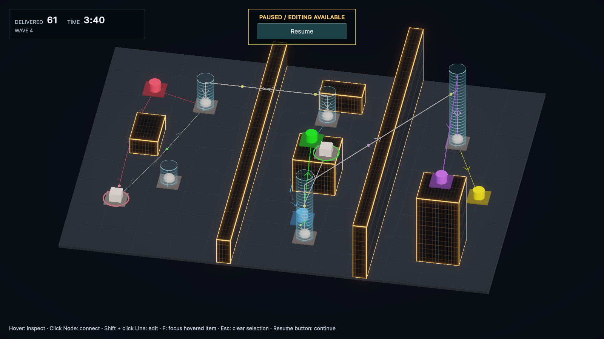
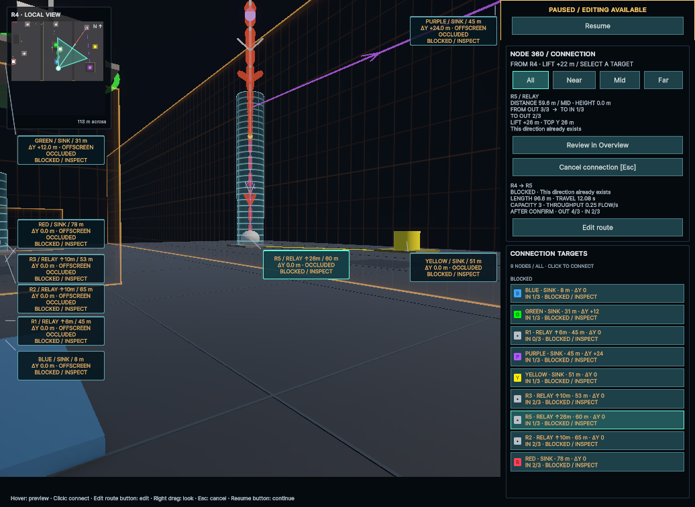

# Relayの高さホログラム（2026-09-26）

Relayの配置Yから接続可能な上限まで、淡い青白色のホログラムを表示する。上限はDomainの`StageDefinition.ConnectionCeiling`をそのまま使い、`MaximumRise`とステージ天井の両方を反映する。上昇能力0のRelayには柱を表示しない。

円柱の天面が上限の実座標に一致し、1 m間隔の帯で高さを読み取れる。上部へ向けて透明度を上げ、天面の内側は輪郭より薄くする。直径4.8 m、線幅0.035 m、上端の不透明度倍率0.45は暫定の見た目設定。色・帯の間隔・透過率は`RelayHologram.mat`で調整できる。

基部の球・パッド・Bufferゲージを維持する。柱はColliderと影を持たず、既存の配線・Node選択を妨げない。フォーカス時は対応するNodeと一緒に減光し、Node 360では始点の柱を隠す。Waveで追加されたRelayにも同じ表示を適用する。常設ラベルは追加しない。

## 実画面

HeightLabの6／10／22／26 mのRelay。uloopから実行中だけ検証用の配線を作り、設定済みWaveを220秒まで進めた。12 Node・13 Line、61配送。シーンとStageアセットにデモ配線は保存していない。

1036×757のNode 360。始点R4の柱は非表示になり、R5の26 mの柱と配線を確認できる。候補への配線は既設のため、画面にはその理由が表示されている。

## 検証

- Red：高さ表示が存在しない旧実装で、新規PlayModeテスト2件の失敗を確認。
- Green：新規2件成功。初期／追加Relay、高所配置、ステージ天井による切り詰め、能力0、表示範囲と実座標、Collider不在、基部の選択、減光、Node 360の非表示／復帰を確認。
- 既存の`ValidationCityTests`・`HeightInteractionTests`・`ConnectionFocusTests`は9/9成功。Ground専用シーンに柱が出ないことも確認。
- コンパイルError／Warning **0**。専用シェーダーの診断メッセージ **0**。画面確認後のConsole Error／Warning **0**。
- 1600×900のOverviewと1036×757のNode 360をuloopで撮影し、透明度・帯・配線の見え方を確認。

確認後はPlay Modeを終了し、HeightLabを初期状態へ戻した。Playerビルドは今回の検証対象外。
