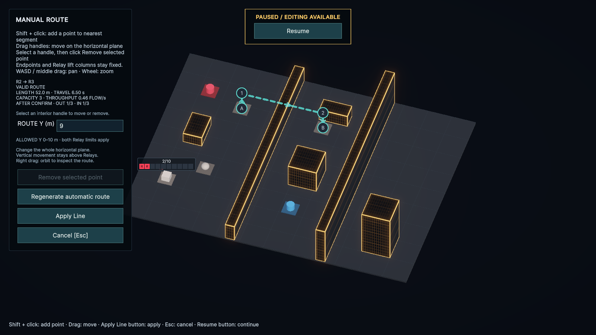
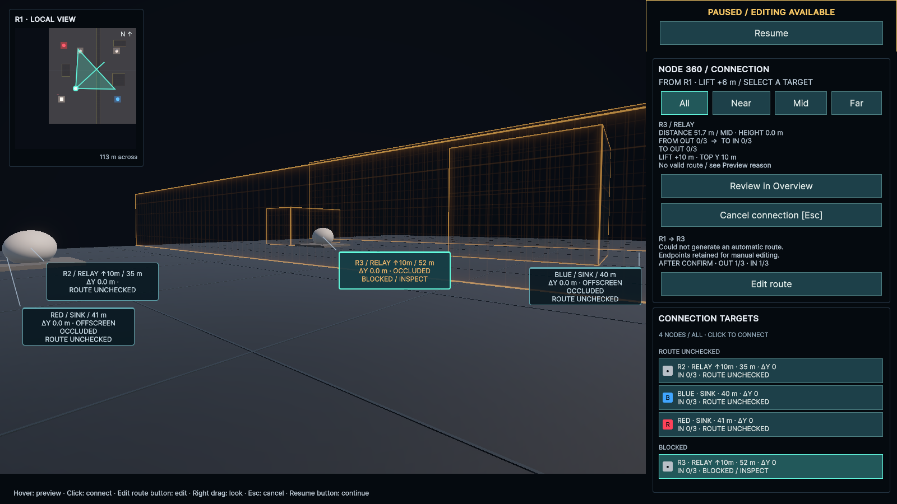
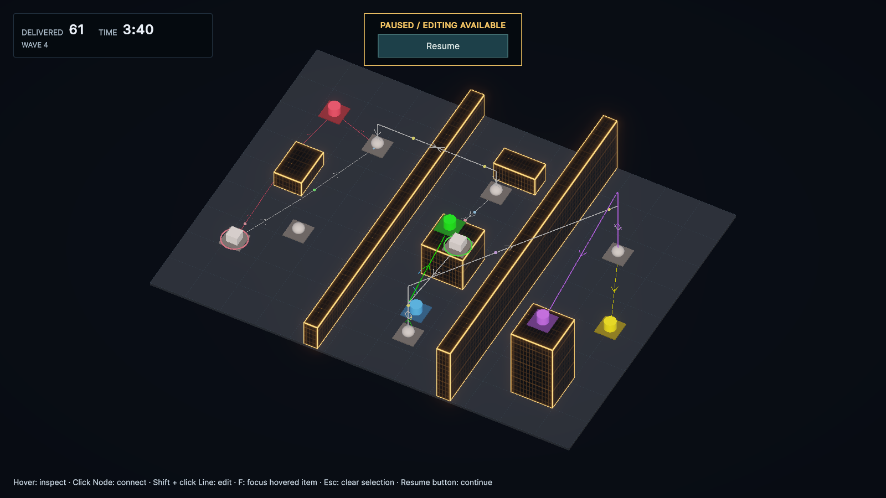
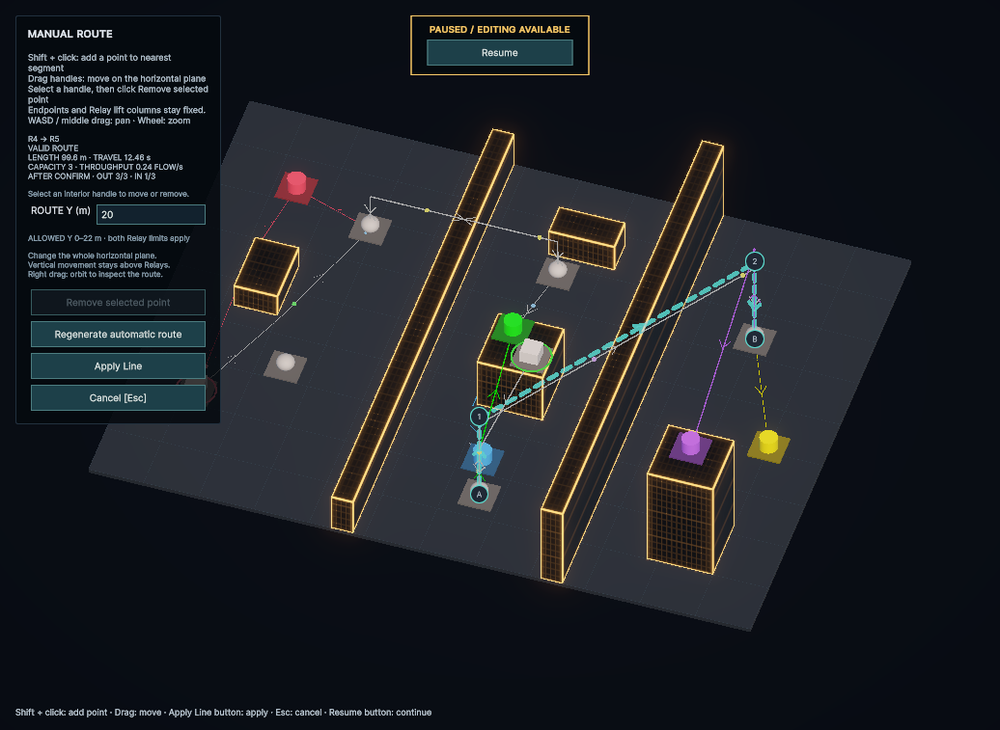

# Relayの高さ制限と垂直配線（2026-09-25）

## 配線ルール

高さ方向の斜め配線を廃止し、Lineを「接続元Relay直上の垂直区間 → 1枚の水平XZ面 → 接続先Relay直上の垂直区間」に変更した。高さ変更が不要な端は垂直区間を省く。XZ面内の斜め線・迂回はGroundと同じ。経路途中では高度を変更できない。

`RelayNodePlacement`と`RelayNodeDefinition`へ`MaximumRise`を追加した。高さ基準は、**Relayの配置位置から上へ伸ばせる距離[m]を暫定採用**。既存データの未設定値は0。始点だけでなく終点Relayにも適用し、両者の高度範囲が重なる場所で水平接続する。ステージの`MaximumAltitude`も上限として適用する。

Source／Sinkは配置Yで接続する。屋上SinkへはRelay側で上昇し、高所Sourceからは対応するRelayの直上まで水平に進んで下降する。垂直区間も建物との衝突・距離・輸送時間の対象になる。

各候補高度でGroundと同じXZ可視グラフ＋A*を使い、垂直区間込みの全長で比較する。候補高度は両端の共通範囲の端と建物の上面／下面に対するクリアランス境界。手動入力は連続値を使える。PLATEAUや大規模都市の性能保証は対象外。

## 編集と表示

- `Edit route`から編集し、`ROUTE Y (m)`で水平部分全体の絶対Yを変更する。個別ハンドルの選択は不要。
- Shift＋クリックで水平部分に点を追加し、ドラッグでXZだけを変更する。Relay直上の折れ点は固定。
- 両端の能力から許容Y範囲を表示する。Source／Sinkによって高さが固定される接続は入力欄を無効にする。
- 上限外・斜め・建物衝突の経路は確定できない。新設・経路切替ともDomainで再検証する。
- Relayのホバー、Node 360の始点・候補表示に`LIFT`の能力値を加えた。常設Node名は追加していない。
- 確定は画面ボタン、Escは取消。経路変更時は既存FLOWの排出を待つ。

## HeightLabの配置

**既存のHeightLabシーンとHeightStageアセットを更新した。新しいシーンは追加していない。** 初期は6 Node・0 Line。都市は120×90m、全体の上限は30m。高さ8mと18mの壁が区域を区切り、壁の端からGroundで迂回できない配置にした。ほかに4棟の局所障害物／屋上を置く。数値・Wave・生成間隔は比較用の暫定値。

| Node | 出現 | 配置Y | MaximumRise | 役割 |
| --- | --- | --- | --- | --- |
| S1 | 初期 | 0m | — | 西区域のSource。REDへ直結できる |
| R1 | 初期 | 0m | 6m | 西区域内のGround中継。8mの壁は越せない |
| R2 / R3 | 初期 | 0m | 各10m | 8mの壁を挟むRelay対。BLUEへの経路を作る |
| RED / BLUE | 初期 | 0m | — | 西区域／中央区域のSink |
| R4 | Wave 2・60秒 | 0m | 22m | 12m屋上への配送と、高い壁を越える準備 |
| GREEN | Wave 2・60秒 | 12m | — | R3では届かずR4が必要な屋上Sink |
| R5 | Wave 3・120秒 | 0m | 26m | R4と対になって18mの壁を越える東区域Relay |
| YELLOW | Wave 3・120秒 | 0m | — | 東区域のGround Sink |
| PURPLE | Wave 4・180秒 | 24m | — | R5の能力を使う屋上Sink |
| S2 | Wave 4・180秒 | 12m | — | 高所Source。R4へ送れるがR3には送れない |

初期の接続例は`S1→RED`と`S1→R2→R3→BLUE`。R2→R3の自動経路はY=8.502mで壁を越える。R1を挟んでも能力不足のまま壁越えはできない。

Wave 2では`R3→R4→GREEN`、Wave 3では`R4→R5→YELLOW`を増設する。R4→R5の自動高度はY=18.502m。Wave 4では`R5→PURPLE`と`S2→R4`を追加し、西側への配送用に`R4→R3→R2→RED`もつなぐ。この13 Lineの例はIN／OUT各3以内で全Sourceの全色を配送できる。

S1は3秒ごと、S2は6秒ごとに生成し、それぞれ出現後20秒の準備時間を設けた。Waveの生成間隔倍率は0.95／0.9／0.85。垂直距離により輸送時間が伸びるため、WiringLabより緩やかな倍率としている。

Wave設定の読み込みは同時追加のNodeをまとめて検証する。Sinkが配列の先頭にあっても、同時出現Relayを経由して既存Node群へつながる構成を受け入れる。

## 実画面

専用worktree `/private/tmp/CityFlow-v02-height`と専用Unity Editorを使用。uloopでPlay状態を操作・撮影した。デモ接続は実行中だけに作成し、HeightStageの初期Lineには保存していない。

### R2→R3：9mの水平面で8mの壁を越える

両端のRelay直上に垂直区間があり、間は一定高度。高さ入力の許容範囲は0〜10m。

### R1：6mの能力では壁を越えられない

始点のLIFT +6m、候補R3のLIFT +10mを確認できる。R3への経路はBLOCKED。ミニカメラと候補一覧を併用する。

### Wave 4：屋上Sinkと高所Source

Waveを順に進め、出現したNodeへ接続を追加した。220秒で61配送、12 Node・13 Line、敗北なし。手作業で接続を考える時間を計測した比較プレイではない。

### 1036×757：R4→R5の高さ編集

高さ20mのPreview。入力欄・範囲・操作ボタンが小さいGame Viewでも収まることを確認した。

## 検証

- Red：斜め配線、Source側での昇降、能力0のRelayによる昇降を拒否する3件が旧実装で失敗。
- Red：新しいHeightLabの初期配置・Wave・全色配送を検証する3件が旧配置で失敗。
- 最終コンパイル：Error **0**、Warning **0**。
- 全EditMode：**182/182成功**。
- 全PlayMode：**65/65成功**。
- Console：テスト後・画面確認後ともError／Warning **0**。

Relay上限の相対基準、ステージ上限、両端の制約、屋根の衝突、Source／Sinkの固定高度、水平面編集、In-Flight中の経路切替、実経路とLine／FLOWの描画座標、各Waveの全Source・全色配送を含む。Groundステージと既存ボタン・Node 360・ミニカメラも回帰対象。

確認後はPlayを止め、専用Editorを初期配線0のHeightLabへ戻した。元のmain checkout／Unityには変更を加えていない。Playerビルド、大規模都市の性能、人による難度比較は未実施。
