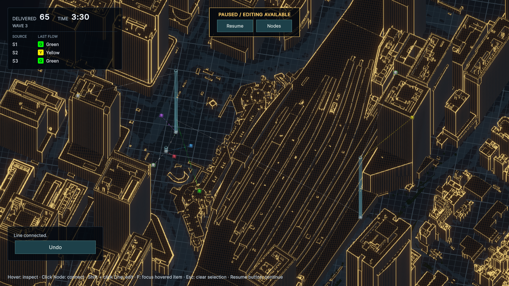
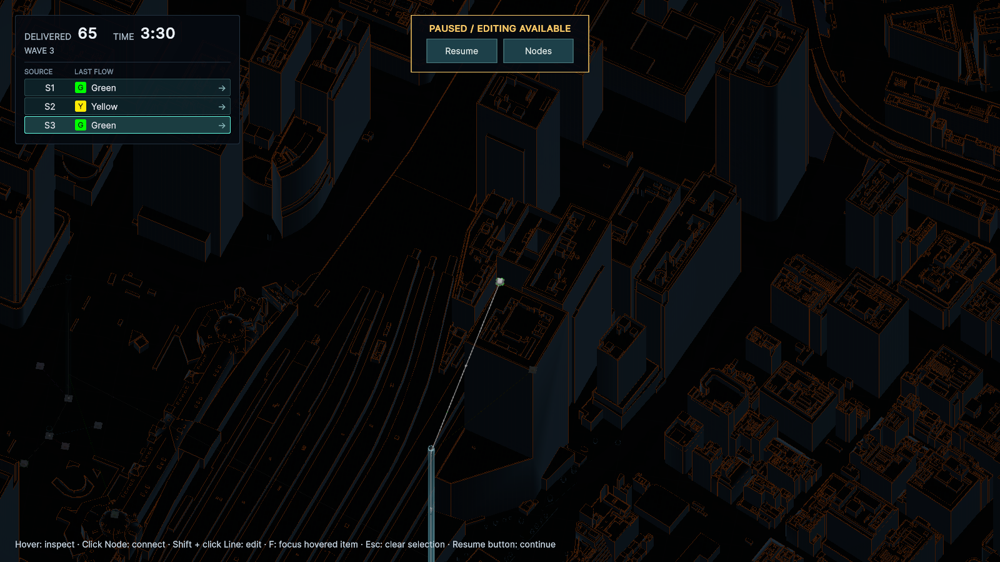

# Sourceの最新FLOW一覧（2026-09-26）

左上のDELIVERED・TIME・Waveの下に、Source IDと最後に生成したFLOWを表示する。色バッジ・頭文字・色名を併記し、未生成は「—」。Bufferの先頭や最後に転送した色ではなく、NetworkSnapshotの最終生成色を使う。配送後・Pause中も保持し、Waveで追加されたSourceを自動で一覧へ加える。

SourceActivityRow.uxmlとValidationHud.ussで行の構造・見た目を定義し、ValidationHudが状態を反映する。ゲーム状態を変更しない。Node 360／経路編集中は従来の基本HUDとともに隠す。Sourceの詳細・接続一覧は引き続きホバーで確認する。2026-09-27に各行へカメラフォーカスを追加し、行のクリックだけをワールドへ渡さないよう変更した。

## 検証

- Red：追加したPlayMode 2件が、Source行と一覧要素の欠如で失敗することを確認。
- Green：関連PlayMode **26/26成功**。ValidationHud、HudPresentation、HoverHud、NodeHighlight、PauseInput、WaveSessionを実行。
- 新規テストで未生成、最新色への更新、Buffer排出後・Pause中の保持、Snapshotと時計の不変、Wave追加、Sourceごとの独立した値、UIDocument再生成時の復元、入力非遮蔽を確認。
- 東京駅を正規のWave進行と参照配線で3分30秒まで進め、Wave 3の3 Sourceを確認。65配送、Buffer内FLOW 0の状態でもS1=Green、S2=Yellow、S3=Greenを表示し、Snapshotと一致。
- 1600×900・1036×757で一覧の配置と文字・色バッジを確認。
- コンパイルError／Warning **0**、画面確認後のConsole Error／Warning **0**。ExpansionLabのPlayModeテストは実行していない。
- 確認後はPlay Modeを停止し、検証用配線・進行を破棄。シーン・Stageの設定は変更せず、Editor設定・Gameビューのサイズを検証前に戻した。

## 一覧からのカメラ移動（2026-09-27）

Source行全体をクリックすると、そのSource本体へ約0.65秒で滑らかに移動する。向き・ズームを保ち、屋上の配置高度も反映する。選択行は枠で示し、最後に生成したFLOWは引き続き表示する。Pause中も移動でき、配線モードには入らない。

別のSource行へ切り替えると現在位置から移動し直す。Pan／Zoom／Orbit、Esc、F／Home、別の選択、Node 360・経路編集への移行で自動移動を止める。行のクリックは背後へ渡さず、キーボードSubmitとGame Over中の行操作は無効。Wave追加とUIDocument再生成時にはクリック購読も結び直す。

- Red：新規PlayMode 3件が、行ボタンとカメラ移動の未実装で失敗することを確認。
- Green：関連PlayMode **52/52成功**。Overview、ValidationHud、NodeArrival、NodeHighlight、PauseInput、NodeConnection、ConnectionFocus、HudPresentation、HoverHud、WaveSession、TokyoStationWiringLabを実行。
- 停止中の行クリック、移動途中・完了、配置高度、移動先の切替、手動操作・モード変更による中断、既存F／Home、Wave追加・HUD再生成、入力遮蔽、シミュレーションの不変を確認。
- 東京駅Wave 3・3分30秒・65配送をPauseし、S2／S3の屋上へ実フレームで移動。S3への移動距離は約489.5 m、開始0.29秒時点で約221.1 m、0.70秒時点で中央に到達。カメラの回転・ズームとNetworkSnapshotは変化しなかった。
- 1600×900と1036×757で行ボタンと中央表示を確認。uloopの汎用マウス注入ではUIクリックを確認できず、UI用コマンドもEventSystemのないこの構成には非対応だったため、UI ToolkitのPointerDown／Upイベントで検証した。物理マウスによる操作確認は未実施。
- コンパイルError／Warning **0**。テスト後はPLATEAU橋梁メッシュの500 m超の三角形に関する既知Warningがあり、Errorは0。実画面確認後の最終ConsoleはError／Warning **0**。ExpansionLabのPlayModeテストは実行していない。
- 確認後はPlay Modeを停止し、Game Viewの1800×1000と検証用設定を復元。シーン・ゲームデータは変更しない。

