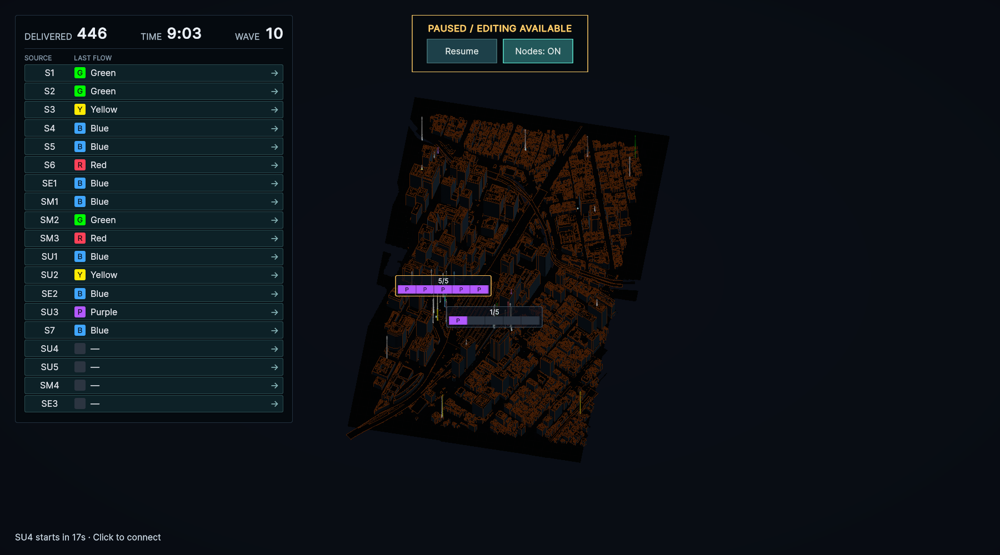

# 東京駅の街全体への配置拡張（2026-09-27）

駅前の600 × 195 mに集中していた配置を、取り込んだ街の1280 × 2090 mへ広げた。Wave 1〜3は丸の内側の導入を維持し、以後のSource・Sink・Relayを北・南・東・西の街路と屋上へ分散する。全45 Nodeの配置範囲はX=-450〜675 m、Z=-660〜1080 m。Waveは60秒間隔・最終10、以後はSource Overloadまで生存時間を競う。

北側の低い屋上、北西・北東・南側の高層屋上を使い、Relayの配置高度とMaximumRiseで接続可能な高さを表す。遠方の追加Sourceは生成間隔45秒を暫定採用し、長い輸送距離へ対応する。全Nodeの座標・能力は[東京駅の設定表](PLATEAU-TokyoStation.md)に記載した。新たな屋上はRenderer Bounds上端を基準とした近似であり、実メッシュ上の全面的なRaycast調査はしていない。

カメラのPan制限も街全体へ拡大した。開始時は駅前の画角220を維持し、Homeは街の中心と全景へ移動する。ホイールの5段階と補間・マウス位置を中心とするズームを維持し、最大段階を全景の画角1463へ広げる。

## 配線探索の扱い

障害物は範囲内の建物・橋梁Bounds 2,378個。障害物の階層索引、水平面の連結性判定、必要な可視辺だけを評価するA*、距離による候補除外を追加した。大規模都市では候補の高度を端点の高度帯両端と近傍の屋根境界16面、256頂点超の可視グラフでは近い48頂点と終点に絞る暫定の近似探索とする。候補を全探索した最短経路や、すべての有効経路の発見は保証しない。見つかった経路は既存のDomainによる全区間の衝突・高度制約検証を通し、描画・距離・輸送に同じ経路を使う。手動編集の高度は連続値のまま。

Editor内での単発計測例はWB→RM1が約21 ms、RM2→RUが約108 ms、街路の長い迂回を含むEB→R2／R3が約2.1／1.8秒。機器・キャッシュに依存する参考値で、長距離の自動Previewは待ち時間が残る。一般的な都市地形対応や最終的な性能最適化は対象外。

## 検証

- Red：旧配置では南北・東西の分散テストが失敗。カメラの旧Homeが駅前中心へ戻ることによる失敗も確認してから変更した。
- コンパイルError／Warning 0。全EditMode **206/206成功**。全Waveの全Source・全色配送、3固定シードで600秒までの生存とFLOW保存、建物とNode高度、接続枠、未配線時の敗北を確認した。幾何経路だけを同じ固定配置のテスト間で共有し、ネットワークと時計は毎回新規に生成する。
- ExpansionLabのPlayModeテストは作成・実行していない。
- 関連PlayModeは28件中26件成功後、OverviewZoomの2件を再確認した。Game Viewを元の1800 × 1000へ戻すとカーソル位置検証が通った。背面Editorで追加した仮想Mouseが無効のままだった入力テストは、テスト内で明示的に有効化して修正し、OverviewZoom **7/7成功**。合計28件すべてを成功確認済み。街の両端へのPan・Home全景・最大ズーム、駅前の開始画角、Wave／HUD／出現演出を確認した。
- uloopによる実シーン確認：検証用配線をWaveごとに追加し、543.6秒でWave 10・45 Node・38 Line・446配送・Game Overなし。PauseとNodes: ONで撮影し、Home全景で全45 Nodeの画面内座標を確認した。Game Viewは1800 × 1000。ConsoleのError／Warningは0。確認後はPlayを停止し、検証用の配線・時計は保存していない。
- 自動配線と明示tickによる動作確認であり、人の操作時間を含む最終難度評価ではない。

