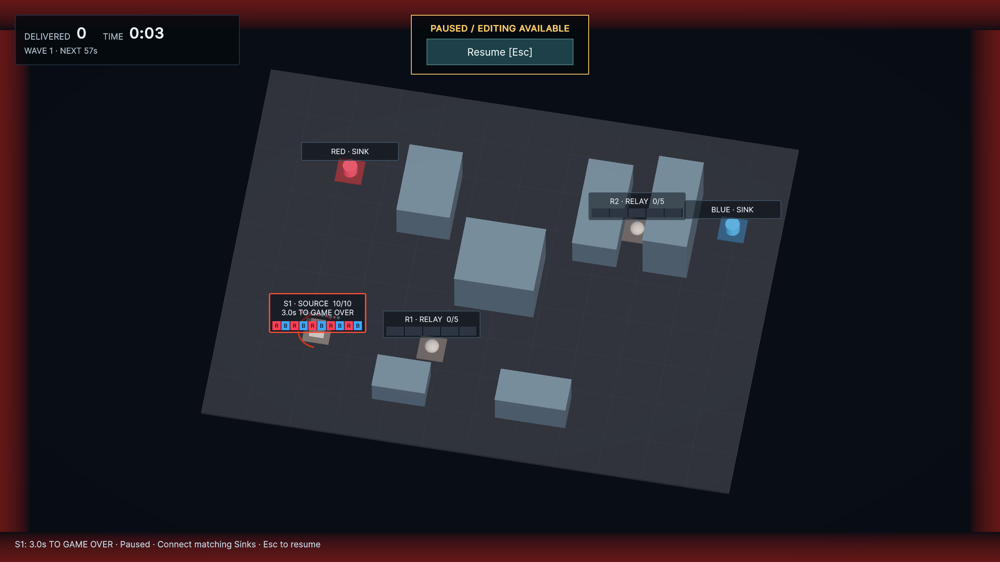
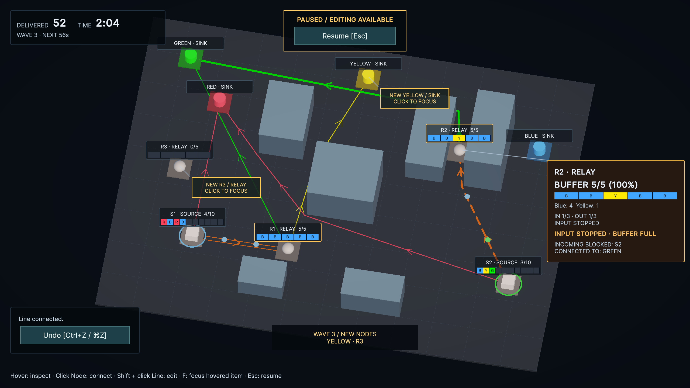
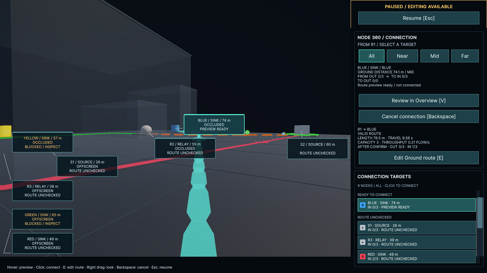
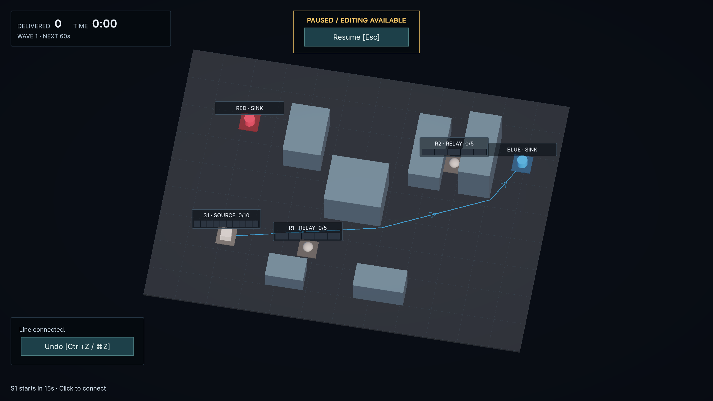

# v0.1 UXレビュー対応（2026-09-22）

Fable5.1の指摘を現行コード・仕様・uloop上の再現テストで確認し、UI/UXの13項目を対応した。Unity Editorを対象とし、PRは作成せず、変更単位でmainへコミット・pushした。

| 指摘 | 対応 |
| --- | --- |
| 1. 敗北の近さ | Source 80%で予告枠。満杯で残り秒数、縮む猶予円弧、控えめな枠点滅・画面端警告。Pauseで固定、回復で解除。画面外でも状況ヒントにSource IDと猶予を表示。#14 |
| 2. 橙の重複 | 混雑は橙＋太さ、削除予約は破線、経路切替待ちは二重線。混雑と予約を同時に表す。#15 |
| 3. RelayとGREEN | RelayとRelay行きLineを無彩色へ。Sinkは色名、候補スウォッチとBuffer枠にはR/B/Y/G/Pを併記。#15 / #17 |
| 4. Wave通知の重複 | 下部を優先し、通知・出現マーカーがNodeラベル・操作欄を避ける。離したマーカーはリーダー線で結ぶ。#17 |
| 5. Waveと時計 | 基本HUDへWAVE/NEXTの1行。TIMEは分:秒、DELIVEREDはゼロ埋めなし。#17 |
| 6. Sink始点 | OUT 0では360へ入らず短い理由を表示。接続枠はFROM OUT / TO IN。#16 |
| 7. 誤接続の取消 | 作成直後6秒以内の空LineをUndo。Ctrl+Z、MacのCmd+Z、ボタンに対応。FLOW保持中・予約中・編集・別配線開始後は対象外。#16 |
| 8. 大きい停止円盤 | Overviewは小さな扁平粒子、Node 360は通常の球サイズ。#15 |
| 9. 候補一覧 | 自分を除外し、接続可能→経路未確認→BLOCKEDで分類。群内は距離順。一覧ホバー中は行位置を固定。マーカー重複を理由に非表示にしない。#16 / #17 |
| 10. 常設Line表 | DIRECTED LINESを廃止。Lineホバーで詳細、クリックで選択、Shift＋クリックで編集。#17 |
| 11. ホバーの構造・位置 | HoverDetails.uxmlへ見出し・主要数値・ゲージ・IN/OUT・警告・接続を分離。対象回避とリーダー線。#17 |
| 12. 操作の発見 | 状況ヒント1行へ開始案内・Source準備・危険・編集操作を集約。Fでホバー中の対象へフォーカス。#17 |
| 13. 文言 | Retry、ゼロ埋め除去、INCOMING BLOCKED / CONNECTED TO。Pause中のEsc案内は「再開」に切り替える。#17 |

## 実装・保守

- SnapshotとNode一覧を不変キャッシュとして再利用。状態変更で失効するためPause中の配線にも即時反映する。読み取り1000回でSnapshot実体が1000個→1個。FPS改善率やGCバイト数は測定していない。
- Viewport比率・重なり回避の余白・安全距離をUSSへ寄せ、OverlayLayout / OverlayLeaderを共通化した。
- GameSessionView、OverviewDetailsView、LineActionsViewの変更箇所を整形した。
- [Architecture.md](Architecture.md) と [Testing.md](Testing.md) を現在の設計・検証方針へ整理し、旧Step記録は [history](history/) へ分離。AGENTS.mdも現行UI方針を更新した。
- [#18](https://github.com/OrthogonalInteractive/CityFlow/issues/18) に、リバインド要件確定後のInputActionAsset移行、Player対象化・Shader保持、既存未追跡ファイルの管理判断を残した。既存のProjectAuditorSettings.assetとdocs/research/は今回の変更に混ぜていない。

## 検証

- 全体検証：EditMode **130/130**、PlayMode **47/47**成功（Snapshot最適化まで）。コンパイルError/Warning **0**、Console Error **0**。
- 新規挙動はRedを確認して実装。Sink始点・Undo・Source警告・混雑と予約の同時表示・候補・通知の重複・Snapshot不変性を検証した。
- 画面確認で見つけたPause案内は再現テストから修正し、関連PlayMode **15/15**成功。詳細は [Testing.md](Testing.md)。
- 途中でuloopのウォームアップが残留。複数の再試行後も回復しなかったため、保存済みEdit Modeからuloop経由でEditorを再起動し、テストをやり直した。未実行の試行は成功件数に含めていない。
- [§18追跡表](V01-Acceptance.md) に既存テストと改善Issueを対応付けた。#12 / #13の人による構成比較・操作感評価・暫定値の最終採用は未完了。

## 実画面

uloop経由の制御検証。撮影用ネットワークとFLOWを公開APIで作成し、自動tickを止めてPauseした。実プレイの難度比較を済ませたという意味ではない。

Source S1にRed/Blue各5個。Buffer 10/10、残り3秒をホバーせず確認できる。

Wave 3・2:04。R2のBlue 4個＋Yellow 1個をゲージとホバーに表示。S2→R2は混雑＋削除予約の破線、S1→R1は混雑＋経路切替待ちの二重線。

R1からBLUEへ注目。8候補を分類し、重なるマーカーをずらしてリーダー線で結ぶ。停止FLOWは球サイズを維持する。

Pause中に作成した空LineのUndo。クリック確定後はOverviewに戻る。

