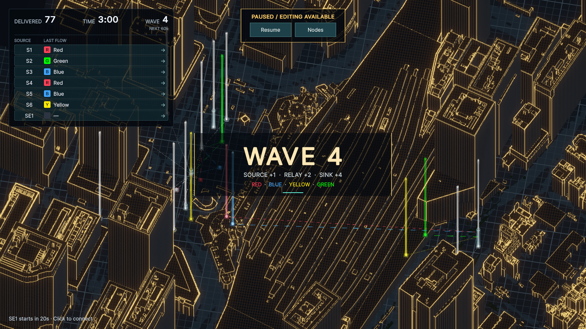

# Wave文字演出と通知の整理（2026-09-27）

初期WaveとWave切替で、大きめの文字が画面左外から中央へ入り、追加Nodeの情報をまとめて表示する。新規Nodeごとのパネル・画面外フォーカスボタン・画面下の追加通知は廃止した。場所を示す光る柱、ホバー詳細、Source一覧からのフォーカスは維持する。

中央はWave番号、その下に追加Source／Relay／Sinkの数、追加Sinkの色を表示する。追加のない種別は省き、同色のSinkが複数なら色名に個数を添える。初期Waveは初期配置分、以後はそのWaveで追加された分だけを使う。領域拡張時は新しい範囲も添える。左上のDELIVERED・TIME・WAVEは数値を同じ23pxで横一列に揃え、次Waveまでの秒数を小さく分けた。

暫定演出は入場0.6ゲーム秒・中央保持2.4秒・フェード0.45秒。文字64px、幅540px。Pause／Editor Pause中は進まず、表示の再構築やモード切替で最初からやり直さない。360／経路編集中も表示するが、文字と背景は入力を遮らない。Game Overで消し、Retryで初期Waveから再開する。ゲーム時計・輸送・SE・ステージ配置は変更していない。

## 検証

- Red：新規のスライド／Pause／RetryとHUD横並びに関する3件が未実装で失敗。続く通知整理では旧パネルが残るため新しい集約表示テストが失敗することを確認。
- 最終の関連PlayMode **32/32成功**。WaveTransition、HudPresentation、WaveSession、NodeArrival、TokyoStationWiringLab、ValidationHud、GameplayAudio、PauseInputを実行。スライド開始位置・中央到達・フェード終了、PauseとHUD再生成での位相保持、全Wave・最終Wave・Game Over・Retry、360中の表示、追加情報と旧パネルの除去、PauseクリックとSourceフォーカスを確認。
- HUD再生成はHUD全体を無効化・再有効化して確認した。UIDocumentだけを1フレーム無効にする旧テスト手順では、既存の他Viewが不在のrootを参照したため、HUD全体の寿命に合わせた手順へ修正した。
- コンパイルError／Warning **0**。Domain／Applicationの変更はなく、EditModeの再実行はしていない。ExpansionLabのPlayModeテストは作成・実行していない。
- 東京駅Wave 4（20 Node）の実画面を1600×900と1036×757で確認。中央に `SOURCE +1 · RELAY +2 · SINK +4` と赤・青・黄・緑を表示。個別の新規Nodeパネルと画面下通知は表示されず、光る柱を維持。左上3項目の文字サイズ・横並び、Pauseパネルとの非重複を確認した。
- 検証用の配線・時計操作は保存せず、東京駅を停止状態へ戻す。Game View解像度も作業前の1800×1000へ戻す。

